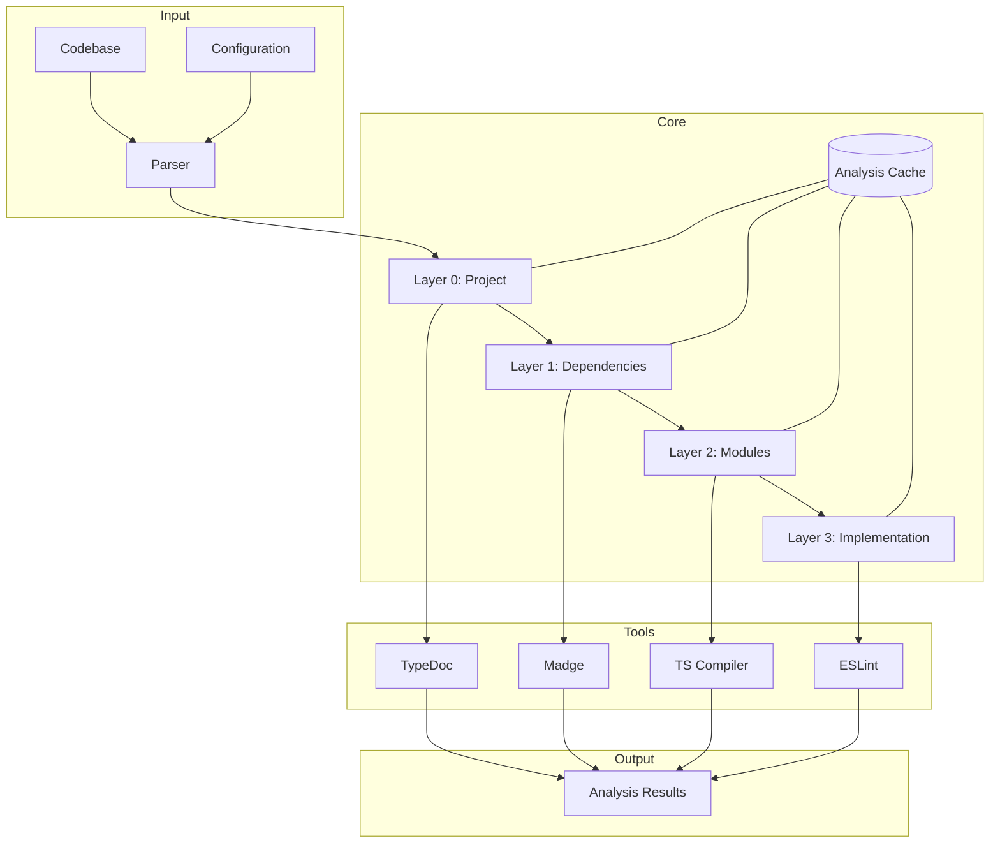

# Progressive Code Analysis System

## System Overview

The Progressive Code Analysis System (PCAS) provides iterative analysis of large codebases through a layered approach
that progressively builds understanding from high-level structure to detailed implementation.

### Core Philosophy

1. **Progressive Resolution**
    - Analyze code like image processing
    - Start with high-level structure
    - Increase detail with each pass
    - Maintain hierarchical understanding

2. **Tool Integration**
    - Leverage existing analysis tools
    - Combine multiple perspectives
    - Unified result format
    - Extensible architecture

3. **Resource Efficiency**
    - Load only necessary data
    - Cache intermediate results
    - Progressive memory management
    - Optimized processing

## Architecture



## Analysis Layers

### Layer 0: Project Structure

- **Purpose**: High-level project understanding
- **Tools**: TypeDoc
- **Outputs**:
    - Project structure
    - Module overview
    - Basic dependencies

### Layer 1: Dependencies

- **Purpose**: Dependency analysis
- **Tools**: Madge, Dependency-cruiser
- **Outputs**:
    - Dependency graph
    - Circular dependencies
    - Module relationships

### Layer 2: Module Analysis

- **Purpose**: Detailed module understanding
- **Tools**: TypeScript Compiler API
- **Outputs**:
    - Exports/imports
    - Type definitions
    - Module interfaces

### Layer 3: Implementation Details

- **Purpose**: Code-level analysis
- **Tools**: ESLint, TypeScript Compiler
- **Outputs**:
    - Code metrics
    - Implementation patterns
    - Quality analysis

## Data Model

### Configuration

```typescript
interface AnalysisConfig {
    entryPoints: string[];
    excludePatterns?: string[];
    maxDepth?: number;
    cacheStrategy: 'memory' | 'disk' | 'none';
    tools: {
        typeDoc?: TypeDocConfig;
        madge?: MadgeConfig;
        eslint?: ESLintConfig;
    };
}
```

### Analysis Results

```typescript
interface AnalysisResult {
    level: number;
    summary: {
        files: number;
        modules: number;
        dependencies: number;
    };
    details: Record<string, any>;
    metadata?: {
        duration: number;
        memory: number;
        toolVersions: Record<string, string>;
    };
}
```

## Implementation Strategy

### 1. Tool Integration

- Abstract tool interfaces
- Unified result format
- Error normalization
- Version management

### 2. Cache Management

- Layer-specific caching
- Memory vs disk strategies
- Cache invalidation
- Result persistence

### 3. Performance Optimization

- Lazy loading
- Incremental analysis
- Parallel processing
- Resource limits

## Future Extensions

### 1. Enhanced Analysis

- Custom analysis rules
- Machine learning integration
- Pattern recognition
- Trend analysis

### 2. Visualization

- Interactive dependency graphs
- Metric dashboards
- Time-series analysis
- Quality indicators

### 3. Integration Points

- CI/CD pipelines
- IDE plugins
- Documentation systems
- Quality monitoring

## Error Handling

### Strategies

1. **Layer-specific Errors**
    - Contained within layers
    - Don't break full analysis
    - Detailed context
    - Recovery options

2. **Tool Errors**
    - Tool-specific handling
    - Fallback options
    - Error normalization
    - Clear reporting

3. **Resource Errors**
    - Memory limits
    - Timeout handling
    - Graceful degradation
    - Recovery procedures

## Security Considerations

### 1. Code Access

- Secure file access
- Permission management
- Sandbox execution
- Data isolation

### 2. Tool Security

- Dependency scanning
- Version control
- Configuration validation
- Resource limits

### 3. Result Security

- Data sanitization
- Access control
- Cache security
- Output validation