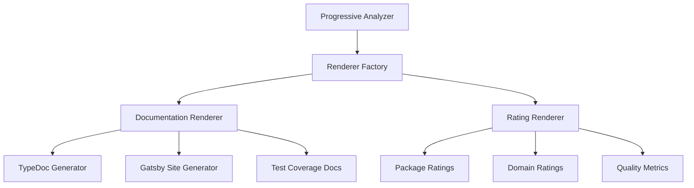

# Analysis Renderers Design

## Core Architecture



## 1. Documentation Renderer

### Core Responsibilities
- Generate TypeDoc annotations
- Create module hierarchy
- Build package documentation
- Generate test coverage reports
- Compile Gatsby documentation site

### Document Structure
```typescript
interface DocStructure {
  packages: {
    [packageName: string]: {
      api: TypeDocOutput;
      design: DesignDoc;
      usage: UsageGuide;
      tests: TestCoverage;
      submodules: ModuleHierarchy[];
    }
  };
  gatsby: {
    pages: GatsbyPage[];
    routes: RouteConfig[];
  };
}
```

### Generation Pipeline
1. **Module Analysis**
   - Parse TypeDoc output
   - Extract module hierarchy
   - Generate category/subcategory structure

2. **Documentation Aggregation**
   - Collect local docs
   - Parse markdown content
   - Extract metadata
   - Build link structure

3. **Gatsby Integration**
   - Generate pages from templates
   - Create dynamic routes
   - Build navigation structure
   - Insert cross-references

## 2. Rating Renderer

### Core Responsibilities
- Package quality analysis
- Dependency tree evaluation
- Multi-criteria assessment
- Metric visualization

### Rating Criteria
```typescript
interface QualityMetrics {
  testCoverage: {
    score: number;
    details: CoverageDetails;
  };
  codeQuality: {
    focus: number;      // Single Responsibility
    clarity: number;    // Code Readability
    modularity: number; // Component Independence
  };
  maintenance: {
    complexity: number;
    documentation: number;
    testability: number;
  };
  bestPractices: {
    patterns: number;
    standards: number;
    consistency: number;
  };
}
```

### Rating Pipeline
1. **Package Analysis**
   - Test coverage evaluation
   - Code quality metrics
   - Dependency analysis
   - API surface review

2. **Domain Analysis**
   - Dependency tree mapping
   - Cross-package metrics
   - Domain cohesion
   - Integration patterns

3. **Quality Assessment**
   - Multi-criteria evaluation
   - Weighted scoring
   - Trend analysis
   - Recommendation generation

## Integration Points

### 1. With Progressive Analyzer
```typescript
class RendererFactory {
  create(type: 'docs' | 'ratings', config: RendererConfig) {
    switch(type) {
      case 'docs':
        return new DocumentationRenderer(config);
      case 'ratings':
        return new RatingRenderer(config);
    }
  }
}

interface RendererConfig {
  analyzer: ProgressiveAnalyzer;
  outputPath: string;
  templates: TemplateConfig;
  plugins: PluginConfig[];
}
```

### 2. With Build System
```typescript
interface BuildHooks {
  onAnalysisComplete: (results: AnalysisResult) => void;
  onDocumentationGenerated: (docs: DocStructure) => void;
  onRatingsComputed: (ratings: QualityMetrics) => void;
}
```

## Implementation Strategy

### 1. Documentation Pipeline
```typescript
class DocumentationRenderer {
  async render(analysis: AnalysisResult) {
    // Generate TypeDoc
    const typedoc = await this.generateTypeDoc(analysis);
    
    // Build module hierarchy
    const modules = this.buildModuleHierarchy(analysis);
    
    // Generate package docs
    const packageDocs = await this.generatePackageDocs(analysis);
    
    // Create Gatsby site
    await this.generateGatsbySite({
      typedoc,
      modules,
      packageDocs
    });
  }
}
```

### 2. Rating Pipeline
```typescript
class RatingRenderer {
  async render(analysis: AnalysisResult) {
    // Compute package metrics
    const packageMetrics = await this.computePackageMetrics(analysis);
    
    // Analyze domains
    const domainMetrics = await this.analyzeDomains(analysis);
    
    // Generate reports
    await this.generateReports({
      packages: packageMetrics,
      domains: domainMetrics
    });
  }
}
```

## Plugin System

### 1. Documentation Plugins
```typescript
interface DocPlugin {
  name: string;
  hooks: {
    beforeDocGeneration?: (analysis: AnalysisResult) => Promise<void>;
    afterDocGeneration?: (docs: DocStructure) => Promise<void>;
    modifyGatsbyConfig?: (config: GatsbyConfig) => GatsbyConfig;
  };
}
```

### 2. Rating Plugins
```typescript
interface RatingPlugin {
  name: string;
  metrics: {
    compute: (analysis: AnalysisResult) => Promise<QualityMetrics>;
    weight: number;
  };
  visualizations?: {
    render: (metrics: QualityMetrics) => Promise<Visualization>;
  };
}
```

## Future Extensions

### 1. Enhanced Documentation
- Interactive API explorer
- Code example repository
- Version comparison
- Change tracking

### 2. Advanced Ratings
- Machine learning analysis
- Historical trends
- Team metrics
- Security scoring

### 3. Integration Features
- CI/CD pipeline integration
- Automated quality gates
- Team notifications
- Review suggestions