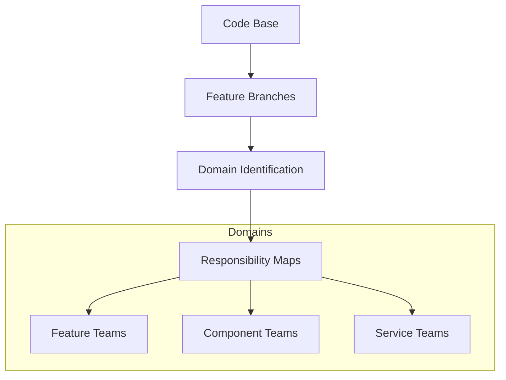
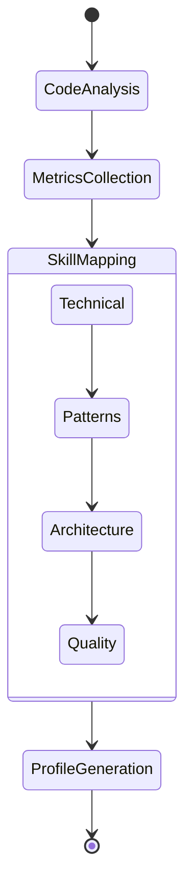
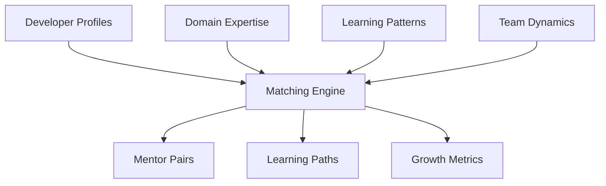

# SpiceTime Team Mentorship: Development Roadmap

## Phase 1: Domain Analysis Foundation

### 1. Repository Structure Analysis
- Git history analysis tools
- Feature branch tracking
- Contribution patterns
- Code ownership mapping

### 2. Responsibility Domains

### 3. Project Management Integration
- Task tracking integration
- Assignment history
- Completion metrics
- Collaboration patterns

## Phase 2: Developer Profile System

### 1. Skill Assessment Engine

### 2. Developer Metrics
- Code quality metrics
- Documentation quality
- Test coverage
- Architecture contributions
- Code review participation
- Knowledge sharing

### 3. Strength/Weakness Identification
- Pattern recognition in code
- Problem-solving approaches
- Technical preferences
- Learning patterns
- Collaboration styles

## Phase 3: Mentorship Matching System

### 1. Matching Engine

### 2. Learning Path Generation
- Skill gap analysis
- Development roadmaps
- Resource recommendations
- Progress tracking
- Achievement metrics

### 3. Mentorship Programs
- Pairing strategies
- Session tracking
- Progress monitoring
- Feedback systems
- Effectiveness metrics

## Phase 4: Team Optimization

### 1. Team Balance Analysis
- Skill distribution
- Knowledge coverage
- Collaboration patterns
- Performance metrics
- Growth trajectories

### 2. Resource Allocation
- Project requirements matching
- Team composition optimization
- Knowledge transfer planning
- Career development paths

### 3. Performance Monitoring
- Team velocity metrics
- Quality improvements
- Knowledge sharing effectiveness
- Collaboration efficiency
- Growth indicators

## Implementation Priorities

1. **Foundation Layer**
   - Repository analysis tools
   - Basic metrics collection
   - Domain identification

2. **Profile System**
   - Developer metrics
   - Skill assessment
   - Basic profiling

3. **Matching System**
   - Basic matching algorithm
   - Mentor pair suggestions
   - Progress tracking

4. **Optimization Layer**
   - Team analysis
   - Resource allocation
   - Performance monitoring

## Future Enhancements

### 1. AI Integration
- Pattern recognition
- Behavior analysis
- Predictive modeling
- Recommendation systems

### 2. Advanced Analytics
- Machine learning models
- Predictive metrics
- Trend analysis
- Impact assessment

### 3. Automation
- Automated assignments
- Dynamic team balancing
- Adaptive learning paths
- Proactive recommendations

## Success Metrics

### 1. Developer Growth
- Skill improvement rates
- Knowledge acquisition
- Quality metrics improvement
- Contribution expansion

### 2. Team Performance
- Velocity improvements
- Quality metrics
- Knowledge distribution
- Collaboration effectiveness

### 3. Project Success
- Delivery metrics
- Code quality trends
- Team satisfaction
- Client satisfaction

## Integration Requirements

### 1. Version Control
- Git integration
- Branch analysis
- Commit patterns
- Review systems

### 2. Project Management
- Task tracking
- Assignment management
- Progress monitoring
- Resource allocation

### 3. Learning Systems
- Documentation integration
- Resource management
- Progress tracking
- Achievement systems

## Challenges & Considerations

### 1. Privacy & Ethics
- Data protection
- Fair assessment
- Ethical matching
- Transparent metrics

### 2. Team Dynamics
- Cultural factors
- Communication styles
- Working preferences
- Personal goals

### 3. Scale & Performance
- Large team handling
- Real-time analysis
- Data processing
- System responsiveness