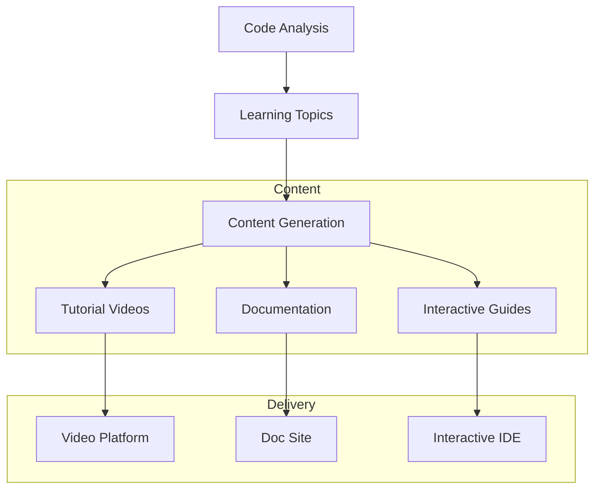
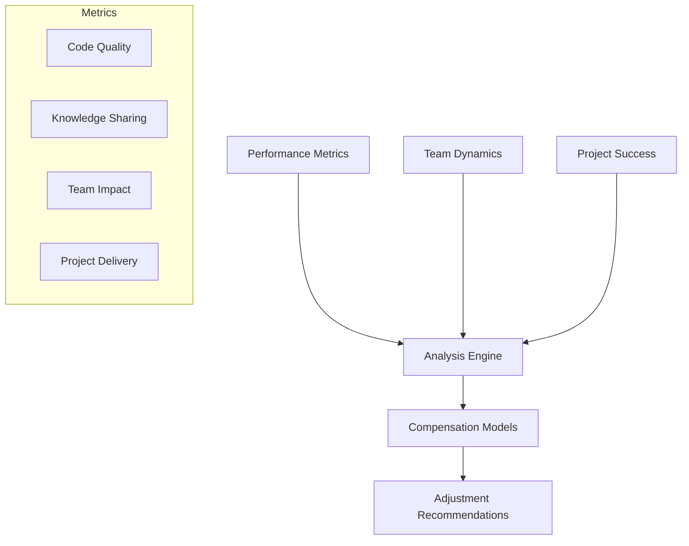

# Educational Platform & Compensation Integration

## 1. Educational Platform Integration

### Content Generation System


### Educational Components

1. **Video Content Generation**
   - Auto-generated lesson plans
   - Code walkthrough templates
   - Best practice demonstrations
   - Common pitfall guides
   - Setup tutorials

2. **Interactive Learning**
   - Live coding sessions
   - Pair programming tools
   - Code review systems
   - Virtual whiteboarding
   - Remote debugging

3. **Onboarding Automation**
   - Personalized learning paths
   - Progress tracking
   - Skill assessments
   - Resource recommendations
   - Team integration guides

## 2. Performance-Based Compensation

### Analysis Pipeline


### Key Components

1. **Performance Metrics**
   - Code quality scores
   - Project contributions
   - Knowledge sharing
   - Mentorship effectiveness
   - Innovation metrics

2. **Value Assessment**
   - Technical expertise level
   - Team impact metrics
   - Project success contribution
   - Growth trajectory
   - Skill market value

3. **Compensation Adjustment**
   - Performance-based models
   - Market rate analysis
   - Skill premium calculations
   - Growth incentives
   - Team impact bonuses

## Integration Points

### 1. Educational Platform
- Learning management system
- Video hosting platform
- Interactive coding environment
- Documentation system
- Progress tracking

### 2. Compensation System
- HR systems integration
- Payroll processing
- Performance reviews
- Market rate data
- Budget planning

## Technical Components

### 1. Content Management
```typescript
interface ContentGenerator {
  // Generate educational content from code analysis
  generateContent(analysis: CodeAnalysis): LearningContent;
  
  // Create personalized learning paths
  createLearningPath(profile: DeveloperProfile): LearningPath;
  
  // Generate video scripts and tutorials
  generateTutorials(topic: CodeDomain): TutorialSet;
}
```

### 2. Compensation Analysis
```typescript
interface CompensationEngine {
  // Analyze performance metrics
  analyzePerformance(metrics: PerformanceMetrics): PerformanceScore;
  
  // Calculate compensation adjustments
  calculateAdjustments(score: PerformanceScore): CompensationUpdate;
  
  // Generate recommendations
  generateRecommendations(update: CompensationUpdate): Recommendations;
}
```

## Implementation Phases

### Phase 1: Educational Foundation
1. **Content Infrastructure**
   - Video platform setup
   - Documentation system
   - Interactive environments
   - Resource management

2. **Content Generation**
   - Tutorial templates
   - Documentation generators
   - Interactive guides
   - Assessment tools

### Phase 2: Remote Learning
1. **Virtual Classroom**
   - Live coding sessions
   - Remote pair programming
   - Virtual whiteboarding
   - Screen sharing

2. **Progress Tracking**
   - Skill assessments
   - Learning analytics
   - Achievement tracking
   - Performance metrics

### Phase 3: Compensation Integration
1. **Metrics Collection**
   - Performance tracking
   - Value assessment
   - Market analysis
   - Skill evaluation

2. **Adjustment System**
   - Calculation models
   - Recommendation engine
   - Review process
   - Implementation tools

## Future Enhancements

### 1. AI-Driven Education
- Personalized content generation
- Adaptive learning paths
- Intelligent tutoring
- Progress prediction

### 2. Advanced Compensation
- Predictive modeling
- Career path optimization
- Market trend analysis
- Value forecasting

## Success Metrics

### Educational Platform
- Learning completion rates
- Skill acquisition speed
- Knowledge retention
- Team capability growth
- Onboarding efficiency

### Compensation System
- Performance improvement
- Team satisfaction
- Retention rates
- Market competitiveness
- Budget optimization

## Challenges

### 1. Content Quality
- Maintaining standards
- Regular updates
- Personalization
- Engagement levels

### 2. Fair Compensation
- Objective metrics
- Market alignment
- Team harmony
- Budget constraints

## Security & Compliance

### 1. Educational Data
- Learning records
- Progress tracking
- Personal information
- Access controls

### 2. Compensation Data
- Salary information
- Performance records
- Review data
- Adjustment history