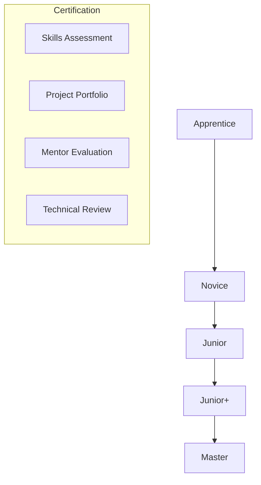

# Developer Progression System

## Levels & Standards

### 1. Apprentice
- **Skills Required**
  - Basic programming concepts
  - Version control basics
  - Following team practices
  - Basic problem solving

- **Certification Process**
  - Complete basic training modules
  - Pass fundamental coding tests
  - Complete simple tasks with guidance
  - Regular mentor check-ins

- **Mentorship Focus**
  - Core programming concepts
  - Development environment setup
  - Team workflow integration
  - Basic debugging skills

### 2. Novice
- **Skills Required**
  - Independent task completion
  - Code review participation
  - Basic testing practices
  - Documentation following

- **Certification Process**
  - Complete intermediate tasks independently 
  - Contribute to code reviews
  - Write basic tests
  - Document own code

- **Mentorship Focus**
  - Code organization
  - Testing practices
  - Documentation skills
  - Problem decomposition

### 3. Junior
- **Skills Required**
  - Feature implementation
  - Test writing
  - Code review comments
  - Technical documentation
  - Basic architecture understanding

- **Certification Process**
  - Lead small feature development
  - Write comprehensive tests
  - Meaningful code reviews
  - Clear technical documentation

- **Mentorship Focus**
  - Design patterns
  - System architecture
  - Code quality
  - Team collaboration

### 4. Junior+
- **Skills Required**
  - Complex feature ownership
  - Architecture contributions
  - Mentoring apprentices
  - Technical decision making

- **Certification Process**
  - Lead complex features
  - Design system components
  - Mentor junior developers
  - Technical presentations

- **Mentorship Focus**
  - System design
  - Technical leadership
  - Mentoring skills
  - Project planning

### 5. Master
- **Skills Required**
  - System architecture
  - Technical leadership
  - Advanced mentoring
  - Innovation & research

- **Certification Process**
  - System architecture design
  - Lead technical initiatives
  - Successful mentoring track record
  - Knowledge sharing programs

- **Mentorship Focus**
  - Architecture mastery
  - Leadership development
  - Teaching skills
  - Innovation practices

## Progression Paths

## Pay Grade Structure

### Base Grades
1. **Apprentice**: Grade 1
   - Entry level compensation
   - Learning period adjustments
   - Performance bonuses

2. **Novice**: Grade 2
   - Base increase from Apprentice
   - Skill acquisition bonuses
   - Project completion bonuses

3. **Junior**: Grade 3
   - Professional level base
   - Technical skill premiums
   - Team contribution bonuses

4. **Junior+**: Grade 4
   - Senior level base
   - Architecture premiums
   - Mentoring bonuses

5. **Master**: Grade 5
   - Expert level base
   - Leadership premiums
   - Innovation bonuses

### Progression Incentives
- Certification completion bonuses
- Skill acquisition rewards
- Mentoring effectiveness bonuses
- Knowledge sharing incentives

## Acceleration Program

### Fast-Track Options
1. **Skill Focus**
   - Targeted learning paths
   - Intensive mentoring
   - Rapid project exposure
   - Regular assessments

2. **Project Acceleration**
   - Complex task assignment
   - Lead role opportunities
   - Cross-team collaboration
   - Innovation projects

3. **Leadership Development**
   - Mentoring responsibilities
   - Technical presentations
   - Architecture participation
   - Team leadership