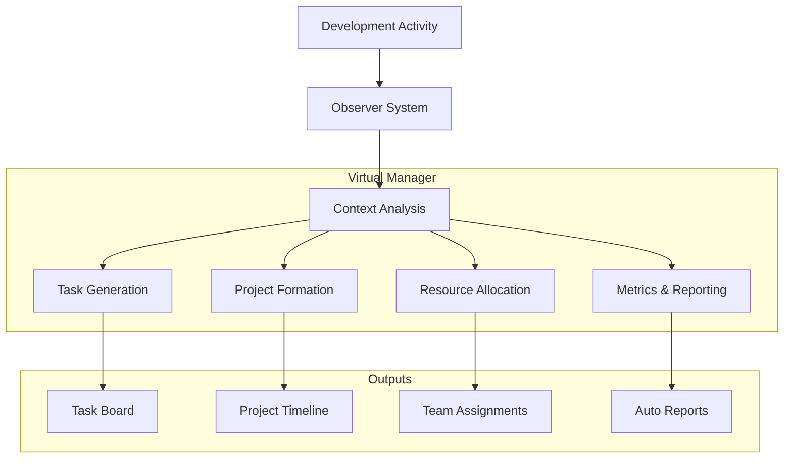
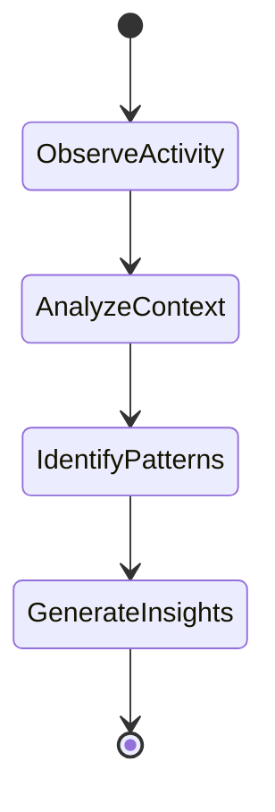

# Virtual Project Manager System

## System Overview



## Core Components

### 1. Development Context Observer
- Monitors git activities
- Tracks code changes
- Observes team communications
- Analyzes PR discussions
- Monitors build/deploy activities

```typescript
interface ActivityObserver {
  gitActivity: {
    branches: BranchActivity[];
    commits: CommitPattern[];
    PRs: PullRequestFlow[];
  };
  
  codeContext: {
    changes: CodeChangePattern[];
    impactAreas: ImpactMap[];
    dependencies: DependencyChanges[];
  };
  
  teamInteractions: {
    discussions: DiscussionThread[];
    reviews: CodeReviewPattern[];
    collaborations: TeamInteraction[];
  };
}
```

### 2. Task Generation System
- Auto-generates tasks from activities
- Identifies dependencies
- Sets priorities
- Estimates complexity
- Assigns resources

```typescript
interface TaskGenerator {
  identifyTasks(context: DevelopmentContext): Task[];
  estimateComplexity(task: Task): ComplexityScore;
  setPriorities(tasks: Task[]): PrioritizedTasks;
  generateTimeline(tasks: Task[]): Timeline;
}
```

### 3. Project Formation
- Groups related tasks
- Creates project structures
- Sets milestones
- Manages dependencies
- Tracks progress

### 4. Resource Management
- Team capacity analysis
- Skill matching
- Workload balancing
- Progress tracking
- Bottleneck identification

## Autonomous Operations

### 1. Context Understanding


### 2. Decision Making
- Priority determination
- Resource allocation
- Timeline adjustments
- Risk identification
- Issue resolution

### 3. Communication
- Status updates
- Progress reports
- Team notifications
- Escalation alerts
- Achievement recognition

## Integration Points

### 1. Version Control
```typescript
interface GitIntegration {
  observeBranches(): BranchActivity[];
  analyzePRFlow(): PRMetrics;
  trackCommits(): CommitPatterns;
  identifyFeatures(): FeatureGroup[];
}
```

### 2. Communication Platforms
- Chat system integration
- Email notifications
- Documentation updates
- Status reporting
- Team announcements

### 3. Build/Deploy Systems
- Pipeline monitoring
- Release tracking
- Environment management
- Deploy coordination
- Issue tracking

## Automated Management Functions

### 1. Task Management
```typescript
class VirtualTaskManager {
  // Observe and create tasks
  async observeAndCreateTasks() {
    const activities = await this.observer.getActivities();
    const context = await this.analyzer.analyzeContext(activities);
    return this.taskGenerator.generateTasks(context);
  }

  // Manage priorities
  async managePriorities() {
    const tasks = await this.getTasks();
    const priorities = this.priorityEngine.calculatePriorities(tasks);
    return this.updateTaskPriorities(priorities);
  }

  // Balance workload
  async balanceTeamLoad() {
    const workload = await this.getTeamWorkload();
    const balanced = this.balancer.optimizeDistribution(workload);
    return this.redistributeTasks(balanced);
  }
}
```

### 2. Project Tracking
- Milestone tracking
- Progress measurement
- Risk assessment
- Issue identification
- Success metrics

### 3. Resource Optimization
- Team utilization
- Skill allocation
- Load balancing
- Bottleneck resolution
- Capacity planning

## Minimal Interaction Requirements

### 1. Required Human Input
- Initial project goals
- Key constraints
- Major decisions
- Critical approvals
- Strategic direction

### 2. Optional Interactions
- Priority adjustments
- Resource constraints
- Timeline modifications
- Scope changes
- Budget updates

## Reporting & Analytics

### 1. Automated Reports
```typescript
interface ReportGenerator {
  generateDailyStatus(): StatusReport;
  createProgressMetrics(): ProgressMetrics;
  analyzeTeamPerformance(): PerformanceReport;
  predictProjectTimeline(): TimelineProjection;
}
```

### 2. Predictive Analysis
- Timeline predictions
- Resource needs
- Risk assessment
- Bottleneck prediction
- Success probability

### 3. Performance Metrics
- Team velocity
- Quality metrics
- Efficiency measures
- Collaboration effectiveness
- Delivery accuracy

## Future Enhancements

### 1. AI Integration
- Pattern learning
- Decision optimization
- Predictive planning
- Risk assessment
- Resource optimization

### 2. Advanced Analytics
- Machine learning models
- Behavioral analysis
- Performance prediction
- Success patterns
- Risk patterns

### 3. Automation Expansion
- Meeting scheduling
- Documentation generation
- Resource forecasting
- Budget optimization
- Stakeholder communication