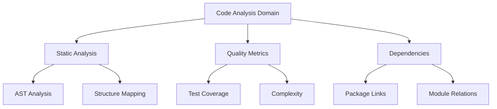
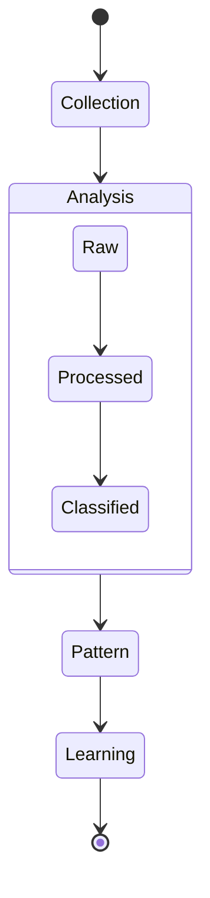
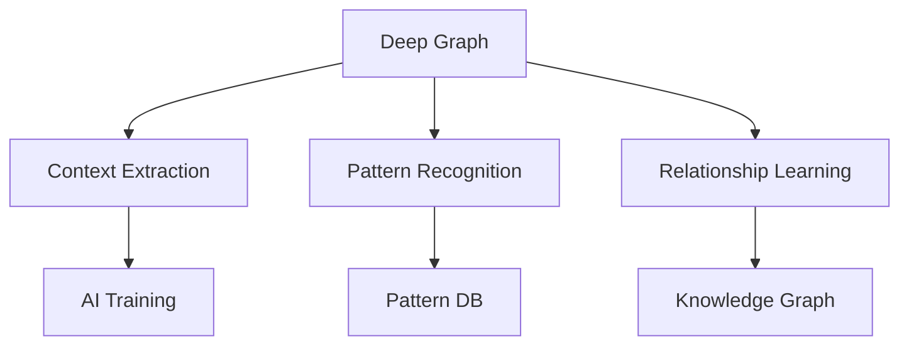

# Deep Integration Roadmap

## Phase 1: Core Integration

### 1. Domain Setup
- Basic domain structure setup
  - Code Analysis domain
  - Project Management domain
  - Organization domain
  - Mentorship domain
- Core relationships definition
- Base type hierarchy
- Cross-domain linking patterns

### 2. Code Analysis Integration

### 3. Real-time Monitoring
- Change detection system
- Event propagation patterns
- Cross-domain updates
- Reactive query optimization

## Phase 2: Advanced Features

### 1. Complex Relationships
- Multi-dimensional links
- Context-aware relationships
- Temporal relationship tracking
- Weighted connections

### 2. Analysis Patterns

### 3. Query Optimization
- Query caching strategies
- Index optimization
- Relationship pre-fetching
- Performance monitoring

## Phase 3: Integration Extensions

### 1. Tool Integration
- IDE plugins leveraging Deep
- CI/CD pipeline integration
- Documentation generators
- Visualization tools

### 2. Cross-Platform Support
- Desktop applications
- Mobile interfaces
- Web extensions
- CLI tools

### 3. AI Integration

## Phase 4: Advanced Analytics

### 1. Pattern Recognition
- Code pattern detection
- Team behavior analysis
- Project patterns
- Success patterns

### 2. Predictive Features
- Resource needs prediction
- Quality issue prediction
- Team dynamic forecasting
- Delivery timeline estimation

### 3. Learning System
- Pattern database building
- Success pattern recognition
- Anti-pattern detection
- Recommendation engine

## Phase 5: Ecosystem Development

### 1. Plugin System
- Custom domain definitions
- Relationship type plugins
- Analysis plugins
- Visualization plugins

### 2. Data Exchange
- Import/export formats
- Integration APIs
- Synchronization protocols
- Migration tools

### 3. Enterprise Features
- Multi-team support
- Organization-wide analytics
- Compliance tracking
- Security features

## Future Considerations

### 1. Advanced Intelligence
- AI-driven graph navigation
- Automated relationship discovery
- Smart pattern recognition
- Intelligent assistance

### 2. Scale Optimization
- Large graph handling
- Distributed processing
- Sharding strategies
- Performance optimization

### 3. New Applications
- Knowledge management
- Decision support
- Strategy planning
- Risk analysis

## Success Metrics

### 1. Integration Success
- Implementation completeness
- Feature adoption
- Performance metrics
- User satisfaction

### 2. Business Impact
- Process efficiency
- Decision quality
- Resource optimization
- Team effectiveness

### 3. Technical Excellence
- Code quality
- System performance
- Scalability
- Maintainability

## Technical Considerations

### 1. Performance
- Query optimization
- Memory management
- Cache strategies
- Network efficiency

### 2. Scalability
- Graph size handling
- User load management
- Data volume handling
- Resource efficiency

### 3. Security
- Access control
- Data protection
- Privacy management
- Compliance handling

## Challenges to Address

### 1. Technical Challenges
- Graph complexity management
- Performance at scale
- Real-time synchronization
- Cross-platform consistency

### 2. Integration Challenges
- Tool ecosystem integration
- Legacy system compatibility
- Data migration
- API compatibility

### 3. User Adoption
- Learning curve management
- Feature discoverability
- Documentation
- Training materials
