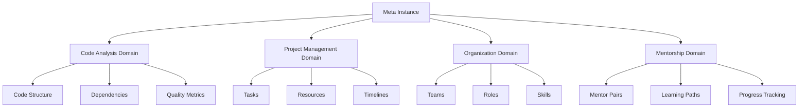

## prompt.tic.4.for design
i wanna explore leveraging project called deep
i can provide api if you need it
it creates and maintains lexical graphs representing perspective, or context
it can be used to represent all the relationships, in any domain, using different instances in each
so, our code base can be one domain
and project management another, and org structure another, and tutoring structure another
and theres an instance of deep that has all those perspectives as nodes in it
or, perhaps its same instance, but with different, but interconnected layers
A super structured connected graph

## answer summary
This is a fascinating direction. From analyzing the Deep documentation, I can see how it could be a perfect fit for our context analyzer and organizational management needs. Let me break down how we could leverage Deep:

Here's how we could structure this using Deep:

1. **Base Layer Architecture**

Let me create an implementation example showing how we could use Deep for this:

[implementation](lexical graphs with deep.prompt.answer.doc.implementation.ts)

This implementation shows how Deep can:

1. **Handle Multiple Domains**
    - Each domain (code, PM, org, mentorship) is a separate context
    - Cross-domain relationships are natural with Deep's linking
    - Everything stays interconnected but organized

2. **Maintain Relationships**
    - Code quality linked to teams
    - Teams linked to skills
    - Mentorship pairs linked to experience
    - Tasks linked to code context

3. **Enable Real-time Monitoring**
    - Track changes across domains
    - React to quality metrics
    - Monitor team progress
    - Track mentorship effectiveness

Would you like me to:
1. Explore more complex cross-domain relationships?
2. Detail how we could leverage Deep's reactive capabilities?
3. Show how this could integrate with our existing analysis tools?
4. Design a specific domain model in more detail?

## prompt, for roadmap
not now, but put all this future concerns into a roadmap, a separate doc

## answer summary
I'll create a roadmap specifically for Deep integration and future explorations.

This roadmap outlines the progression from basic Deep integration to a full ecosystem. It's organized into phases that build upon each other, with each phase focusing on specific aspects of functionality, integration, and optimization.

Each phase is designed to deliver concrete value while setting up for future enhancements. The roadmap covers technical aspects, business considerations, and potential challenges, providing a comprehensive guide for long-term development.

Would you like me to:
1. Detail any specific phase further?
2. Focus on particular technical challenges?
3. Expand on integration strategies?
4. Create more detailed timelines?

## prompt, for procedural logic
Deep can also store functional relationships, as would be implemented by react component, operating on the state which is graph
using the functional linkages linking the nodes in state
lets give it a shot
create a cmponent, for some use case
