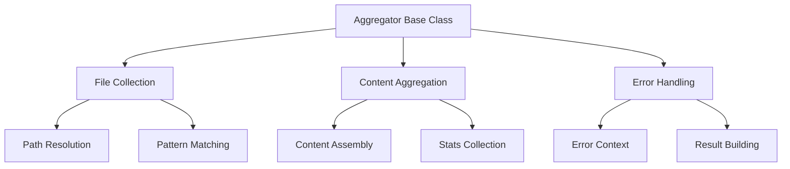

# Base Aggregator: Design Documentation

## Core Philosophy

The Base Aggregator serves as the foundational member of the aggregator utility family, implementing pure content
aggregation functionality without assumptions about processing or higher-order operations.

### Design Principles

1. **Pure Functionality**
    - Core content aggregation only
    - No content processing
    - No business logic
    - Clear single responsibility

2. **Composition Over Configuration**
    - Minimal base configuration
    - Extensible through inheritance
    - Composable with other utilities
    - Clear extension points

3. **Space-Time Awareness**
    - Package versioning indicates location
    - Path resolution relative to repo root
    - Version coordinates for navigation
    - Family hierarchy through versioning

4. **Error Philosophy**
    - Errors capture space-time coordinates
    - Pass contextual information upward
    - No error processing
    - Clean error boundaries

## Technical Architecture

### Core Components



### Data Flow

1. **Configuration Phase**
    - Validate input paths
    - Resolve base directories
    - Apply default settings
    - Prepare error context

2. **Collection Phase**
    - Traverse directories
    - Match file patterns
    - Apply exclusions
    - Build file list

3. **Aggregation Phase**
    - Read file contents
    - Track statistics
    - Handle errors
    - Assemble result

### Type System

The type system is designed for clarity and extensibility:

```typescript
// Core configuration
interface AggregatorConfig {
  includePaths: string[];     // Required base paths
  extensions: string[];       // Required extensions
  excludePatterns?: string[]; // Optional exclusions
  maxDepth?: number;         // Optional depth limit
}

// Rich result type
interface AggregateResult {
  content: string;           // Combined content
  files: string[];          // Processed files
  errors: AggregationError[]; // Error context
  stats: AggregationStats;   // Operation stats
}
```

## Extension Points

### 1. Content Collection

Override `collectFiles` to implement custom file collection:

```typescript
protected async collectFiles(result: AggregateResult): Promise<void> {
  // Custom collection logic
}
```

### 2. Content Processing

Override `processFiles` to implement custom processing:

```typescript
protected async processFiles(result: AggregateResult): Promise<void> {
  // Custom processing logic
}
```

### 3. Error Handling

Extend error handling through result object:

```typescript
interface CustomError extends AggregationError {
  severity: 'warning' | 'error';
  code: string;
}
```

## Implementation Guidelines

### 1. File System Operations

- Use async operations
- Handle platform differences
- Implement retry logic
- Manage resources properly

### 2. Error Management

- Preserve error context
- Include file locations
- Track operation stage
- Maintain error chain

### 3. Performance Considerations

- Stream large files
- Implement backpressure
- Manage memory usage
- Monitor statistics

## Testing Strategy

### 1. Unit Tests

- Test configuration validation
- Verify path resolution
- Check error handling
- Validate statistics

### 2. Integration Tests

- Test file system operations
- Verify content aggregation
- Check error scenarios
- Test platform specifics

### 3. Performance Tests

- Measure memory usage
- Track execution time
- Test large files
- Verify streaming

## Future Considerations

### 1. Enhanced Capabilities

- Content transformation
- Pattern matching
- Metadata collection
- Event emission

### 2. Family Evolution

- Specialized aggregators
- Custom processors
- Enhanced statistics
- Extended metadata

### 3. Integration Points

- Event system
- Metrics collection
- Plugin system
- Configuration management