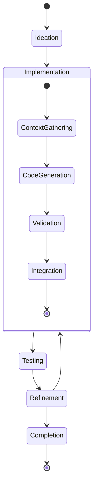
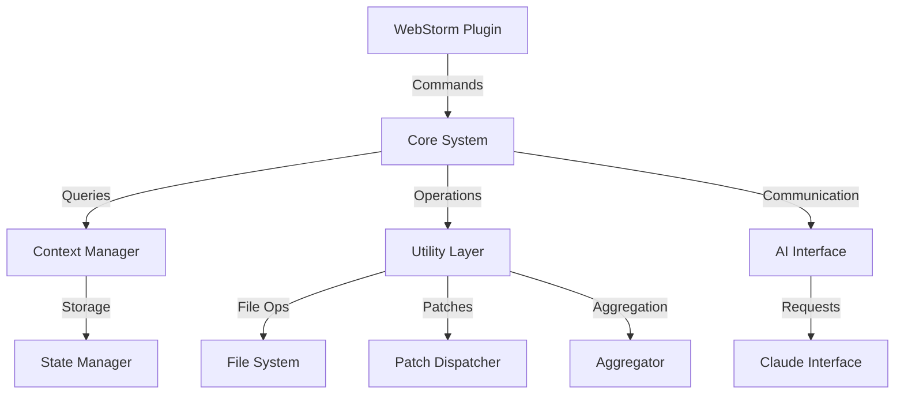

# SpiceTime AI Code Assistant Design

## Overview

The SpiceTime AI Code Assistant is designed as a process-centric system that facilitates AI-assisted software
development through granular, focused utilities that combine into a larger, self-modifying architecture. This document
outlines the design philosophy, strategy, and implementation approach for creating an effective AI coding assistant.

## Design Philosophy

### Core Principles

1. **Process-Centric Development**
    - Development is viewed as a continuous process rather than discrete tasks
    - Each development activity is part of interconnected processes
    - Processes have well-defined states, transitions, and operations
    - All changes are tracked and reversible

2. **Granular Utility Architecture**
    - Start with small, focused utilities
    - Each utility has a single, well-defined responsibility
    - Utilities are composable into larger workflows
    - Bootstrap approach enables progressive enhancement

3. **Context Awareness**
    - System maintains awareness of project structure
    - Tracks development context across sessions
    - Preserves intent and reasoning behind changes
    - Manages dependencies between different contexts

4. **Self-Modifying Architecture**
    - System can modify its own codebase
    - Changes are controlled through formal processes
    - Modifications are verified and validated
    - System maintains consistency through changes

## Development Strategy

### Bootstrap Phase

1. **Initial Utilities**
    - File aggregation for context gathering
    - Patch dispatching for code modifications
    - Context management for state tracking
    - Command processing for operations

2. **Process Development**
    - Define process states and transitions
    - Implement state management
    - Create workflow orchestration
    - Build validation mechanisms

3. **Integration Layer**
    - WebStorm plugin interface
    - Claude browser interface
    - GraphQL API development
    - Event system implementation

### Process Lifecycle



## System Architecture

### Component Structure



### Process States

1. **Ideation**
    - State: Design documentation
    - Intent capture
    - Dependency mapping
    - Constraint definition

2. **Implementation**
    - State: Source code
    - Test specifications
    - Configuration
    - Documentation

3. **Testing**
    - State: Test results
    - Coverage reports
    - Performance metrics
    - Validation status

4. **Refinement**
    - State: Change proposals
    - Optimization metrics
    - Quality indicators
    - Feedback data

## Implementation Approach

### Initial Focus: Core Utilities

1. **FileAggregator**
   ```javascript
   class FileAggregator {
     async aggregate(paths, extensions) {...}
   }
   ```
    - Purpose: Context gathering
    - Scope: File system operations
    - Output: Structured content

2. **PatchDispatcher**
   ```javascript
   class PatchDispatcher {
     async applyPatch(patch, context) {...}
   }
   ```
    - Purpose: Code modification
    - Scope: File operations
    - Safety: Validation and rollback

### Progressive Enhancement

1. **Stage 1: Basic Utilities**
    - File operations
    - Content aggregation
    - Patch application
    - Basic validation

2. **Stage 2: Process Management**
    - State tracking
    - Transition logic
    - Event handling
    - Error recovery

3. **Stage 3: AI Integration**
    - Context provision
    - Response processing
    - Code generation
    - Validation logic

4. **Stage 4: IDE Integration**
    - Plugin development
    - UI components
    - Command handling
    - Event system

## Process Integration

### Development Workflow

1. **Context Initialization**
    - Load project structure
    - Parse configuration
    - Initialize state
    - Prepare workspace

2. **Operation Execution**
    - Validate context
    - Apply changes
    - Update state
    - Verify results

3. **State Management**
    - Track changes
    - Maintain history
    - Handle transitions
    - Ensure consistency

4. **Process Completion**
    - Validate results
    - Update documentation
    - Clean resources
    - Archive state

## Future Extensions

### Planned Processes

1. **Automated Testing**
    - Test generation
    - Coverage analysis
    - Performance testing
    - Integration testing

2. **Documentation Management**
    - Auto-generation
    - Consistency checking
    - Format conversion
    - Version tracking

3. **Quality Assurance**
    - Code analysis
    - Style checking
    - Security scanning
    - Performance monitoring

4. **Deployment Pipeline**
    - Build process
    - Environment management
    - Release automation
    - Monitoring setup

## Conclusion

The SpiceTime AI Code Assistant represents a systematic approach to AI-assisted development, built on the principles of
process-centric design and granular utility architecture. Through careful bootstrap development and progressive
enhancement, it will evolve into a comprehensive system that maintains context awareness while facilitating efficient
development workflows.

The success of this system depends on:

- Maintaining clear process boundaries
- Ensuring utility focus and composability
- Building robust state management
- Implementing effective validation
- Preserving context awareness

This design provides a foundation for creating an AI assistant that truly understands and supports the development
process, rather than just providing disconnected suggestions.