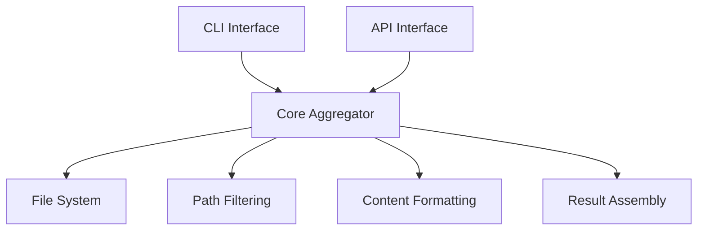

# @spicetime/aggregator

A utility for aggregating file contents from multiple sources with flexible filtering and formatting options. Part of
the SpiceTime architecture toolkit.

## Installation

```bash
# Global installation (recommended for CLI usage)
npm install -g @spicetime/aggregator

# Local installation
npm install @spicetime/aggregator
```

## Quick Start

### CLI Usage

```bash
# Basic usage - aggregate all TypeScript files in src directory
spicetime-aggregate --paths "./src" --extensions ".ts"

# Multiple paths and extensions
spicetime-aggregate -p "./src,./lib" -e ".ts,.js" -o "aggregated.txt"

# Exclude patterns and depth limit
spicetime-aggregate --paths "./src" --exclude "tests,fixtures" --max-depth 2
```

### Programmatic Usage

```typescript
import { Aggregator } from '@spicetime/aggregator';

const aggregator = new Aggregator({
  includePaths: ['./src', './lib'],
  extensions: ['.ts', '.js'],
  excludePatterns: ['node_modules', 'tests']
});

const result = await aggregator.aggregate();
console.log(`Processed ${result.stats.totalFiles} files`);
```

## CLI Reference

```bash
spicetime-aggregate [options]

Options:
  -p, --paths <paths>         Comma-separated paths to include (default: "./src")
  -e, --extensions <exts>     Comma-separated file extensions (default: ".ts,.js")
  -x, --exclude <patterns>    Comma-separated exclude patterns (default: "node_modules,dist")
  -d, --max-depth <depth>     Maximum directory depth (default: "Infinity")
  -o, --output <file>        Output file path (optional)
  -h, --help                 Display help information
```

## API Reference

### Aggregator Class

```typescript
class Aggregator {
  constructor(config: AggregatorConfig, cwd?: string);
  aggregate(): Promise<AggregateResult>;
}
```

### Types

```typescript
interface AggregatorConfig {
  includePaths: string[];      // Paths to include in aggregation
  extensions: string[];        // File extensions to process
  excludePatterns?: string[];  // Patterns to exclude
  maxDepth?: number;          // Maximum directory depth
}

interface AggregateResult {
  content: string;            // Combined file contents
  files: string[];           // Processed file paths
  errors: Array<{           // Errors encountered
    path: string;
    message: string;
  }>;
  stats: {                  // Aggregation statistics
    totalFiles: number;
    totalSize: number;
    skippedFiles: number;
  };
}
```

## Design Documentation

### Core Philosophy

The aggregator is designed as a foundational utility for the SpiceTime architecture, following these key principles:

1. **Path-Centric Operation**
    - All operations based on current working directory
    - Consistent path handling across platforms
    - Relative path output for portability

2. **Flexible Configuration**
    - Multiple inclusion paths
    - Extension filtering
    - Pattern-based exclusion
    - Depth control

3. **Robust Error Handling**
    - Continues processing despite individual file errors
    - Detailed error reporting
    - Statistics for monitoring

4. **Clean Integration**
    - Works as both CLI and library
    - Consistent output format
    - Stateless operation

### Architecture



### Implementation Details

1. **Path Resolution**
    - Uses `process.cwd()` as base
    - Normalizes paths for cross-platform compatibility
    - Maintains relative paths in output

2. **File Processing**
    - Asynchronous file reading
    - Streaming for large files
    - UTF-8 encoding

3. **Error Management**
    - Non-blocking error handling
    - Detailed error context
    - Statistics tracking

4. **Output Formatting**
    - File path comments
    - Content separation
    - Optional output file

## User Guide

### Common Use Cases

1. **Project Context Gathering**
   ```bash
   spicetime-aggregate -p "./src" -e ".ts,.tsx,.js,.jsx" -o "context.txt"
   ```

2. **Documentation Aggregation**
   ```bash
   spicetime-aggregate -p "./docs" -e ".md" --exclude "draft,temp"
   ```

3. **Source Analysis**
   ```bash
   spicetime-aggregate -p "./src/components" -e ".tsx" --max-depth 1
   ```

### Best Practices

1. **Path Selection**
    - Use relative paths from working directory
    - Specify multiple paths for complex projects
    - Consider using `.gitignore` patterns for exclusions

2. **Performance**
    - Limit depth for large directories
    - Use specific extensions
    - Exclude unnecessary paths

3. **Integration**
    - Use output files for large aggregations
    - Consider adding to build scripts
    - Automate context gathering

### Troubleshooting

1. **Common Issues**
    - Path resolution problems
    - Permission errors
    - Memory limitations

2. **Solutions**
    - Verify working directory
    - Check file permissions
    - Adjust depth and filters

## Contributing

1. **Development Setup**
   ```bash
   git clone <repository>
   cd packages/utils/aggregator
   npm install
   npm run build
   ```

2. **Testing**
   ```bash
   npm test
   ```

3. **Building**
   ```bash
   npm run build
   ```

## License

MIT License - See LICENSE file for details.
