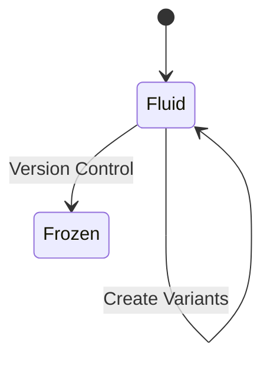
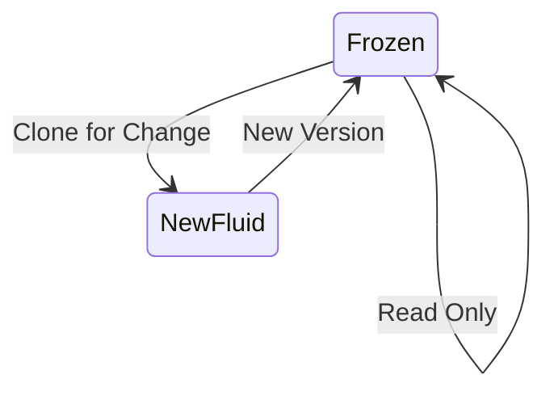

# SpiceTime: Laws of Content Spacetime

## Core Laws

### 1. Conservation of History

- Nothing is ever destroyed
- All changes extend the graph
- Every mutation preserves its lineage
- History is append-only

### 2. Causality Protection

- Tic sequences cannot be reordered
- Timeline integrity must be preserved
- File timestamps must match tic sequence
- Breaking causality is forbidden

### 3. Phase Evolution

```
# Original tic
dogFood.bad.tic.1.md

# Adding phase information
dogFood.bad.tic.1.soupy.1.md
```

- Imaginary extensions track thought phases
- Title changes spawn imaginary variants
- Phase history is preserved
- Multiple phases can coexist

### 4. Node Transformation Rules

#### Creation from Tics

- Tics can become nodes by changing base title
- Original node remains unchanged
- New node records inspiration link
- Position in space is initially fluid

#### Freezing Process

- Nodes freeze when version controlled
- Frozen nodes are immutable inside
- Changes require node cloning
- Links record frozen node lineage

## Mutation Rules

### Allowed Operations

1. **Title Extensions**
    - Add phase information
    - Create imaginary variants
    - Extend descriptors
    - Add metadata

2. **Node Creation**
    - Convert tics to nodes
    - Create inspiration links
    - Start new timelines
    - Add space dimensions

3. **Link Recording**
    - Track transformations
    - Record inspiration sources
    - Map relationships
    - Preserve lineage

### Forbidden Operations

1. **Timeline Manipulation**
    - Reordering tics
    - Breaking causality
    - Modifying timestamps
    - Destroying history

2. **Node Violation**
    - Changing frozen nodes
    - Breaking version control
    - Losing lineage
    - Destroying links

## Graph Structure

### Immutable Properties

- Node existence
- Timeline sequence
- Historical links
- Creation timestamps

### Mutable Properties

- Node positions
- Link metadata
- Phase information
- Space dimensions

## State Transitions

### Fluid State



### Frozen State



## Evolution Patterns

### Phase Addition

```
# Evolution with phases
node.concept.tic.1.md
node.concept.tic.1.phase1.1.md
node.concept.tic.1.phase2.2.md
```

### Node Creation

```
# Tic to node transformation
oldNode.concept.tic.1.md
    ↓ (transform)
newNode.md (+ inspiration link)
```

### Frozen Node Changes

```
frozenNode.v1.md (immutable)
    ↓ (clone)
frozenNode.v2.fluid.md (mutable)
    ↓ (freeze)
frozenNode.v2.md (immutable)
```

## Implementation Considerations

### Graph Database Integration

- Record all nodes and links
- Track full history
- Maintain relationships
- Support queries

### Version Control Interface

- Handle node freezing
- Manage cloning
- Track versions
- Preserve links

### Visualization Tools

- Show timelines
- Display phases
- Map relationships
- Navigate history

## Practical Applications

### Development Flow

1. Start with fluid nodes
2. Evolve through tics
3. Add phases as needed
4. Freeze when stable

### Change Management

1. Clone frozen nodes
2. Create new timeline
3. Evolve as needed
4. Freeze new version

### Space Organization

1. Create nodes freely
2. Record relationships
3. Organize dimensions
4. Preserve structure

## Future Considerations

### Quantum Mechanics Parallels

- Phase space evolution
- Hilbert space mapping
- State superposition
- Timeline interference

### Graph Evolution

- Relationship patterns
- Dimensional organization
- Navigation tools
- Query optimization