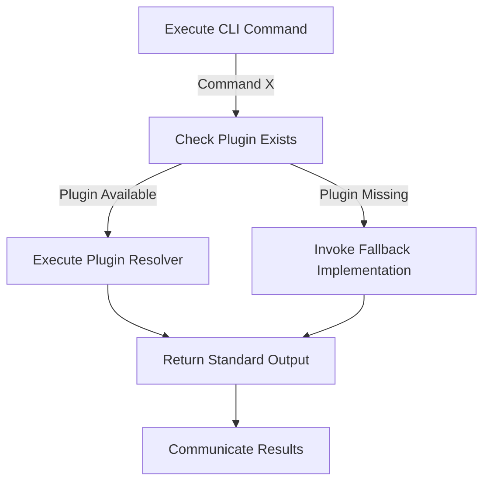

# **Distributed CLI System with Fallbacks**

## **1. Overview**

This document outlines the design of a **Distributed CLI System** equipped with pluggable modules that include *
*fallback implementations** in plain JavaScript. In this distributed design:

- Nodes may execute commands using plugins.
- In the absence of a required plugin, the system falls back to basic functionality using a JavaScript implementation.
- The system ensures **resiliency** and **interoperability** across nodes running different plugin configurations.

---

## **2. Design Goals**

1. **Distributed Compatibility**:  
   Ensure that individual nodes in the distributed system can process CLI commands even without access to certain
   plugins.

2. **Fallback Support**:  
   Every plugin must define a fallback implementation using **plain JavaScript** for graceful degradation when the
   plugin is unavailable.

3. **Resiliency**:  
   Prevent system-wide failures by enabling nodes to handle commands locally, regardless of dependency issues.

4. **Extensibility**:  
   Support seamless addition of new plugins without disrupting existing fallback behavior.

---

## **3. Architecture Overview**

### **3.1 System Components**

- **Global Schema (`global-schema.json`)**:  
  Defines all commands, plugins, and their fallback configurations.

- **Plugins**:  
  Plugins encapsulate advanced parsing and execution logic for specific commands using custom tools like `espree` or
  `chevrotain`.

- **Fallbacks**:  
  Plain JavaScript implementations that provide limited functionality of commands in the absence of a plugin.

- **Core CLI Engine (`cli-core.js`)**:  
  Acts as the command executor, routing commands to the appropriate plugin or fallback.

---

### **3.2 System Behavior**

1. **Normal Execution**:
    - When a command is executed, the system checks for the respective plugin.
    - If the plugin is available, it uses the plugin's resolver to execute the command.

2. **Fallback Execution**:
    - If the required plugin is unavailable, the system invokes the pre-defined fallback JavaScript implementation for
      the command.

3. **Interoperability**:
    - All outputs are standardized (e.g., using JSON format) to allow seamless communication between nodes despite local
      differences in plugin availability.

---

### **3.3 Schema Design**

The `global-schema.json` file defines:

1. **Plugins**:
   A list of all plugins, along with their resolvers and fallback implementations.

2. **Global Commands**:  
   Commands that are not plugin-specific.

3. **Execution Strategies**:  
   Defines how commands are executed and routed to plugins or fallbacks.

#### Example: `global-schema.json`

```json
{
  "name": "Distributed-CLI",
  "description": "A modular CLI with distributed fallback support",
  "plugins": [
    {
      "name": "jsonPlugin",
      "parser": "espree",
      "description": "Parses JSON-based CLI commands",
      "commands": {
        "parseJson": {
          "arguments": ["jsonData"],
          "resolver": "jsonPlugin.parse",
          "fallback": "fallbacks/jsonFallback.parse"
        }
      }
    },
    {
      "name": "customDSLPlugin",
      "parser": "chevrotain",
      "description": "Handles a custom DSL for advanced workflows",
      "commands": {
        "customCommand": {
          "arguments": ["arg1", "arg2"],
          "resolver": "customDSLPlugin.handleCommand",
          "fallback": "fallbacks/customDSLFallback.handleCommand"
        }
      }
    }
  ],
  "globalCommands": [
    {
      "verb": "add",
      "arguments": ["...nums"],
      "resolver": "global.addNumbers"
    },
    {
      "verb": "multiply",
      "arguments": ["a", "b"],
      "resolver": "global.multiplyNumbers"
    }
  ]
}
```

---

### **3.4 Plugins**

#### **Plugin Responsibilities**:

1. Provide complex command parsing and execution logic.
2. Extend the CLI with custom behavior beyond the generic functionality.
3. Include a fallback declaration in the schema.

---

### **3.5 Fallbacks**

#### **Why Fallbacks?**

- In distributed systems, nodes cannot always guarantee the availability of a plugin due to:
    - Environment constraints.
    - Missing dependencies.
    - Mismatched versions.

#### **Fallback Design:**

- Fallbacks are simple implementations written using **plain JavaScript** and rely only on the core functionality of the
  language.
- They act as a **backup mechanism** to ensure that commands are still executable.

---

## **4. Core CLI Pipeline**

The core CLI pipeline (`cli-core.js`) is responsible for:

1. **Command Routing**:  
   It checks for the availability of a plugin first, and if unavailable, executes the fallback version.

2. **Standardized Outputs**:  
   Ensures that commands, whether executed via plugin or fallback, return results in a consumable format.

3. **Distributed Interoperability**:
   When interacting with other nodes, CLI commands and responses adhere to a global standard.

#### Example: Execution Flow



---

## **5. Implementation Details**

### **5.1 CLI Command Execution**

```javascript
// Load Schema
const schema = require("./global-schema.json");

// Load Plugins and Fallbacks
const plugins = {};
const fallbacks = {};

for (const pluginConfig of schema.plugins) {
  try {
    // Attempt to load plugin
    const plugin = require(`./plugins/${pluginConfig.name}`);
    plugins[plugin.name] = plugin;
  } catch (err) {
    console.warn(`Plugin ${pluginConfig.name} not found. Using fallback.`);
  }

  try {
    // Load fallback
    const fallback = require(`./${pluginConfig.commands[Object.keys(pluginConfig.commands)[0]].fallback}`);
    fallbacks[pluginConfig.name] = fallback;
  } catch (err) {
    console.error(`Fallback for ${pluginConfig.name} not found.`);
    process.exit(1);
  }
}

// Unified CLI Executor
const executeCommand = (commandVerb, args) => {
  // Check for a plugin-specific resolver
  for (const plugin of Object.values(plugins)) {
    if (plugin.commands[commandVerb]) {
      return plugin.commands[commandVerb].resolver(...args);
    }
  }

  // Use fallback implementation
  for (const fallback of Object.values(fallbacks)) {
    if (fallback[commandVerb]) {
      console.warn(`Using fallback for ${commandVerb}`);
      return fallback[commandVerb](...args);
    }
  }

  throw new Error(`Command '${commandVerb}' not found.`);
};
```

---

### **5.2 Example Plugin**

#### `plugins/jsonPlugin.js`

```javascript
const espree = require("espree");

module.exports = {
  name: "jsonPlugin",
  parser: espree,
  commands: {
    parseJson: {
      resolver: (jsonString) => {
        try {
          const parsed = JSON.parse(jsonString);
          return parsed;
        } catch (err) {
          throw new Error("Invalid JSON!");
        }
      }
    }
  }
};
```

---

### **5.3 Example Fallback**

#### `fallbacks/jsonFallback.js`

```javascript
module.exports = {
  parse: (jsonString) => {
    try {
      return JSON.parse(jsonString);
    } catch (err) {
      return { error: "Invalid JSON string", details: err.message };
    }
  }
};
```

---

## **6. Standardized Output**

To ensure seamless communication between distributed nodes, all commands (plugin or fallback executions) produce
standardized outputs.

#### Example:

```json
{
  "status": "success",
  "result": { "key": "value" },
  "error": null
}
```

If an error occurs:

```json
{
  "status": "error",
  "result": null,
  "error": "Invalid JSON string"
}
```

---

## **7. Extensibility**

1. **Adding New Plugins**:
    - Write a new plugin implementation in the `plugins/` folder.
    - Implement a fallback in the `fallbacks/` folder.
    - Update `global-schema.json` to register the plugin and fallback.

2. **Dynamic Plugin Loading**:
    - Use runtime detection to selectively enable or disable plugins based on environment constraints.

---

## **8. Conclusion**

This design ensures scalability, resiliency, and distributed compatibility for CLI-based systems. By leveraging *
*fallbacks** as a backup mechanism, the system provides:

- Robust default behaviors.
- Better fault tolerance in diverse environments.
- Clear paths for extending functionality through plugins.

The distributed CLI system is ready to handle both resource-constrained nodes and advanced multi-node workflows!

---