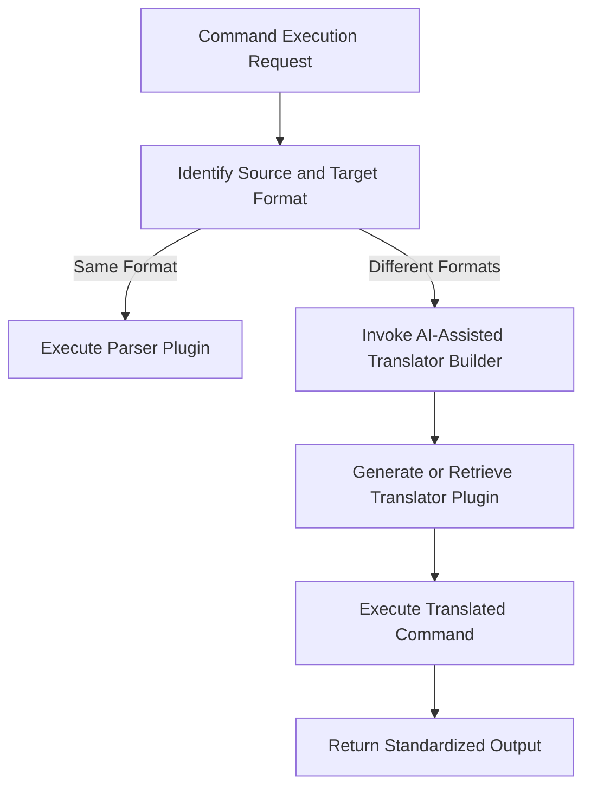

# **AI-Assisted Bridge Plugin Builder Design Document**

## **1. Overview**

The increasing complexity of distributed CLI systems, with diverse parsers and command formats, requires
interoperability. To address this challenge, we propose an **AI-Assisted Bridge Plugin Builder**, specifically designed
to:

1. Dynamically generate **translator plugins** between source and target formats.
2. Simplify development by automating repetitive translation patterns.
3. Fill gaps in format compatibility and promote a collaborative, community-driven tooling ecosystem.

This system leverages AI to analyze schema definitions, identify patterns, and generate bridge plugins (translator
plugins) dynamically or by request.

---

## **2. Goals and Benefits**

### **2.1 Core Goals**

1. **Automated Translator Generation**:
   Build AI-generated translator plugins for any combination of **sourceFormat** → **targetFormat**.

2. **Schema-Driven Automation**:
   Use metadata from a standardized `global-schema.json` to infer patterns and consistently generate effective code.

3. **Dynamic Extension Support**:
   Provide on-demand generation of new bridge plugins when nodes or command formats need to interoperate.

4. **Testing and Validation**:
   Verify generated translators through AI-generated test cases, simulating distributed node environments.

### **2.2 Benefits**

- **Interoperability**:  
  Ensure seamless communication between distributed CLI nodes with diverse plugin configurations.

- **Developer Productivity**:  
  Reduce manual effort when developing translators, especially for custom parsers or command languages.

- **Scalability**:  
  Support the growth of new parsers and formats without requiring extensive manual integration efforts.

- **Community Usability**:  
  Empower the community to contribute parsers while letting the AI handle translator development.

---

## **3. System Overview**

### **3.1 System Components**

1. **AI Core Engine**:
    - Leverages machine learning and predefined rules to analyze schemas and generate translator plugins.
    - Includes:
        - Code generators.
        - Syntax mapping logic.
        - Test case generation and validation mechanisms.

2. **Translation Manager**:
    - The orchestrator that interfaces between schemas, plugins, and the AI Core.
    - Handles requests for new translators and manages existing ones.

3. **Schema Definitions**:
    - `global-schema.json`: The source of truth containing:
        - Available parsers and their supported formats.
        - Translator metadata.
        - Syntax rules.
        - Input/output format definitions.

4. **Bridge Plugin Generator**:
    - Focused code generator for creating JavaScript-based translator plugins based on AI Core outputs.

5. **Testing Framework**:
    - Uses **AI-simulated commands** to validate generated translators.
    - Ensures command integrity across format translations.

---

### **3.2 Workflow Overview**



---

## **4. Design Details**

### **4.1 Translator Plugin Lifecycle**

#### **Step 1: Schema Analysis**

The tool reads `global-schema.json` to:

- Identify gaps in available translators.
- Discover compatible resolvers between sourceFormat and targetFormat.
- Collect metadata (e.g., command syntax, arguments, output structure).

#### Example: `global-schema.json`

```json
{
  "translators": [
    {
      "name": "jsonToDSLTranslator",
      "sourceFormat": "json",
      "targetFormat": "customDSL",
      "resolver": "translators.jsonToDSLTranslator.translate"
    }
  ],
  "parsers": [
    {
      "name": "jsonParser",
      "plugin": "espree",
      "format": "json"
    },
    {
      "name": "dslParser",
      "plugin": "chevrotain",
      "format": "customDSL"
    }
  ]
}
```

#### **Step 2: Translator Generation**

Based on the schema, the AI Core generates JavaScript code that:

- Parses input in the **sourceFormat** (e.g., JSON).
- Converts it to the equivalent structure in the **targetFormat** (e.g., DSL).

##### Example Generated Translator:

```javascript
module.exports = {
  translate: (jsonInput) => {
    try {
      const parsedJson = JSON.parse(jsonInput);
      if (parsedJson.command === "add") {
        return `add ${parsedJson.arg1} ${parsedJson.arg2}`;
      } else {
        throw new Error("Unsupported command for translation.");
      }
    } catch (err) {
      return { error: "Translation failed", details: err.message };
    }
  }
};
```

#### **Step 3: Validation and Testing**

AI generates test cases to verify translator functionality:

- Input: `{"command": "add", "arg1": 4, "arg2": 5}`
- Expected Output: `"add 4 5"`

Testing flow:

1. Simulate execution in sourceFormat and generate output.
2. Re-translate the output back into the sourceFormat.
3. Validate that the round-trip translation preserves command integrity.

---

### **4.2 Key System Modules**

#### **1. Schema Processor**

- Parses `global-schema.json` to extract:
    - Parser definitions.
    - Translator metadata (source/target formats, commands).

- Produces a structured mapping of available plugins and their relationships.

##### Example:

```javascript
const schemaProcessor = (schema) => {
  const translators = schema.translators;
  const parsers = schema.parsers.map((p) => p.format);
  return { translators, parsers };
};
```

---

#### **2. AI Core Engine**

- Powered by predefined rules and machine learning models.
- Predicts translation patterns:
    - Syntax tokenization.
    - Structural mapping (e.g., nested JSON → string commands).

##### Example:

**Custom AI Rule for Tokenizing DSL Commands**

```javascript
const tokenizeDSL = (dslInput) => {
  return dslInput.split(" ");
};

// Example Input: "add 2 3"
// Output: ["add", "2", "3"]
```

---

#### **3. Bridge Plugin Generator**

- Dynamically creates JavaScript modules for translator plugins.
- Populates functions like `translate()` based on AI mappings.

##### Example:

```javascript
const translatorTemplate = (sourceFormat, targetFormat, mappingLogic) => `
module.exports = {
  translate: (input) => {
    try {
      const parsedInput = parse${sourceFormat}(input);
      return build${targetFormat}Output(parsedInput);
    } catch (err) {
      return { error: "Translation failed", details: err.message };
    }
  }
};
`;
```

---

#### **4. Testing Framework**

- Runs both **functional tests** (e.g., input/output verification) and **integration tests** in distributed settings (
  multi-node environments).

---

## **5. Implementation Steps**

### **5.1 Development Phases**

1. **Phase 1: Schema Integration**
    - Define schema specification for parsers, commands, and translators.
    - Implement the schema processor.

2. **Phase 2: AI Core Engine**
    - Leverage pre-trained models (e.g., GPT-based) or hardcoded syntax rules for command translation.

3. **Phase 3: Code Generator**
    - Build the translator template system.
    - Integrate mappings from the AI Core.

4. **Phase 4: Validation Framework**
    - Implement validation tests, including round-trip translations and edge cases.

5. **Phase 5: Dynamic Environment Simulation**
    - Simulate multi-node environments for testing translator interoperability.

---

## **6. Future Enhancements**

1. **Real-Time Translator Suggestions**:
    - Allow nodes to broadcast missing parsers or translators and trigger AI-assisted plugin generation dynamically.

2. **Translator Marketplace**:
    - Enable community members to share AI-generated custom translators.

3. **Chained Translations**:
    - Support chained translators (e.g., JSON → DSL → XML) for complex workflows.

---

## **7. Conclusion**

The AI-Assisted Bridge Plugin Builder will:

- Reduce manual effort in creating translator plugins.
- Enable dynamic compatibility in distributed CLI environments.
- Foster a collaborative and scalable ecosystem for the community.

Its AI-driven approach ensures robust interoperability and adaptability, making it ideal for diverse, ever-expanding
distributed systems.