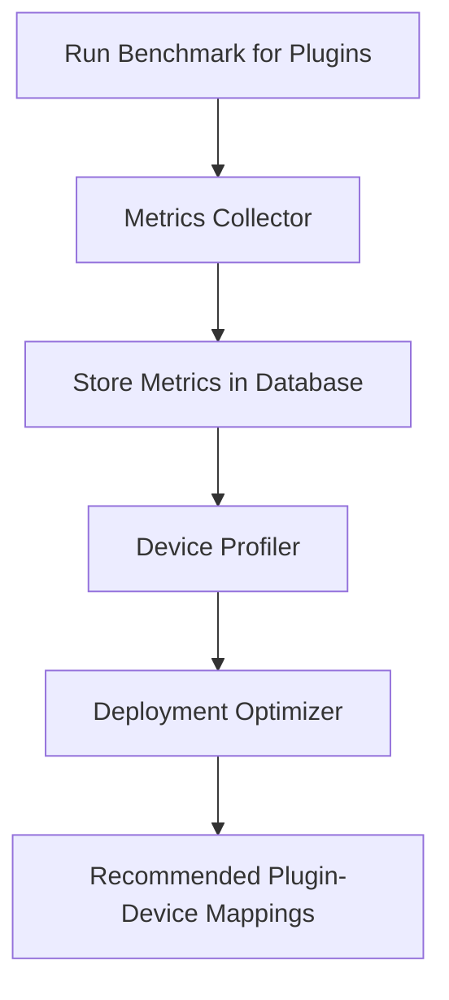

# **Plugin Benchmarking System Design Document**

## **1. Overview**

The **Plugin Benchmarking System** provides a mechanism to measure and evaluate the resource utilization and performance
of all plugins (parser and translator combinations) within the distributed CLI ecosystem. This allows you to
intelligently decide which plugin combinations to deploy on specific devices (e.g., phones or resource-constrained
devices).

---

## **2. Goals and Benefits**

### **2.1 Core Goals**

1. **Accurate Performance Metrics**:
    - Measure CPU usage, memory consumption, execution time, and initial footprint for each plugin or translator.

2. **Automated Compatibility Guidance**:
    - Recommend optimal plugin combinations for specific devices based on hardware resources and plugin benchmarks.

3. **Dynamic Scaling**:
    - Allow nodes to dynamically select plugins based on their resource constraints and runtime requirements.

4. **Continuous Testing**:
    - Integrate benchmarks with CI/CD pipelines to consistently evaluate performance with updates.

---

### **2.2 Benefits**

- **Optimal Resource Usage**:  
  Deploy efficient plugin combinations for devices with limited CPU, memory, or storage.

- **Improved User Experience**:  
  Faster execution and lower resource overhead translate to better performance, especially on low-end phones.

- **Scalability**:  
  As new plugins are added, benchmarks ensure smooth scaling without significant degradation in performance.

- **Automation-Driven Decisions**:  
  A data-driven approach eliminates guesswork when deciding which plugins to deploy on which nodes or devices.

---

## **3. Metrics Tracked**

### **3.1 Key Parameters Evaluated**

1. **CPU Utilization**:
    - Percentage of CPU used during plugin execution over a benchmark test.

2. **Memory Consumption**:
    - Amount of RAM used by the plugin:
        - **Peak memory** (during execution).
        - **Steady state memory** (after initialization).

3. **Execution Speed**:
    - Time taken to execute a command (in milliseconds or nanoseconds).

4. **Initial Footprint**:
    - Storage size and dependencies required to instantiate and deploy the plugin.

5. **Throughput**:
    - Number of commands processed per second:
        - Evaluates efficiency in high-load conditions.

---

## **4. Design Details**

### **4.1 Architecture**

To manage benchmarks, the system is composed of the following components:

1. **Benchmark Runner**:
    - Automates plugin testing in isolated environments to capture performance metrics.

2. **Metrics Collector**:
    - Collects data during benchmark execution:
        - Tracks CPU, memory, and speed in real-time.

3. **Device Profiler**:
    - Maintains a database of hardware profiles for different classes of devices (e.g., phones, tablets, PCs).
    - Examples:
        - **Low-end Phone**: 2GB RAM, quad-core CPU, 1.5 GHz.
        - **Mid-range Device**: 4GB RAM, octa-core CPU, 2.0 GHz.
        - **High-end Device**: 8GB RAM, octa-core CPU, 2.8 GHz.

4. **Performance Database**:
    - Stores benchmark scores of plugins and translator combinations.
    - Records mappings between hardware profiles and preferred plugin combos.

5. **Deployment Optimizer**:
    - Uses benchmark data and device profiles to suggest:
        - **Best-performing combo** for resource-intensive tasks.
        - **Fallback combos** for resource-constrained devices.

---

### **4.2 Workflow**



---

### **4.3 Workflow Steps**

1. **Benchmark Execution**:
    - Plugin combinations are executed in an isolated environment (e.g., Docker containers or simulators).
    - For each input and command, record:
        - Resource utilization.
        - Time taken to translate/execute commands.

2. **Metrics Collection**:
    - Collect performance data during and after execution.
    - Use system measurement libraries/tools, e.g.:
        - **CPU/Memory**: via `os` module or `process.memoryUsage()` (in Node.js).
        - **Execution Time**: `console.time()` and `performance.now()`.

3. **Result Storage**:
    - Store metrics in a centralized database alongside:
        - Plugin combination metadata (sourceFormat → targetFormat).
        - Input size and type (to account for variability).

4. **Device Profiling**:
    - Compare benchmark scores against known hardware profiles:
        - Filter scores based on CPU/RAM capabilities of the target devices.

5. **Recommendation Generation**:
    - Use stored metrics to prioritize plugins for specific devices or nodes:
        - High-performance hardware → Use fastest translators.
        - Low-resource devices → Use lightweight (low CPU/memory usage) translators.

---

## **5. Core Modules**

### **5.1 Benchmark Runner**

The **Benchmark Runner** tests plugins systematically using a predefined benchmark suite.

#### Example API:

```javascript
const os = require('os');
const performance = require('perf_hooks').performance;

// Tracks benchmark metrics
let metrics = {};

function runBenchmark(plugin, input) {
  // Measure initial memory usage
  const initialMemory = process.memoryUsage().heapUsed;

  // Start Execution Timer
  const startTime = performance.now();

  // Plugin execution
  try {
    plugin.translate(input); // Simulate plugin operation
  } catch (err) {
    console.error('Plugin failed:', err.message);
  }

  // End Execution Timer
  const endTime = performance.now();
  const executionTime = endTime - startTime;

  // Measure post-execution memory usage
  const finalMemory = process.memoryUsage().heapUsed;

  // Collect CPU usage (simple average over time)
  const cpuUsage = os.loadavg()[0];

  // Save metrics
  metrics = {
    executionTime, // In ms
    memoryUsage: finalMemory - initialMemory, // In bytes
    cpuUsage, // Avg CPU utilization
  };
  return metrics;
}
```

#### Outputs:

```json
{
  "executionTime": 45,        // ms
  "memoryUsage": 1048576,    // bytes (1 MB)
  "cpuUsage": 1.5            // Avg CPU load
}
```

---

### **5.2 Metrics Storage**

- Use a lightweight database (e.g., MongoDB, SQLite) to store benchmark scores persistently.
- Schema Example for Benchmarks:

```json
{
  "pluginCombination": "jsonToDSL",
  "cpuUsage": 1.7,
  "memoryUsage": 1048576,
  "executionTime": 35,
  "initialFootprint": 20000, // KB
  "environment": "Linux x64",
  "device": "Low-end Phone"
}
```

---

### **5.3 Device Profiler**

The **Device Profiler** creates and stores profiles for hardware devices.

#### Examples:

```json
{
  "deviceName": "Low-End Phone",
  "cpuCores": 4,
  "maxMemory": 2048,  // MB
  "cpuSpeed": 1.5     // GHz
}
```

---

### **5.4 Deployment Optimizer**

The optimizer uses benchmarks and device profiles to:

- Rank plugin combinations by efficiency for a given device class.
- Recommend fallback options based on performance degradation limits.

---

## **6. Implementation Steps**

### **6.1 Phase 1: Core Benchmark Runner**

- Develop plugin execution and performance measurement features using Node.js `os` and `performance` APIs.

### **6.2 Phase 2: Metrics Database**

- Set up a database to reliably store benchmark results for long-term analysis.

### **6.3 Phase 3: Device Profiler**

- Collect data on target hardware classes.

### **6.4 Phase 4: Recommendation System**

- Build logic to suggest plugin combos for specific devices.

---

## **7. Enhancements**

1. **Dynamic Benchmarking**:  
   Allow nodes to conduct real-time benchmarking on their local setup.

2. **Distributed Metrics Collection**:  
   Synchronize benchmarks from various nodes to create global average scores.

3. **Multi-Scenario Testing**:  
   Test with variable input sizes and edge cases (e.g., malformed commands).

4. **Graphical Reporting**:  
   Build a reporting dashboard to visualize plugin performance across devices.

---

## **8. Conclusion**

This **Plugin Benchmarking System** ensures that the distributed CLI ecosystem operates optimally across a wide range of
devices by dynamically selecting efficient plugins. It promotes scalability, resource efficiency, and superior user
experience through a data-driven approach.