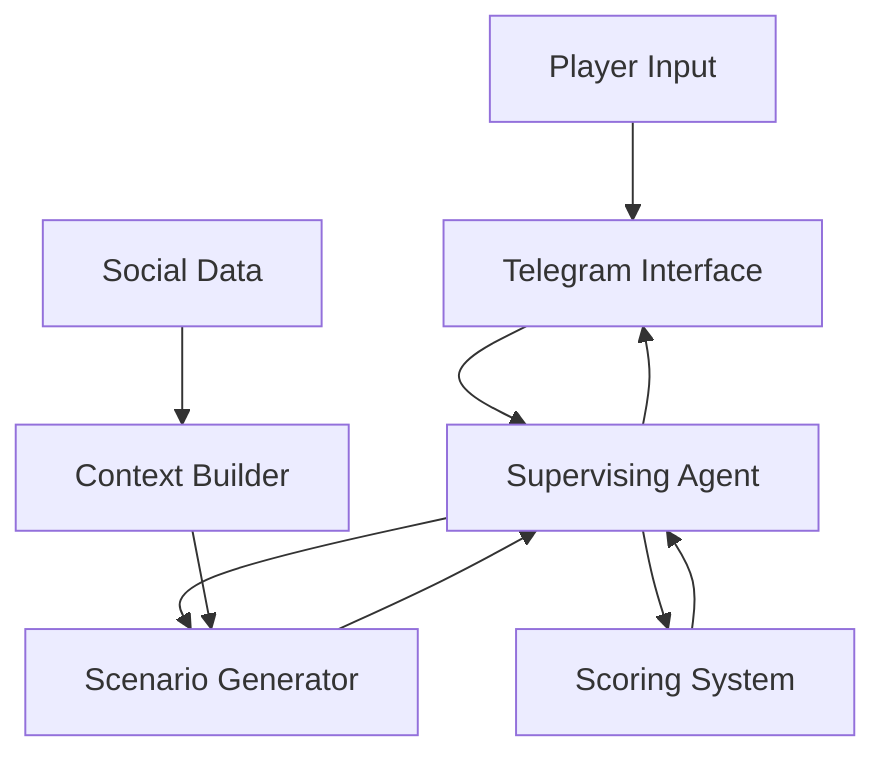

# Ethical Development Game System Design Documentation

## 1. Vision & Objectives

### 1.1 Core Vision
Create an AI-driven personal development system that helps individuals improve their decision-making and ethical reasoning through personalized, context-aware scenarios and feedback.

### 1.2 Key Objectives
- Help players develop better personal strategies for real-life situations
- Create meaningful connections between individual actions and community impact
- Provide objective scoring of ethical decision-making
- Foster understanding of how personal choices affect broader social dynamics
- Enable experimentation with different approaches in a safe environment

### 1.3 Target Outcomes
- Improved decision-making capabilities in players
- Better understanding of community dynamics
- Developed ethical reasoning skills
- Practical strategy development for real-life situations
- Measurable personal growth through scoring metrics

## 2. System Architecture

### 2.1 Core Components
1. **Supervising AI Agent**
   - Orchestrates game flow
   - Generates scenarios
   - Provides scoring and feedback
   - Manages player interaction
   - Handles questions and complaints

2. **Data Collection System**
   - Social media integration
   - Context analysis
   - Privacy protection
   - Data structuring

3. **Scenario Generation Engine**
   - Context-aware scenario creation
   - Difficulty scaling
   - Stakeholder mapping
   - Consequence modeling

4. **Scoring System**
   - Multi-dimensional evaluation
   - Progress tracking
   - Bonus calculation
   - Feedback generation

5. **Interaction Interface**
   - Telegram-based communication
   - Natural language processing
   - Response generation
   - Context maintenance

### 2.2 Data Flow


## 3. Implementation Strategy

### 3.1 Phase 1: Foundation
1. Basic Telegram interface setup
2. Core supervising agent implementation
3. Simple scenario generation
4. Basic scoring system
5. Initial feedback mechanisms

### 3.2 Phase 2: Enhancement
1. Social media integration
2. Advanced scenario generation
3. Refined scoring metrics
4. Improved feedback systems
5. Context analysis capabilities

### 3.3 Phase 3: Advanced Features
1. Community impact simulation
2. Complex scenario chains
3. Advanced ethical metrics
4. Personalized learning paths
5. Governance system modeling

## 4. Ethical Framework

### 4.1 Core Principles
1. **Respect for Autonomy**
   - Player agency
   - Informed consent
   - Choice significance

2. **Transparency**
   - Clear scoring criteria
   - Explicit feedback
   - Understandable mechanics

3. **Privacy Protection**
   - Data minimization
   - Secure storage
   - Controlled access

4. **Fairness**
   - Objective scoring
   - Equal opportunity
   - Balanced scenarios

### 4.2 Scoring Dimensions
1. **Openness**
   - Communication clarity
   - Information sharing
   - Transparency level

2. **Respect**
   - Stakeholder consideration
   - Cultural awareness
   - Power dynamics

3. **Accountability**
   - Responsibility taking
   - Consequence awareness
   - Follow-through

4. **Practice**
   - Implementation viability
   - Resource consideration
   - Practical constraints

5. **Validation**
   - Verifiability
   - Trust building
   - Evidence basis

6. **Outcomes**
   - Impact assessment
   - Long-term effects
   - Community benefit

## 5. Technical Specifications

### 5.1 Telegram Interface
```python
class TelegramInterface:
    - Message handling
    - Response formatting
    - Context maintenance
    - State management
```

### 5.2 Scenario Generation
```python
class ScenarioGenerator:
    - Context analysis
    - Difficulty scaling
    - Stakeholder mapping
    - Outcome modeling
```

### 5.3 Scoring System
```python
class ScoringSystem:
    - Multi-dimensional evaluation
    - Progress tracking
    - Feedback generation
    - Bonus calculation
```

## 6. User Experience Design

### 6.1 Interaction Flow
1. Initial Contact
   - System introduction
   - Consent gathering
   - Context collection

2. Regular Interaction
   - Scenario presentation
   - Response collection
   - Feedback provision
   - Score explanation

3. Progress Review
   - Growth tracking
   - Strategy assessment
   - Improvement suggestions

### 6.2 Communication Guidelines
1. Clear and concise messaging
2. Constructive feedback
3. Encouraging tone
4. Educational focus
5. Ethical guidance

## 7. Privacy and Security

### 7.1 Data Protection
1. Minimal data collection
2. Secure storage
3. Access control
4. Regular auditing

### 7.2 User Rights
1. Data access
2. Deletion requests
3. Privacy controls
4. Transparency

## 8. Evaluation and Metrics

### 8.1 Success Metrics
1. Player engagement
2. Score improvement
3. Strategy development
4. Feedback quality
5. Learning outcomes

### 8.2 System Performance
1. Response time
2. Scenario quality
3. Scoring accuracy
4. Feedback relevance

## 9. Governance Profiles and Strategy Builder

### 9.1 Governance Profiles
1. **Base Profile Types**
   - Democratic Leader
     * Consensus-driven
     * Transparency focused
     * Regular feedback loops
   
   - Technocratic Leader
     * Data-driven decisions
     * Expert consultation
     * Efficiency optimization
   
   - Moral Authority
     * Values-based leadership
     * Cultural preservation
     * Community focus
   
   - Progressive Reformer
     * Innovation focus
     * Change management
     * Future orientation

2. **Profile Components**
   - Decision Making Style
     * Consultative
     * Directive
     * Collaborative
     * Analytical
   
   - Communication Approach
     * Open and transparent
     * Strategic and controlled
     * Inspirational
     * Fact-based
   
   - Resource Allocation
     * Egalitarian
     * Merit-based
     * Need-based
     * Investment-focused
   
   - Conflict Resolution
     * Mediation
     * Rule-based
     * Consensus-building
     * Power balancing

### 9.2 Strategy Builder System
1. **Component Selection**
   - Mix and match governance components
   - Weight different approaches
   - Set priority levels
   - Define red lines

2. **Strategy Scoring**
   - Internal consistency check
   - Historical success patterns
   - Community fit analysis
   - Implementation viability

3. **World Impact Simulation**
   - Scale-up effects
   - System dynamics
   - Feedback loops
   - Unintended consequences

4. **Strategy Guidance**
   - Real-time alignment checking
   - Course correction suggestions
   - Progress tracking
   - Impact visualization

## 10. Future Development

### 9.1 Planned Features
1. VR integration
2. Advanced simulations
3. Community connections
4. Governance modeling
5. Global impact analysis

### 9.2 Research Areas
1. Ethical metrics refinement
2. Cultural dynamics modeling
3. Community impact assessment
4. Decision-making patterns
5. Learning optimization

## 10. Appendices

### A. Glossary
- Key terms and definitions
- Technical concepts
- Ethical principles

### B. References
- Cultural dynamics theory
- Ethical frameworks
- Technical standards
- Research papers

### C. Change Log
- Version history
- Major updates
- System changes
- Feature additions
