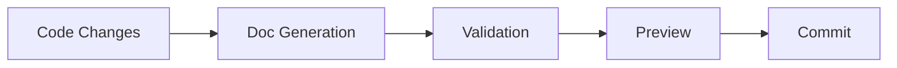
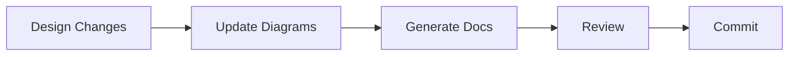

# SpiceTime Documentation Guide

## Documentation Tools Overview

### Code Documentation
1. TypeDoc
   - Generates API documentation from TypeScript code
   - Outputs to `docs/.generated/api`
   - Integration with Markdown and Mermaid diagrams
   ```bash
   npm run docs:generate:api
   ```

2. GraphQL Documentation
   - Generates schema documentation
   - Interactive GraphQL playground
   - Type definitions and resolvers documentation
   ```bash
   npm run docs:generate:graphql
   ```

3. OpenAPI/Swagger Documentation
   - ReDoc for REST API documentation
   - Interactive API testing
   - Request/response examples
   ```bash
   npm run docs:generate:openapi
   ```

### Architecture Documentation
1. C4 Builder
   - System context diagrams
   - Container diagrams
   - Component diagrams
   - Code diagrams
   ```bash
   npm run docs:generate:diagrams
   ```

2. Mermaid
   - Sequence diagrams
   - Flow charts
   - State diagrams
   - Class diagrams
   ```markdown
   ```mermaid
   sequenceDiagram
   ```
   ```

### Quality Assurance
1. Markdown Linting
   - Style consistency
   - Link validation
   - Structure validation
   ```bash
   npm run docs:validate:markdown
   ```

2. Documentation Coverage
   - API documentation coverage
   - Test coverage reports
   - Missing documentation alerts
   ```bash
   npm run docs:validate:coverage
   ```

## Workflows

### 1. Development Documentation Flow


1. Write Code with Documentation
   ```typescript
   /**
    * @description Service for managing user authentication
    */
   export class AuthService {
     /**
      * Authenticates a user
      * @param credentials User credentials
      * @returns Authentication token
      */
     async authenticate(credentials: Credentials): Promise<Token>
   }
   ```

2. Generate Documentation
   ```bash
   npm run docs:generate
   ```

3. Validate Documentation
   ```bash
   npm run docs:validate
   ```

4. Preview Changes
   ```bash
   npm run docs:dev
   ```

### 2. Architecture Documentation Flow


1. Update Architecture Diagrams
   ```bash
   # Update C4 diagrams in docs/architecture/diagrams
   npm run docs:generate:diagrams
   ```

2. Update Architecture Decision Records (ADRs)
   ```markdown
   # ADR-001: Using GraphQL for API Layer
   
   ## Context
   We need a flexible API layer that supports complex data requirements.
   
   ## Decision
   We will use GraphQL as our primary API technology.
   
   ## Consequences
   Improved flexibility but increased initial setup complexity.
   ```

### 3. Release Documentation Flow


1. Pre-release Documentation Update
   ```bash
   npm run docs:generate
   npm run docs:validate
   ```

2. Version Documentation
   ```bash
   # Updates version references in docs
   npm run docs:version
   ```

3. Deploy Documentation
   ```bash
   npm run docs:build
   npm run docs:deploy
   ```

### 4. Continuous Integration Flow

1. GitHub Actions Integration
   ```yaml
   # .github/workflows/documentation.yml
   on:
     push:
       branches: [ main ]
       paths:
         - 'src/**'
         - 'docs/**'
         - 'schema.graphql'
   ```

2. Automated Validation
   ```bash
   # Runs in CI pipeline
   npm run docs:validate
   npm run docs:test
   ```

3. Documentation Website Deployment
   ```bash
   # Automated on main branch
   npm run docs:build
   npm run docs:deploy
   ```

## Best Practices

1. Code Documentation
   - Document public APIs
   - Include examples
   - Explain complex logic
   - Keep documentation close to code

2. Architecture Documentation
   - Use C4 model hierarchy
   - Keep diagrams focused
   - Document decisions (ADRs)
   - Update diagrams with code

3. Maintenance
   - Regular documentation reviews
   - Automated validation
   - Version documentation with code
   - Monitor documentation coverage

4. Organization
   - Follow standard structure
   - Cross-reference related docs
   - Keep navigation logical
   - Use consistent formatting

## Project Structure
```
spicetime-architecture/
├── docs/
│   ├── .generated/     # Generated documentation
│   ├── architecture/   # Architecture documentation
│   ├── api/           # API documentation
│   └── development/   # Development guides
├── .docs/             # Documentation tooling
└── website/          # Documentation site
```

## Common Commands

```bash
# Generate all documentation
npm run docs:generate

# Validate documentation
npm run docs:validate

# Start documentation development server
npm run docs:dev

# Build and deploy documentation
npm run docs:build
npm run docs:deploy

# Check documentation coverage
npm run docs:coverage
```
