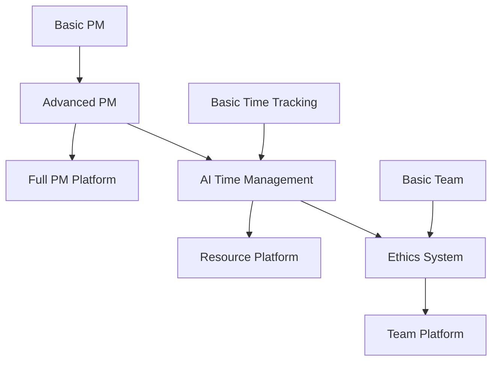

# SpiceTime Project Roadmap Collection

## Project Structure
This document organizes the roadmaps and future projects discussed in our planning session.

## Core Projects

### 1. PM Architecture Project
**Purpose**: Design and implement comprehensive PM system
- GitHub-based history tracking
- NextCloud integration
- Advanced CLI development
- Custom database infrastructure
[Details in spicetime-pm/ directory]

### 2. AI Services Project
**Purpose**: Intelligent service layer
- Time tracking intelligence
- Team formation optimization
- Ethics and mentorship
[Details in spicetime-ai/ directory]

### 3. Infrastructure Project
**Purpose**: Core technical foundation
- Event bus system
- Database infrastructure
- Service integration
[Details in spicetime-architecture/infrastructure/]

## Development Streams

### Stream 1: Project Management
1. Basic PM Service (Current)
   - NextCloud integration
   - Simple project tracking
   - Basic team management

2. Advanced PM Features
   - GitHub integration
   - Complex workflows
   - Advanced CLI

3. Full PM Platform
   - Custom database infrastructure
   - Advanced features
   - Complete ecosystem integration

### Stream 2: Time and Resource Management
1. Job Tracking
   - Basic job numbers
   - Simple time tracking
   - Basic allocation

2. AI-Driven Time Management
   - Automatic tracking
   - Smart allocation
   - Context awareness

3. Complete Resource Platform
   - Multi-project optimization
   - Resource prediction
   - Advanced analytics

### Stream 3: Team and Ethics
1. Basic Team Management
   - Role assignment
   - Simple tracking
   - Basic profiles

2. Ethics Rating System
   - Rating framework
   - Mentorship system
   - Performance tracking

3. Advanced Team Platform
   - Team optimization
   - Advanced mentorship
   - Complete ethics system

## Project Dependencies

## Timeline Overview
1. Current Phase (3-4 months)
   - Basic PM implementation
   - Infrastructure setup
   - Initial CLI

2. Medium Term (6-8 months)
   - PM architecture project
   - Time tracking AI
   - Advanced features

3. Long Term (12+ months)
   - Complete ecosystem
   - Advanced AI features
   - Full platform integration

## Chat Organization
Future development will be organized into these main chat streams:

1. PM Architecture Chat
   - System design
   - Integration patterns
   - Implementation details

2. AI Services Chat
   - Time tracking AI
   - Team optimization
   - Ethics system

3. Infrastructure Chat
   - Database design
   - Event system
   - Integration protocols

4. CLI Development Chat
   - Command design
   - User experience
   - Integration patterns

## Next Steps
1. Complete basic PM service
2. Begin PM architecture project
3. Plan AI services development
4. Design infrastructure components

## Success Metrics
1. Technical
   - System performance
   - Integration reliability
   - Code quality
   - Test coverage

2. User Experience
   - CLI usability
   - Workflow efficiency
   - Documentation quality
   - Support effectiveness

3. Business
   - Development velocity
   - Resource utilization
   - Team satisfaction
   - System adoption