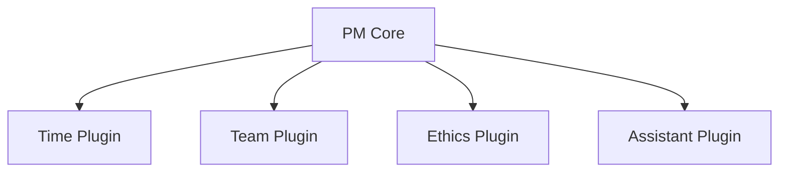
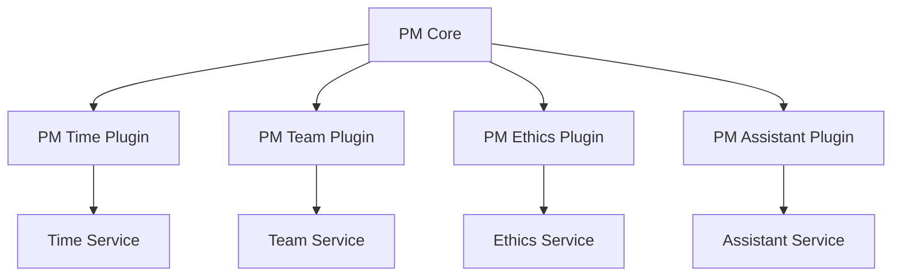

# SpiceTime PM Project Structure

## Project Organization
```
spicetime-pm/
├── core/                          # PM Core Service
│   ├── src/
│   │   ├── domain/               # Core PM domain logic
│   │   ├── infrastructure/       # Storage and external services
│   │   ├── plugins/              # Plugin system
│   │   └── api/                  # GraphQL API
│   └── docs/
│
├── cli/                          # PM CLI Tool
│   ├── src/
│   └── docs/
│
├── plugins/                      # PM-Specific Plugin Implementations
│   ├── time-tracking/           # Time tracking for PM needs
│   ├── team-management/         # Team management for PM
│   ├── ethics/                  # Basic ethics tracking
│   └── assistants/              # PM-specific AI assistants
│
└── infrastructure/              # PM Infrastructure
    ├── nextcloud/              # NextCloud integration
    ├── github/                 # GitHub integration
    └── databases/              # PM-specific data stores

# Future Generalizations (will move to spicetime-architecture)
spicetime-architecture/
├── packages/
│   ├── services/
│   │   ├── time-tracking/      # Generalized from PM plugin
│   │   ├── team-formation/     # Generalized from PM plugin
│   │   ├── ethics-rating/      # Generalized from PM plugin
│   │   └── assistant/          # Generalized AI capabilities
│   └── ...
```

## Plugin Development Strategy

### 1. PM-First Development
- Develop plugins within PM scope
- Focus on PM-specific needs
- Keep interfaces simple
- Enable future extraction

### 2. Plugin Categories

#### Time Tracking Plugin
- Initial: Basic time tracking for PM
- Future: Extract to general time tracking service
- Integration: Keep PM-specific adapters

#### Team Management Plugin
- Initial: Basic team tracking for PM
- Future: Extract to team formation service
- Integration: PM-specific team features

#### Ethics Plugin
- Initial: Basic role requirements
- Future: Extract to ethics service
- Integration: PM-specific ethics checks

#### Assistant Plugins
- Initial: PM-specific AI helpers
- Future: General AI capabilities
- Integration: PM-specific assistants

### 3. Generalization Process
1. Develop within PM scope
2. Identify general patterns
3. Extract to upper scope
4. Create PM plugins using extracted services

## Integration Strategy

### Current Phase (PM-Scoped)


### Future Phase (Generalized)


## Development Phases

### Phase 1: PM Infrastructure
1. Core PM service
2. Basic plugin system
3. NextCloud integration
4. Simple CLI

### Phase 2: PM Plugins
1. Basic time tracking
2. Simple team management
3. Role requirements
4. PM assistants

### Phase 3: Generalization
1. Extract common patterns
2. Create general services
3. Convert to PM plugins
4. Maintain PM specifics

## Success Criteria
1. Plugin Independence
   - Clear interfaces
   - Minimal dependencies
   - Easy extraction
   - Simple updates

2. PM Functionality
   - Complete PM features
   - Performance metrics
   - User experience
   - Reliability

3. Future Readiness
   - Clean abstractions
   - Clear boundaries
   - Documented interfaces
   - Migration paths