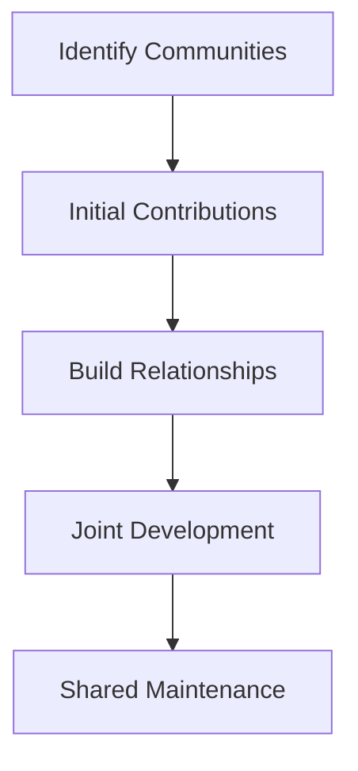

# SpiceTime Ecosystem Integration Strategy

## Strategic Objectives

### 1. Leverage Existing Work
- Minimize reinvention
- Build on proven solutions
- Contribute back to ecosystem
- Create win-win collaborations

### 2. Find Collaboration Points
- Identify strategic partners
- Build community relationships
- Share development efforts
- Create shared value

### 3. Maintain Focus
- Keep PM as driving force
- Ensure clean integration
- Preserve architectural vision
- Control complexity

## Priority Integrations

### Phase 1: Core Infrastructure
1. **Temporal.io Integration**
   - Workflow durability
   - State persistence
   - Error handling
   - Action scheduling

2. **IPFS/OrbitDB**
   - Distributed storage
   - State management
   - Content addressing
   - Data persistence

3. **Matrix Protocol**
   - Real-time updates
   - Team communication
   - State synchronization
   - Event distribution

### Phase 2: Tool Integration
1. **Development Tools**
   - GitHub integration
   - IDE plugins
   - CI/CD systems
   - Monitoring tools

2. **Team Tools**
   - NextCloud integration
   - Communication platforms
   - Documentation systems
   - Knowledge bases

### Phase 3: Method Integration
1. **Project Methods**
   - Agile frameworks
   - Kanban systems
   - Resource planning
   - Time tracking

## Collaboration Strategy

### 1. Community Engagement

### 2. Development Approach
- Start with small contributions
- Build credibility
- Share our vision
- Create shared roadmaps

### 3. Value Exchange
- Contribute improvements
- Share development effort
- Provide integration examples
- Build shared tools

## Integration Priorities

### Immediate Focus (3 months)
1. **Temporal Core**
   - Basic workflow integration
   - State persistence patterns
   - Error handling framework
   - Development relationship

2. **IPFS Foundation**
   - Storage integration
   - OrbitDB experimentation
   - Community engagement
   - Tool development

3. **Matrix Ecosystem**
   - Basic protocol integration
   - State sync patterns
   - Community connections
   - Proof of concepts

### Medium Term (6 months)
1. **Tool Ecosystem**
   - GitHub apps/actions
   - IDE extensions
   - CLI tools
   - Development utilities

2. **Team Tools**
   - NextCloud apps
   - Communication bridges
   - Documentation tools
   - Knowledge sharing

### Long Term (12 months)
1. **Method Integration**
   - Agile frameworks
   - Resource systems
   - Planning tools
   - Analytics platforms

## Collaboration Process

### 1. Initial Engagement
- Study project governance
- Understand contribution process
- Start with documentation
- Fix small issues

### 2. Relationship Building
- Regular contributions
- Community participation
- Knowledge sharing
- Tool development

### 3. Strategic Partnership
- Joint development
- Shared roadmaps
- Resource sharing
- Combined efforts

## Success Metrics

### Technical
- Integration quality
- Performance impact
- Maintenance effort
- Error rates

### Community
- Contribution acceptance
- Relationship strength
- Community feedback
- Shared development

### Business
- Development velocity
- Resource efficiency
- Feature leverage
- Maintenance cost

## Risk Management

### Technical Risks
- Integration complexity
- Version compatibility
- Performance impact
- Security concerns

### Community Risks
- Mission alignment
- Contribution acceptance
- Relationship management
- Resource competition

### Mitigation Strategies
1. Start small
2. Build trust
3. Prove value
4. Share goals
5. Clear boundaries
6. Regular communication

## Next Steps

### Immediate Actions
1. Start Temporal integration
   - Basic workflows
   - State patterns
   - Community contact

2. IPFS prototyping
   - Storage patterns
   - OrbitDB testing
   - Tool development

3. Matrix exploration
   - Protocol testing
   - Sync patterns
   - Community engagement

### Documentation Needs
1. Integration patterns
2. Contribution guides
3. Development docs
4. Roadmap sharing

### Team Preparation
1. Community guidelines
2. Contribution process
3. Communication channels
4. Development standards