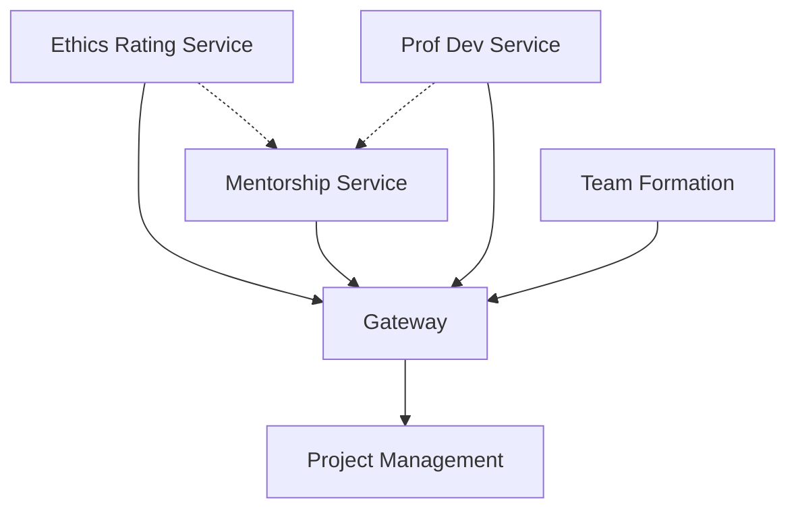

# SpiceTime Ethics and Mentorship Services Roadmap

## Overview
Extension to the core SpiceTime roadmap focusing on ethics rating, mentorship, and professional development services.

## New Core Services

### 1. Ethics Rating Service
- **Purpose**: Maintain continuous ethics ratings for team members
- **Core Components**:
  - Ethics assessment engine
  - Rating history tracking
  - Privacy management system
  - Rating categories management
  - Organizational values weighting system

**Key Features**:
- Three primary axes: Openness, Respect, Accountability
- Privacy-first design with configurable exposure
- Historical tracking with explanation
- Integration with mentorship systems
- Dynamic performance thresholds

### 2. Professional Development Service
- **Purpose**: Track and manage professional growth
- **Components**:
  - Skill level tracking (novice, jr, jr+, senior)
  - Skill decay monitoring
  - Role requirement definitions
  - Performance analytics

### 3. Mentorship Service
- **Purpose**: Facilitate AI and human mentorship
- **Components**:
  - Mentor matching system
  - Progress tracking
  - AI mentorship integration
  - Resource recommendation engine
  - Mentorship session scheduling

### 4. Team Formation Service
- **Purpose**: Optimize team composition based on ethics and skills
- **Components**:
  - Role-based team assembly
  - Ethics-weighted member selection
  - Team balance optimization
  - Priority standing calculation

## Integration Points

### Project Management Service
- Role assignment suggestions based on ethics ratings
- Team composition optimization
- Performance threshold verification
- Mentorship integration for project roles

### Gateway Service
- Ethics privacy management
- Cross-service authorization
- Rating aggregation and exposure control

## Development Phases

### Phase 1: Foundation
1. Ethics Rating Service core implementation
2. Basic mentorship system
3. Integration with existing PM service

### Phase 2: Professional Development
1. Skill tracking implementation
2. Performance threshold system
3. Dynamic skill decay monitoring

### Phase 3: Advanced Mentorship
1. AI mentorship integration
2. Volunteer mentor platform
3. Resource recommendation system

### Phase 4: Team Optimization
1. Team formation algorithms
2. Ethics-based priority system
3. Advanced analytics and reporting

## Technical Considerations

### Data Privacy
- Ethical ratings require strict access control
- Configurable exposure levels
- Audit trails for rating changes
- Secure storage for mentorship records

### Service Architecture
- Event-driven updates for continuous rating
- Caching for frequently accessed thresholds
- Distributed mentorship session management
- Real-time team optimization calculations

### Integration Architecture

## Immediate Next Steps
1. Ethics Rating Service specification
2. Privacy management system design
3. Integration points documentation
4. Initial mentorship system prototype

## Success Metrics
- Ethics rating accuracy and consistency
- Mentorship effectiveness
- Team performance improvement
- Service response times
- Privacy compliance
- User satisfaction (both mentors and mentees)

## Risk Management
- Privacy breach prevention
- Rating system fairness
- Mentor availability
- System gaming prevention
- Performance impact monitoring
