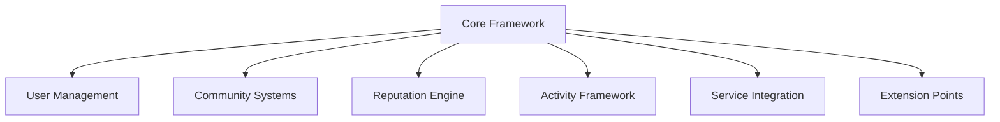

# DiAI Club Framework: Modular Community Architecture

## Abstract

This paper presents a modular club framework designed to support various domain-specific implementations. The
architecture provides core community features, user management, reputation systems, and AI service integration points
while maintaining flexibility for domain-specific extensions.

## 1. Core Architecture

### 1.1 Framework Components



### 1.2 Component Interfaces

```typescript
// Core framework interface
interface ClubFramework {
    userSystem: UserManagement;
    communitySystem: CommunityManagement;
    reputationEngine: ReputationSystem;
    activityFramework: ActivitySystem;
    serviceIntegration: ServiceConnector;
    extensionPoints: ExtensionRegistry;
}

// User management system
interface UserManagement {
    profiles: ProfileSystem;
    authentication: AuthSystem;
    permissions: PermissionSystem;
    preferences: PreferenceManager;
}

// Community management
interface CommunityManagement {
    groups: GroupSystem;
    communication: CommunicationSystem;
    content: ContentManager;
    moderation: ModerationSystem;
}
```

## 2. Extension System

### 2.1 Plugin Architecture

```typescript
interface PluginSystem {
    // Plugin registration
    registerPlugin(plugin: Plugin): void;
    
    // Extension point hooks
    addExtensionPoint(point: ExtensionPoint): void;
    
    // Domain-specific features
    enableFeatures(domain: string): Promise<Feature[]>;
}

interface Plugin {
    id: string;
    domain: string;
    features: Feature[];
    dependencies: Dependency[];
}
```

### 2.2 Integration Points

```typescript
interface IntegrationPoints {
    // AI service hooks
    aiServiceConnector: AIConnector;
    
    // Domain-specific extensions
    domainExtensions: DomainRegistry;
    
    // Custom features
    featureRegistry: FeatureRegistry;
}
```

## 3. User Management

### 3.1 Profile System

```typescript
interface ProfileSystem {
    // Basic profile
    profile: {
        basic: BasicProfile;
        preferences: UserPreferences;
        settings: UserSettings;
    };
    
    // Domain-specific extensions
    domainProfiles: Map<string, DomainProfile>;
    
    // Reputation and history
    reputation: ReputationData;
    history: ActivityHistory;
}
```

### 3.2 Permission System

```typescript
interface PermissionSystem {
    // Role-based access
    roles: RoleManager;
    
    // Feature access
    featureAccess: FeatureAccessManager;
    
    // Domain-specific permissions
    domainPermissions: DomainPermissionManager;
}
```

## 4. Community Features

### 4.1 Group Management

```typescript
interface GroupSystem {
    // Group creation and management
    createGroup(config: GroupConfig): Promise<Group>;
    manageMembers(groupId: string): MemberManager;
    
    // Activity tracking
    trackActivity(groupId: string): ActivityTracker;
    
    // Content management
    manageContent(groupId: string): ContentManager;
}
```

### 4.2 Communication System

```typescript
interface CommunicationSystem {
    // Messaging
    directMessages: MessageSystem;
    groupMessages: GroupMessageSystem;
    
    // Notifications
    notifications: NotificationSystem;
    
    // Content sharing
    contentSharing: SharingSystem;
}
```

## 5. Reputation Engine

### 5.1 Scoring System

```typescript
interface ReputationSystem {
    // Base reputation
    baseScore: BaseScoreCalculator;
    
    // Domain-specific scores
    domainScores: DomainScoreManager;
    
    // Activity impact
    activityImpact: ActivityScoreCalculator;
}
```

### 5.2 Achievement System

```typescript
interface AchievementSystem {
    // Achievement tracking
    trackAchievements(userId: string): AchievementTracker;
    
    // Rewards
    manageRewards(userId: string): RewardManager;
    
    // Progress tracking
    trackProgress(userId: string): ProgressTracker;
}
```

## 6. Activity Framework

### 6.1 Activity Types

```typescript
interface ActivitySystem {
    // Basic activities
    basicActivities: BasicActivityManager;
    
    // Custom activities
    customActivities: CustomActivityRegistry;
    
    // Activity tracking
    tracking: ActivityTracker;
}
```

### 6.2 Reward System

```typescript
interface RewardSystem {
    // Point system
    points: PointManager;
    
    // Achievements
    achievements: AchievementManager;
    
    // Custom rewards
    customRewards: CustomRewardManager;
}
```

## 7. Service Integration

### 7.1 AI Service Connector

```typescript
interface AIConnector {
    // Service registration
    registerService(service: AIService): void;
    
    // Usage tracking
    trackUsage(serviceId: string): UsageTracker;
    
    // Billing integration
    manageBilling(serviceId: string): BillingManager;
}
```

### 7.2 External Services

```typescript
interface ExternalServices {
    // Payment processing
    payments: PaymentProcessor;
    
    // Storage services
    storage: StorageManager;
    
    // Analytics
    analytics: AnalyticsSystem;
}
```

## 8. Mobile Implementation

### 8.1 App Architecture

```typescript
interface AppArchitecture {
    // Core features
    core: CoreFeatures;
    
    // UI components
    ui: UIComponents;
    
    // State management
    state: StateManager;
}
```

### 8.2 UI Components

```typescript
interface UIComponents {
    // Basic components
    basic: BasicComponents;
    
    // Custom components
    custom: CustomComponentRegistry;
    
    // Theme system
    theme: ThemeManager;
}
```

## 9. Security Framework

### 9.1 Authentication

```typescript
interface AuthSystem {
    // User authentication
    auth: AuthenticationManager;
    
    // Session management
    sessions: SessionManager;
    
    // Security policies
    policies: SecurityPolicyManager;
}
```

### 9.2 Data Protection

```typescript
interface DataProtection {
    // Encryption
    encryption: EncryptionManager;
    
    // Access control
    access: AccessControlManager;
    
    // Privacy settings
    privacy: PrivacyManager;
}
```

## 10. Implementation Guide

### 10.1 Basic Setup

```typescript
// Framework initialization
const clubFramework = new ClubFramework({
    config: BaseConfig,
    extensions: ExtensionConfig,
    services: ServiceConfig
});

// Plugin registration
clubFramework.registerPlugin({
    id: 'domain-plugin',
    domain: 'specific-domain',
    features: domainFeatures,
    dependencies: []
});
```

### 10.2 Extension Pattern

```typescript
// Domain-specific extension
class DomainExtension implements Plugin {
    id: string;
    domain: string;
    features: Feature[];
    
    initialize() {
        // Setup domain-specific features
    }
    
    registerHooks() {
        // Register extension points
    }
}
```

## Conclusion

This modular framework provides:

- Core community features
- Flexible extension system
- Secure user management
- Activity tracking
- Service integration

While enabling:

- Domain-specific implementations
- Custom feature development
- AI service integration
- Community growth

## Appendix

[Technical specifications and implementation examples to be added]