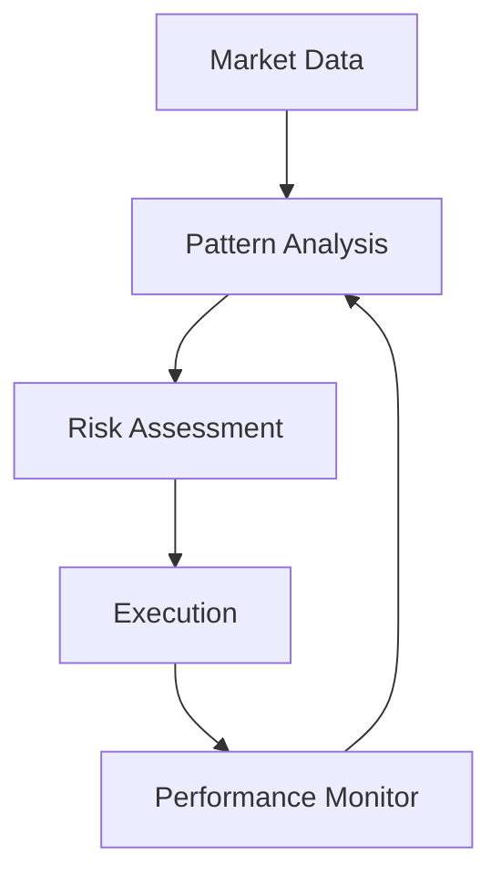

# U(3) Symmetry in Cryptocurrency Pool Operations: A Novel Approach to DeFi Optimization

## Abstract

This paper extends the U(3) symmetry model to cryptocurrency pool operations, demonstrating how quantum
chromodynamics-inspired patterns can optimize DeFi services. We present a comparative analysis between traditional
liquidity pools and our symmetry-based approach, including revenue projections and efficiency metrics.

## 1. Introduction

Traditional DeFi services often operate in silos, leading to inefficient capital utilization and missed yield
opportunities. We propose a framework that treats core DeFi operations as fundamental "colors" combining according to U(
3) symmetry rules, enabling discovery of optimal yield patterns and risk-managed combinations.

## 2. Fundamental Components in DeFi

### 2.1 The Three Colors

1. Pool (P): Liquidity Aggregation
    - AMM liquidity pools
    - Yield farming aggregation
    - Staking pools
    - MEV opportunity aggregation

2. Buffer (B): Cross-chain Operations
    - Bridge services
    - Flash loan provision
    - Slippage management
    - Price impact mitigation

3. Direct (D): Individual Transactions
    - Spot trading
    - Immediate swaps
    - Individual staking
    - P2P transactions

### 2.2 U(3) Symmetry in DeFi

Symmetry properties manifest in DeFi as:

- Conservation of liquidity across operations
- Rotation between yield opportunities
- Stable combinations of services

## 3. Stable Combinations in DeFi

### 3.1 Three-Color States (Baryonic)

Example: Cross-chain Yield Optimizer

```
P + B + D = Stable DeFi Service
- Pool aggregates small deposits
- Buffer manages cross-chain operations
- Direct handles entry/exit
```

Implementation:

1. Smart contract architecture
2. Cross-chain messaging
3. Yield optimization algorithms
4. Risk management systems

### 3.2 Color-Anticolor Pairs (Mesonic)

Example: Bridge-Pool Service

```
P + B̄ Pattern:
- Liquidity pool with dedicated bridge
- No direct trading capability
- Specialized for cross-chain operations
```

## 4. AI Pattern Discovery in DeFi

### 4.1 Yield Pattern Recognition

The AI system optimizes:

1. Gas fees across chains
2. Yield opportunities
3. Risk exposure
4. Capital efficiency
5. MEV opportunities

### 4.2 Risk Management Process

```
Algorithm Flow:
1. Monitor network conditions
2. Track yield sources
3. Analyze risk metrics
4. Execute optimal combinations
5. Adjust for market changes
```

## 5. Comparative Analysis

### 5.1 Traditional Liquidity Pools

Current limitations:

1. Single-chain focus
2. Capital inefficiency
3. High slippage
4. Limited yield optimization

### 5.2 U(3) Enhanced Pools

Advantages:

1. Cross-chain optimization
2. Dynamic yield routing
3. Reduced slippage
4. MEV protection

## 6. Revenue Projections

### 6.1 Traditional Pool Revenue Sources

1. Trading Fees
    - Average: 0.3% per trade
    - Annual volume: $X billion
    - Revenue: $Y million

2. Yield Farming
    - Average APY: 5-15%
    - Capital deployed: $Z billion
    - Revenue: $W million

### 6.2 U(3) Enhanced Revenue Sources

1. Enhanced Trading Fees
    - Cross-chain arbitrage
    - Reduced slippage benefits
    - Projected increase: 25-40%

2. Optimized Yield Farming
    - Cross-chain opportunities
    - MEV capture
    - Projected increase: 30-50%

3. New Revenue Streams
    - Bridge fees
    - Flash loan fees
    - Optimization fees

### 6.3 Comparative Projections

Year 1 Projections (per $1B TVL):

Traditional Pool:

```
Revenue Sources:
- Trading Fees:     $3M
- Yield Farming:    $5M
- Other:            $1M
Total:              $9M
```

U(3) Enhanced Pool:

```
Revenue Sources:
- Trading Fees:     $4.2M (+40%)
- Yield Farming:    $7.5M (+50%)
- Bridge Fees:      $2M (new)
- Flash Loans:      $1.5M (new)
- MEV Capture:      $1M (new)
Total:              $16.2M (+80%)
```

## 7. Implementation Architecture

### 7.1 Smart Contract Layer

1. Core Contracts:
    - Pool management
    - Cross-chain bridges
    - Flash loan facility
    - Yield optimizer

2. Security Features:
    - Multi-sig governance
    - Time locks
    - Circuit breakers

### 7.2 AI Optimization Layer



## 8. Risk Analysis

### 8.1 Traditional Pool Risks

1. Smart Contract Risk
2. Market Risk
3. Liquidity Risk
4. Impermanent Loss

### 8.2 Additional U(3) Risks

1. Cross-chain Bridge Risk
2. Complex Contract Interaction Risk
3. MEV Exposure Risk
4. Flash Loan Attack Risk

### 8.3 Mitigation Strategies

1. Insurance Coverage
2. Gradual Rollout
3. Conservative Parameters
4. Active Monitoring

## 9. Future Developments

### 9.1 Technical Roadmap

1. Phase 1: Basic Implementation
    - Single chain pools
    - Basic yield optimization
    - Risk monitoring

2. Phase 2: Cross-chain Integration
    - Bridge integration
    - Multi-chain yield
    - MEV protection

3. Phase 3: Full AI Integration
    - Autonomous optimization
    - Dynamic risk management
    - Advanced pattern discovery

### 9.2 Market Expansion

1. Geographic Expansion
2. New Chain Integration
3. Partnership Development
4. Governance Token Launch

## 10. Conclusion

The U(3) symmetry approach to DeFi pool operations offers significant advantages over traditional models, with projected
revenue increases of 80% or more. While introducing additional complexity and risks, the model's ability to optimize
across chains and capture multiple revenue streams justifies the implementation challenges.

## Appendix A: Mathematical Foundations

[To be added - detailed mathematical treatment of U(3) symmetry applications to DeFi operations]

## Appendix B: Smart Contract Architecture

[To be added - technical specifications and security considerations]

## References

[To be added - relevant papers on DeFi, pool mathematics, and cross-chain operations]