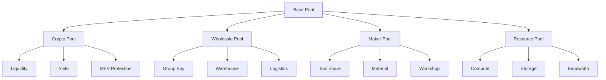

# DiAI Pool Implementations: Domain-Specific Extensions

## Abstract

This paper details specific pool implementations that extend the base DiAI Club Framework. We present architectures for
crypto pools, wholesale pools, maker pools, and resource pools, demonstrating how domain-specific features integrate
with the core framework while maintaining separation of concerns.

## 1. Pool Architecture

### 1.1 Base Pool Interface

```typescript
interface BasePool {
    // Core pool functionality
    poolManagement: PoolManager;
    memberManagement: MemberManager;
    resourceTracking: ResourceTracker;
    valueCalculation: ValueCalculator;
}

interface PoolManager {
    createPool(config: PoolConfig): Promise<Pool>;
    joinPool(poolId: string, member: Member): Promise<void>;
    trackActivity(poolId: string): ActivityTracker;
    calculateValue(poolId: string): Promise<Value>;
}
```

### 1.2 Pool Types



## 2. Crypto Pool Implementation

### 2.1 Pool Features

```typescript
interface CryptoPool extends BasePool {
    // Liquidity management
    liquidityManagement: LiquidityManager;
    
    // Yield optimization
    yieldOptimization: YieldOptimizer;
    
    // MEV protection
    mevProtection: MEVProtector;
    
    // Cross-chain operations
    crossChainBridge: BridgeManager;
}

interface LiquidityManager {
    addLiquidity(amount: TokenAmount): Promise<void>;
    removeLiquidity(amount: TokenAmount): Promise<void>;
    optimizePools(): Promise<OptimizationResult>;
}
```

### 2.2 Value Calculation

```typescript
interface CryptoValueCalculator {
    // Yield calculation
    calculateYield(poolId: string): Promise<YieldMetrics>;
    
    // MEV savings
    calculateMEVSavings(poolId: string): Promise<MEVSavings>;
    
    // Efficiency metrics
    calculateEfficiency(poolId: string): Promise<EfficiencyMetrics>;
}
```

## 3. Wholesale Pool Implementation

### 3.1 Pool Features

```typescript
interface WholesalePool extends BasePool {
    // Group buying
    groupBuying: GroupBuyManager;
    
    // Warehouse management
    warehouseManagement: WarehouseManager;
    
    // Logistics optimization
    logisticsOptimization: LogisticsOptimizer;
}

interface GroupBuyManager {
    createOrder(order: Order): Promise<void>;
    joinOrder(orderId: string): Promise<void>;
    trackDelivery(orderId: string): Promise<DeliveryStatus>;
}
```

### 3.2 Resource Management

```typescript
interface WholesaleResources {
    // Inventory tracking
    inventory: InventoryManager;
    
    // Storage allocation
    storage: StorageManager;
    
    // Delivery management
    delivery: DeliveryManager;
}
```

## 4. Maker Pool Implementation

### 4.1 Pool Features

```typescript
interface MakerPool extends BasePool {
    // Tool sharing
    toolSharing: ToolManager;
    
    // Material management
    materialManagement: MaterialManager;
    
    // Workshop resources
    workshopResources: WorkshopManager;
}

interface ToolManager {
    listTools(filters: ToolFilters): Promise<Tool[]>;
    reserveTool(toolId: string): Promise<Reservation>;
    trackUsage(toolId: string): Promise<UsageMetrics>;
}
```

### 4.2 Project Collaboration

```typescript
interface ProjectSystem {
    // Project management
    projects: ProjectManager;
    
    // Resource allocation
    resources: ResourceManager;
    
    // Collaboration tools
    collaboration: CollaborationTools;
}
```

## 5. Resource Pool Implementation

### 5.1 Pool Features

```typescript
interface ResourcePool extends BasePool {
    // Compute management
    computeManagement: ComputeManager;
    
    // Storage management
    storageManagement: StorageManager;
    
    // Bandwidth allocation
    bandwidthManagement: BandwidthManager;
}

interface ComputeManager {
    allocateResources(request: ResourceRequest): Promise<Allocation>;
    trackUsage(allocationId: string): Promise<UsageMetrics>;
    optimizeAllocation(): Promise<OptimizationResult>;
}
```

### 5.2 Resource Optimization

```typescript
interface ResourceOptimizer {
    // Resource allocation
    optimizeAllocation(resources: Resources): Promise<OptimalAllocation>;
    
    // Usage prediction
    predictUsage(metrics: UsageMetrics): Promise<UsagePrediction>;
    
    // Cost optimization
    optimizeCosts(allocation: Allocation): Promise<CostOptimization>;
}
```

## 6. Integration with Club Framework

### 6.1 Extension Points

```typescript
interface PoolExtension {
    // Framework integration
    registerWithFramework(framework: ClubFramework): void;
    
    // Feature registration
    registerFeatures(): void;
    
    // Hook registration
    registerHooks(): void;
}
```

### 6.2 Service Integration

```typescript
interface PoolServices {
    // AI service integration
    aiServices: AIServiceConnector;
    
    // Analytics integration
    analytics: AnalyticsConnector;
    
    // External services
    externalServices: ServiceConnector;
}
```

## 7. Value Calculation System

### 7.1 Base Metrics

```typescript
interface ValueMetrics {
    // Direct savings
    calculateDirectSavings(): Promise<Savings>;
    
    // Efficiency gains
    calculateEfficiencyGains(): Promise<Efficiency>;
    
    // Resource optimization
    calculateOptimization(): Promise<Optimization>;
}
```

### 7.2 Domain-Specific Metrics

```typescript
interface DomainMetrics {
    // Custom calculations
    calculateCustomMetrics(): Promise<CustomMetrics>;
    
    // Domain impact
    calculateDomainImpact(): Promise<Impact>;
    
    // Value creation
    calculateValueCreation(): Promise<Value>;
}
```

## 8. Implementation Strategy

### 8.1 Pool Launch Process

```typescript
// Pool initialization
class PoolLauncher {
    async launchPool(config: PoolConfig): Promise<Pool> {
        // Verify requirements
        await this.verifyRequirements(config);
        
        // Initialize pool
        const pool = await this.initializePool(config);
        
        // Setup features
        await this.setupFeatures(pool);
        
        return pool;
    }
}
```

### 8.2 Feature Deployment

```typescript
// Feature deployment
class FeatureDeployer {
    async deployFe