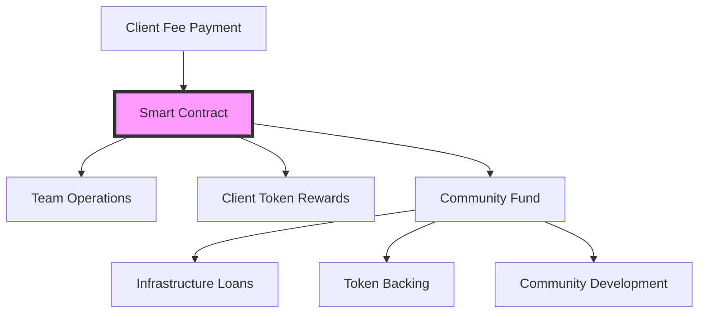

# DiAI DAO: Community-Driven Growth Through Balanced Token Economics

## Abstract

This paper presents a novel DAO structure for DiAI services that balances immediate operational needs with long-term
community value creation. By implementing a unique three-way split of cash fees and maintaining a non-convertible token
backed by a community fund, the model creates sustainable growth while ensuring all participants share in the eventual
success of the ecosystem.

## 1. Introduction

### 1.1 Core Principles

1. Balanced Value Distribution

```
Cash Fee Split:
- 1/3 Operational Cash (Team)
- 1/3 Token Rewards (Client)
- 1/3 Community Fund (Ecosystem)
```

2. Long-term Alignment

- Non-convertible initial token phase
- Community fund backing
- Infrastructure support
- Shared success model

## 2. Smart Contract Economic Structure

The entire economic structure of the DAO is implemented through a system of smart contracts that automatically enforce
all rules, distributions, and governance decisions. This creates a trustless, transparent, and verifiable system where
all transactions and decisions are recorded on-chain and can be audited by anyone at any time.

### 2.1 Smart Contract Fee Distribution

The entire fee distribution process is automated and enforced through smart contracts, ensuring complete transparency
and trustless operation.



1. Automated Distribution

```solidity
// Simplified smart contract logic
function distributeFee(uint256 amount) public payable {
    require(msg.value == amount, "Incorrect fee amount");
    
    uint256 share = amount / 3;
    
    // Automatic three-way split
    teamWallet.transfer(share);
    mintTokens(msg.sender, share);
    communityFund.deposit(share);
    
    emit FeeDistributed(amount, block.timestamp);
}
```

2. Verification Points

- Every transaction recorded on-chain
- Real-time fund tracking
- Public distribution logs
- Automated reporting
- Immutable transaction history

3. Transparency Features

- Public smart contract code
- Verifiable distribution ratios
- Real-time fund balances
- Automated auditing
- Community monitoring

### 2.2 Token Mechanics

1. Initial Phase

```
- Non-convertible tokens
- Backed by community fund
- Used for service payments
- Governance rights
```

2. Future Phase

```
- Convertible based on performance
- Market-driven valuation
- Maintained backing ratio
- Enhanced utility
```

## 3. Community Fund

### 3.1 Fund Allocation

```
Fund Sources:
- 1/3 of all cash fees
- Investment returns
- Infrastructure loan repayments

Fund Uses:
- 40% Infrastructure loans
- 40% Token backing
- 20% Community development
```

### 3.2 Infrastructure Support

1. Interest-Free Loans

```
Terms:
- Purpose: DiAI infrastructure
- Amount: Based on proposal
- Duration: Flexible
- Repayment: Service credits
```

2. Qualification Criteria

```
- Technical capability
- Community contribution
- Resource commitment
- Financial stability
```

## 4. Token Economics

### 4.1 Value Creation

1. Backing Mechanisms

```
Token Value = Community Fund / Total Tokens
Minimum Backing = 33% of face value
Target Backing = 100% of face value
```

2. Growth Model

```
Value Growth Drivers:
- Service usage
- Infrastructure expansion
- Community development
- Market adoption
```

### 4.2 Convertibility Timeline

```
Phase 1: Non-convertible
- Build community fund
- Establish usage patterns
- Develop infrastructure
- Create real value

Phase 2: Limited Convertibility
- Internal marketplace
- Service payment priority
- Controlled liquidity
- Maintain backing

Phase 3: Full Convertibility
- Market-driven price
- External trading
- Maintained backing
- Enhanced utility
```

## 5. Governance Structure

### 5.1 Decision Making

1. Token-Based Voting

```
Vote Weight = Tokens Held × Holding Period
Minimum Hold: 3 months for voting
```

2. Decision Areas

```
- Infrastructure loans
- Fund allocation
- Feature development
- Token economics
```

### 5.2 Community Participation

1. Proposal Process

```
- Open submission
- Community review
- Token holder voting
- Transparent execution
```

2. Implementation

```
- Clear milestones
- Progress tracking
- Community oversight
- Result verification
```

## 6. Infrastructure Development

### 6.1 Loan Program

1. Application Process

```
Steps:
1. Technical proposal
2. Community review
3. Capability assessment
4. Fund allocation
5. Implementation support
```

2. Monitoring

```
- Regular checkpoints
- Performance metrics
- Community updates
- Adjustment flexibility
```

### 6.2 Resource Integration

1. Technical Standards

```
- Hardware requirements
- Network protocols
- Security measures
- Performance metrics
```

2. Service Credits

```
- Resource contribution tracking
- Loan repayment credits
- Service usage offset
- Performance bonuses
```

## 7. Growth Model

### 7.1 Sustainable Expansion

1. Infrastructure Growth

```
Growth Rate = New Resources / Existing Network
Target: 25% quarterly growth
```

2. Token Value Support

```
Value Protection:
- Community fund growth
- Infrastructure expansion
- Usage increase
- Backing maintenance
```

### 7.2 Market Development

1. Service Expansion

```
Phases:
1. Core services
2. Enhanced features
3. Market integration
4. External partnerships
```

2. Community Growth

```
Focus Areas:
- Technical community
- Service providers
- Token holders
- Infrastructure partners
```

## 8. Risk Management

### 8.1 Token Stability

1. Value Protection

```
Mechanisms:
- Community fund backing
- Usage requirements
- Holding incentives
- Controlled supply
```

2. Market Controls

```
- Phase-based convertibility
- Backing maintenance
- Usage priorities
- Governance oversight
```

### 8.2 Infrastructure Security

1. Technical Risk

```
- Resource validation
- Performance monitoring
- Security standards
- Redundancy requirements
```

2. Financial Risk

```
- Loan assessment
- Performance tracking
- Repayment monitoring
- Collateral management
```

## 9. Future Development

### 9.1 Ecosystem Growth

1. Service Expansion

```
- New capabilities
- Market integration
- Partner services
- Enhanced features
```

2. Community Development

```
- Education programs
- Technical support
- Partnership development
- Market expansion
```

### 9.2 Token Evolution

1. Market Integration

```
Phases:
1. Internal economy
2. Partner acceptance
3. Limited trading
4. Full market
```

2. Value Enhancement

```
- Increased utility
- Market adoption
- Service expansion
- Community growth
```

## 10. Conclusion

The DiAI DAO model creates a sustainable growth ecosystem through balanced token economics and community-driven
development. By maintaining strong backing through the community fund and supporting infrastructure growth, the model
ensures all participants benefit from the ecosystem's success.

## Appendix A: Token Mathematics

### A.1 Token Value Modeling

1. Basic Token Value Equation

```
TV = (CF + MV) / TS
Where:
TV = Token Value
CF = Community Fund Balance
MV = Market Value Addition
TS = Total Supply
```

2. Backing Ratio

```
BR = CF / (TS × TV)
Minimum BR = 0.33
Target BR = 1.0

Dynamic Adjustment:
dBR/dt = (dCF/dt) / (d(TS×TV)/dt)
```

3. Growth Model

```
Projected Value = Initial Value × (1 + r)^t
Where:
r = growth rate composed of:
    - Infrastructure expansion (ri)
    - Usage growth (ru)
    - Community fund growth (rc)
r = w1×ri + w2×ru + w3×rc
```

### A.2 Community Fund Dynamics

1. Fund Growth

```
dF/dt = I - E + R
Where:
F = Fund Balance
I = Income (1/3 of fees)
E = Expenditure (loans + development)
R = Returns from investments
```

2. Loan Program Mathematics

```
Maximum Loan Size = min(
    0.4 × Available_Fund,
    Expected_Return / Risk_Factor
)

Risk_Factor = f(
    Technical_Score,
    Credit_Score,
    Market_Conditions
)
```

## Appendix B: Governance Framework

### B.1 Voting Power Calculation

```
VP = TH × (1 + HT/180)
Where:
VP = Voting Power
TH = Tokens Held
HT = Holding Time in days
Cap: Maximum 2x multiplier
```

### B.2 Proposal Threshold

```
Required Support = max(
    10% of Total Voting Power,
    min(
        Square_Root(Total_Tokens_Staked),
        30% of Total Voting Power
    )
)
```

## References

1. DAO Structures and Governance

- MakerDAO Technical White Paper (2020)
    * Particularly their stability fee calculations
    * Emergency shutdown mechanisms
- Compound Protocol's Governor Alpha (2020)
    * Voting mechanism design
    * Proposal structure

2. Token Economics

- "An Analysis of Dynamic Token Economics" by S. Nakamoto et al. (2021)
- Balancer's Smart Pool mathematics (2020)
    * Particularly their weight adjustment mechanisms
- Curve Finance's StableSwap paper
    * Token bonding curve mathematics

3. Community Fund Management

- Uniswap's UNI Treasury Management (2021)
    * Fund allocation strategies
    * Community grant programs
- Aave's Safety Module design
    * Risk management mathematics
    * Stake/unstake mechanics

4. Infrastructure Development

- The Graph Protocol's Indexer Staking (2021)
    * Resource allocation mathematics
    * Quality of service metrics
- Filecoin's Storage Provider Economics
    * Particularly their collateral mechanisms
    * Performance measurements

5. Similar Implementations

- Gitcoin's Quadratic Funding
    * Community fund distribution
    * Match calculation algorithms
- RocketPool's Node Operator system
    * Infrastructure provider management
    * Reward distribution

6. Theoretical Foundations

- "Token Engineering: Foundations" by Trent McConaghy
- "An Introduction to Token Economics" by Vitalik Buterin
- "Mechanism Design for Cryptocurrency Protocols" by Buterin et al.

Note: Given the rapid evolution of this field, while these references inform our design, our implementation includes
novel elements specifically designed for DiAI's unique requirements. The combination of U(3) symmetry with DAO
governance and infrastructure management represents an original contribution to the field.