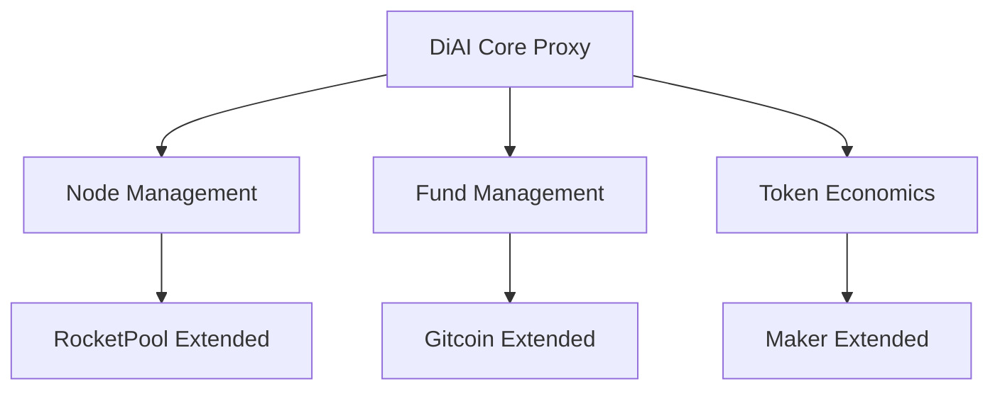

# DiAI Smart Contract Architecture: Leveraging Existing Protocols

## Abstract

This technical specification details the smart contract architecture for DiAI, integrating proven components from
RocketPool, Gitcoin, and MakerDAO. We present a modular design that leverages existing protocol primitives while adding
novel functionality for compute resource management and U(3) symmetry-based optimizations.

## 1. Contract Architecture

### 1.1 Core Components



### 1.2 Contract Inheritance Structure

```solidity
// Core proxy contract
contract DiAICore is UUPSUpgradeable {
    // Core protocol references
    IRocketPool public rocketPool;
    IGitcoinGrants public grants;
    IMakerDAO public maker;
    
    // DiAI specific storage
    mapping(address => ComputeNode) public nodes;
    mapping(address => uint256) public computeCredits;
    
    // Upgrade control
    function _authorizeUpgrade(address) internal override onlyGov {}
}

// Node management extension
contract DiAINode is RocketNodeManager {
    struct ComputeMetrics {
        uint256 resources;
        uint256 uptime;
        uint256 performance;
        uint256 lastUpdate;
    }
    
    mapping(address => ComputeMetrics) public nodeMetrics;
}

// Fund management extension
contract DiAIFund is GitcoinGrantsV1 {
    struct LoanProposal {
        uint256 amount;
        uint256 duration;
        address recipient;
        uint256 computeCommitment;
        uint256 votes;
    }
    
    mapping(uint256 => LoanProposal) public loans;
}

// Token economics extension
contract DiAIToken is MakerToken {
    struct TokenMetrics {
        uint256 backing;
        uint256 computeCredits;
        uint256 lockPeriod;
    }
    
    mapping(address => TokenMetrics) public metrics;
}
```

## 2. Core Functionality Implementation

### 2.1 Node Management (RocketPool Extension)

```solidity
contract ComputeNodeManager is DiAINode {
    // Resource staking
    function stakeCompute(uint256 resources) external {
        require(resources > 0, "Invalid resource amount");
        
        // Extend RocketPool staking
        super.stake();
        
        // Add compute metrics
        nodeMetrics[msg.sender].resources += resources;
        nodeMetrics[msg.sender].lastUpdate = block.timestamp;
        
        emit ComputeStaked(msg.sender, resources);
    }
    
    // Performance tracking
    function updateMetrics(address node, uint256 performance) external {
        require(isAuthorized(msg.sender), "Unauthorized");
        
        ComputeMetrics storage metrics = nodeMetrics[node];
        metrics.performance = performance;
        metrics.lastUpdate = block.timestamp;
        
        // Adjust rewards based on performance
        adjustRewards(node, performance);
    }
    
    // Resource allocation
    function allocateResources(address user, uint256 amount) 
        external 
        returns (address[] memory nodes) 
    {
        require(hasCredits(user, amount), "Insufficient credits");
        
        // Use RocketPool's node selection algorithm
        nodes = super.selectNodes(amount);
        
        // Add DiAI specific allocation
        for (uint256 i = 0; i < nodes.length; i++) {
            allocateCompute(nodes[i], amount / nodes.length);
        }
        
        return nodes;
    }
}
```

### 2.2 Fund Management (Gitcoin Extension)

```solidity
contract CommunityFundManager is DiAIFund {
    // Fee distribution
    function distributeFee(uint256 amount) external payable {
        require(msg.value == amount, "Invalid amount");
        
        uint256 share = amount / 3;
        
        // Team share
        payable(teamWallet).transfer(share);
        
        // Token rewards
        mintTokens(msg.sender, share);
        
        // Community fund
        processFunding(share);
    }
    
    // Loan proposal creation
    function proposeLoan(
        uint256 amount,
        uint256 duration,
        uint256 computeCommitment
    ) external returns (uint256 proposalId) {
        require(amount <= maxLoanAmount(), "Exceeds maximum");
        
        // Use Gitcoin's quadratic funding mechanism
        proposalId = super.createProposal();
        
        // Add DiAI specific loan data
        loans[proposalId] = LoanProposal({
            amount: amount,
            duration: duration,
            recipient: msg.sender,
            computeCommitment: computeCommitment,
            votes: 0
        });
        
        return proposalId;
    }
    
    // Voting implementation
    function vote(uint256 proposalId, uint256 amount) external {
        require(hasTokens(msg.sender, amount), "Insufficient tokens");
        
        // Use Gitcoin's voting mechanism
        super.vote(proposalId, amount);
        
        // Add DiAI specific vote tracking
        loans[proposalId].votes += amount;
    }
}
```

### 2.3 Token Economics (Maker Extension)

```solidity
contract TokenManager is DiAIToken {
    // Token minting with backing
    function mint(address to, uint256 amount) external {
        require(isAuthorized(msg.sender), "Unauthorized");
        
        // Check community fund backing
        require(sufficientBacking(amount), "Insufficient backing");
        
        // Use Maker's stability mechanisms
        super.mint(to, amount);
        
        // Update backing metrics
        updateBacking(amount);
    }
    
    // Compute credit management
    function allocateCredits(
        address user,
        uint256 amount,
        uint256 duration
    ) external {
        require(hasTokens(user, amount), "Insufficient tokens");
        
        // Lock tokens
        lockTokens(user, amount, duration);
        
        // Allocate compute credits
        computeCredits[user] += calculateCredits(amount, duration);
    }
    
    // Backing ratio maintenance
    function updateBacking(uint256 amount) internal {
        TokenMetrics storage metrics = metrics[msg.sender];
        
        // Use Maker's CDP logic for backing
        uint256 newBacking = calculateBacking(amount);
        metrics.backing = newBacking;
        
        // Adjust stability if needed
        if (backingRatio() < MIN_BACKING_RATIO) {
            adjustStability();
        }
    }
}
```

## 3. Integration Points

### 3.1 RocketPool Integration

1. Node Management

```solidity
interface IRocketPool {
    function registerNode(address) external;
    function stake() external payable;
    function selectNodes(uint256) external view returns (address[] memory);
}

contract DiAINodeIntegration {
    IRocketPool public rocketPool;
    
    function initialize(address _rocketPool) external {
        rocketPool = IRocketPool(_rocketPool);
    }
    
    // Integration methods
    function registerComputeNode() external {
        // Register with RocketPool
        rocketPool.registerNode(msg.sender);
        // Add DiAI specific setup
        setupComputeNode(msg.sender);
    }
}
```

### 3.2 Gitcoin Integration

1. Quadratic Funding

```solidity
interface IGitcoin {
    function createGrant(address, uint256) external returns (uint256);
    function matchFunding(uint256) external view returns (uint256);
}

contract DiAIFundingIntegration {
    IGitcoin public gitcoin;
    
    // Integration methods
    function allocateFunding(uint256 amount) external {
        // Use Gitcoin's quadratic funding
        uint256 matched = gitcoin.matchFunding(amount);
        // Add DiAI specific allocation
        distributeFunding(amount + matched);
    }
}
```

### 3.3 Maker Integration

1. Stability Mechanisms

```solidity
interface IMaker {
    function adjustRates() external;
    function getLiquidationRatio() external view returns (uint256);
}

contract DiAIStabilityIntegration {
    IMaker public maker;
    
    // Integration methods
    function maintainStability() external {
        // Use Maker's stability mechanisms
        maker.adjustRates();
        // Add DiAI specific adjustments
        adjustComputeRates();
    }
}
```

## 4. Upgrade Management

### 4.1 Proxy Pattern Implementation

```solidity
contract DiAIProxy is UUPSUpgradeable {
    address public implementation;
    
    function initialize(address _implementation) external initializer {
        implementation = _implementation;
    }
    
    function upgrade(address newImplementation) external onlyGov {
        _upgradeToAndCall(newImplementation, "");
    }
}
```

### 4.2 Storage Management

```solidity
contract DiAIStorage {
    // Storage slots for upgradeable pattern
    bytes32 internal constant COMPUTE_SLOT = 
        keccak256("diai.compute.storage");
    bytes32 internal constant FUND_SLOT = 
        keccak256("diai.fund.storage");
    bytes32 internal constant TOKEN_SLOT = 
        keccak256("diai.token.storage");
}
```

## 5. Security Considerations

### 5.1 Access Control

```solidity
contract DiAIAccess {
    using AccessControl for RoleManager;
    
    bytes32 public constant ADMIN_ROLE = keccak256("ADMIN_ROLE");
    bytes32 public constant NODE_ROLE = keccak256("NODE_ROLE");
    bytes32 public constant FUND_ROLE = keccak256("FUND_ROLE");
    
    function grantNodeRole(address node) external onlyAdmin {
        _grantRole(NODE_ROLE, node);
    }
}
```

### 5.2 Emergency Procedures

```solidity
contract DiAIEmergency {
    bool public paused;
    
    function pause() external onlyAdmin {
        paused = true;
    }
    
    function unpause() external onlyAdmin {
        paused = false;
    }
    
    modifier whenNotPaused() {
        require(!paused, "System is paused");
        _;
    }
}
```

## 6. Testing Framework

### 6.1 Test Structure

```javascript
describe("DiAI Core", () => {
    let core, node, fund, token;

    before(async () => {
        // Deploy core contracts
    });

    it("should stake compute resources", async () => {
        // Test compute staking
    });

    it("should distribute fees correctly", async () => {
        // Test fee distribution
    });
});
```

## Conclusion

This implementation leverages existing protocol primitives while adding novel functionality for compute resource
management. The modular design allows for future upgrades and extensions while maintaining security and stability.

## Appendix: Deployment Procedure

1. Deploy base contracts
2. Initialize proxies
3. Set up access control
4. Configure integration points
5. Verify contracts
6. Transfer admin rights

## References

1. RocketPool Smart Contracts v3.0
2. Gitcoin Grants v1 Contracts
3. MakerDAO Core Contracts
4. OpenZeppelin Contract Library
5. Ethereum Improvement Proposals (EIPs)
    - EIP-1967: Proxy Storage Slots
    - EIP-2535: Diamond Standard
    - EIP-1822: Universal Upgradeable Proxy Standard