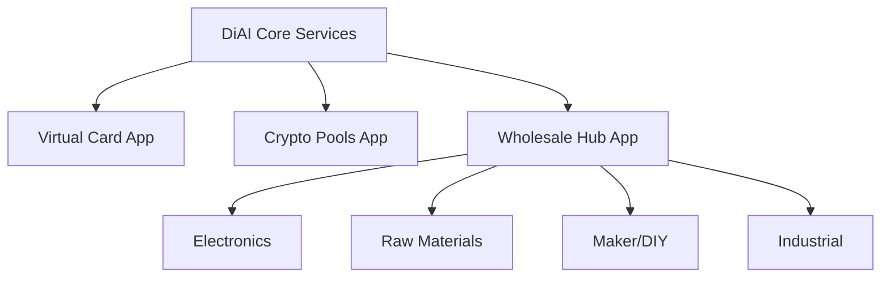

# DiAI Mobile: Progressive Implementation Strategy

## 1. App Family Architecture

### 1.1 Core Apps



### 1.2 Shared Components

```typescript
// Core service interfaces
interface DiAIService {
    poolManagement: IPoolManager;
    savingsCalculator: ISavingsCalculator;
    virtualCards: IVirtualCardManager;
    userContext: IContextManager;
}

// Savings verification
interface ISavingsCalculator {
    calculatePoolSavings(poolId: string): Promise<SavingsMetrics>;
    verifyTransaction(txId: string): Promise<VerifiedSavings>;
    aggregateUserSavings(userId: string): Promise<UserSavings>;
}
```

## 2. Phase 1: Basic Implementation

### 2.1 Virtual Card Features

```typescript
interface VirtualCardFeatures {
    createCard(): Promise<VirtualCard>;
    setVendorLock(cardId: string, vendors: string[]): Promise<void>;
    setSpendingLimits(cardId: string, limits: SpendingLimits): Promise<void>;
    delegateAccess(cardId: string, delegateId: string): Promise<void>;
}

class SpendingLimits {
    perTransaction: number;
    daily: number;
    monthly: number;
    categories: string[];
}
```

### 2.2 Group Buying Features

```typescript
interface GroupBuyFeatures {
    listActivePools(): Promise<Pool[]>;
    joinPool(poolId: string): Promise<void>;
    trackContribution(poolId: string): Promise<Contribution>;
    viewSavings(): Promise<SavingsMetrics>;
}

interface Pool {
    id: string;
    category: string;
    targetAmount: number;
    currentAmount: number;
    deadline: Date;
    expectedSavings: number;
}
```

### 2.3 User Interface

```typescript
// React Native components
const PoolList: React.FC = () => {
    const pools = useActivePools();
    
    return (
        <FlatList
            data={pools}
            renderItem={({item}) => (
                <PoolCard 
                    pool={item}
                    onJoin={() => joinPool(item.id)}
                />
            )}
        />
    );
};
```

## 3. Phase 2: Initial AI Integration

### 3.1 Basic Pattern Matching

```typescript
interface PatternMatcher {
    analyzeUserBehavior(userId: string): Promise<PurchasePatterns>;
    suggestPools(patterns: PurchasePatterns): Promise<Pool[]>;
    optimizeTiming(poolId: string): Promise<TimingStrategy>;
}

interface PurchasePatterns {
    frequency: Record<string, number>;
    volumes: Record<string, number>;
    seasonality: Record<string, SeasonalPattern>;
}
```

### 3.2 Batch Formation

```typescript
interface BatchOptimizer {
    formBatch(orders: Order[]): Promise<Batch>;
    calculateSavings(batch: Batch): Promise<number>;
    suggestTiming(batch: Batch): Promise<Date>;
}

class Batch {
    orders: Order[];
    totalVolume: number;
    expectedDiscount: number;
    suggestedTiming: Date;
}
```

## 4. Phase 3: Advanced Optimization

### 4.1 U(3) Pattern Discovery

```typescript
interface U3Optimizer {
    discoverPatterns(context: UserContext): Promise<OptimizationPattern[]>;
    simulateStrategies(patterns: OptimizationPattern[]): Promise<SimulationResult>;
    recommendStrategy(results: SimulationResult[]): Promise<Strategy>;
}

interface OptimizationPattern {
    type: 'Pool' | 'Buffer' | 'Direct';
    confidence: number;
    expectedSavings: number;
    requirements: ResourceRequirement[];
}
```

### 4.2 Cross-Pool Optimization

```typescript
interface CrossPoolOptimizer {
    findSynergies(pools: Pool[]): Promise<Synergy[]>;
    optimizeResources(synergies: Synergy[]): Promise<ResourceAllocation>;
    calculateCombinedSavings(allocation: ResourceAllocation): Promise<number>;
}
```

## 5. Implementation Roadmap

### 5.1 Phase 1 (Months 1-6)

```
Month 1-2:
- Basic app infrastructure
- Virtual card integration
- User authentication
- Pool listing

Month 3-4:
- Group buying features
- Savings tracking
- Basic analytics
- Payment processing

Month 5-6:
- Multi-app framework
- Domain-specific features
- Integration testing
- Beta launch
```

### 5.2 Phase 2 (Months 7-12)

```
Month 7-8:
- AI infrastructure setup
- Basic pattern matching
- User behavior analysis
- Recommendation engine

Month 9-10:
- Batch optimization
- Timing algorithms
- Market analysis
- Performance monitoring

Month 11-12:
- Integration refinement
- Scaling preparation
- Security audits
- Full launch
```

### 5.3 Phase 3 (Months 13-24)

```
Month 13-15:
- U(3) implementation
- Pattern discovery
- Strategy optimization
- Cross-pool synergies

Month 16-18:
- Advanced AI features
- Custom contexts
- Predictive analytics
- Resource optimization

Month 19-24:
- Full ecosystem integration
- Advanced optimization
- Performance tuning
- Market expansion
```

## 6. Technical Stack

### 6.1 Mobile App

```
Frontend:
- React Native
- TypeScript
- Redux Toolkit
- React Navigation

UI Components:
- Tailwind React Native
- Custom UI Kit
- Native Base
```

### 6.2 Backend Services

```
Core Services:
- Node.js/Express
- PostgreSQL
- Redis
- RabbitMQ

AI Services:
- Python
- TensorFlow
- PyTorch
- FastAPI
```

### 6.3 Infrastructure

```
Cloud Services:
- AWS or GCP
- Kubernetes
- Docker
- Terraform

Monitoring:
- Prometheus
- Grafana
- ELK Stack
- Sentry
```

## 7. Revenue Model

### 7.1 Phase 1

```
Fee Structure:
- 20% of verified savings
- No base fees
- Pay for performance
- Transparent tracking

Example:
Pool Savings: $10,000
User Fee: $2,000
Net User Savings: $8,000
```

### 7.2 Phase 2

```
Enhanced Value:
- Same 20% structure
- AI-driven increased savings
- Additional optimization value
- Automated verification

Example:
AI-Optimized Savings: $15,000
User Fee: $3,000
Net User Savings: $12,000
```

### 7.3 Phase 3

```
Maximum Value:
- Maintained 20% structure
- Complex optimization strategies
- Cross-domain savings
- Predictive optimization

Example:
Advanced Optimization: $25,000
User Fee: $5,000
Net User Savings: $20,000
```

## 8. Success Metrics

### 8.1 Phase 1 KPIs

```
User Adoption:
- Download numbers
- Active users
- Pool participation
- Savings generated

Technical Performance:
- App stability
- Response times
- Error rates
- User satisfaction
```

### 8.2 Phase 2 KPIs

```
AI Performance:
- Pattern accuracy
- Prediction success
- Optimization impact
- Resource efficiency

Business Metrics:
- Revenue growth
- User retention
- Feature adoption
- Support costs
```

### 8.3 Phase 3 KPIs

```
Advanced Metrics:
- Strategy effectiveness
- Cross-pool synergies
- Resource utilization
- Market penetration

Growth Metrics:
- Ecosystem expansion
- Domain coverage
- User sophistication
- Platform value
```

## 9. Risk Management

### 9.1 Technical Risks

```
Mitigation Strategies:
- Gradual rollout
- Extensive testing
- Redundant systems
- Regular audits

Monitoring:
- Real-time alerts
- Performance tracking
- Security scanning
- User feedback
```

### 9.2 Business Risks

```
Risk Controls:
- Market analysis
- User research
- Competitive monitoring
- Adaptation planning

Response Plans:
- Quick iterations
- Feature adjustment
- Support scaling
- Crisis management
```

## 10. Future Expansion

### 10.1 Additional Domains

```
Potential Areas:
- Service procurement
- Equipment sharing
- Logistics optimization
- Resource pooling

Integration:
- Domain analysis
- Market validation
- Pilot programs
- Scaled rollout
```

### 10.2 Advanced Features

```
Future Capabilities:
- AI automation
- Predictive markets
- Dynamic optimization
- Ecosystem integration

Development:
- Research priorities
- Prototype testing
- User validation
- Feature deployment
```

## Conclusion

This phased approach allows for:

- Rapid market entry
- Value-based growth
- Natural AI integration
- Sustainable scaling

The mobile-first strategy provides:

- Easy user adoption
- Familiar interfaces
- Progressive complexity
- Natural expansion path

## Appendix

[Technical specifications, API documentation, and detailed implementation guides to be added]