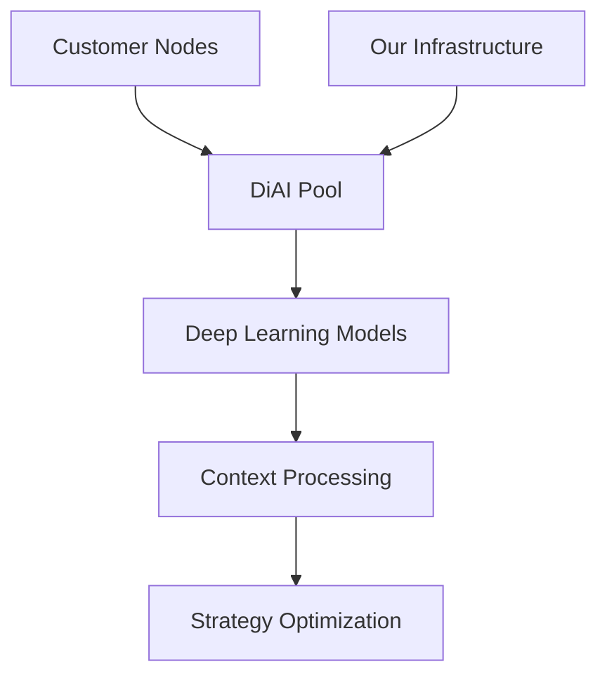

# DiAI: Distributed Intelligence Service for DeFi Optimization

## Abstract

This paper presents DiAI, a distributed artificial intelligence service model for DeFi optimization. Unlike traditional
SaaS models, DiAI operates as a pure compute service, where customers can either purchase compute tokens or contribute
their own computational resources to the network. The system emphasizes transparent cost-based pricing and allows
participants to both consume and provide computational resources in a distributed intelligence pool.

## 1. Introduction

### 1.1 Service Model

DiAI represents a new paradigm in AI services:

- Pure compute service model
- No fee on financial transactions
- Customer keeps 100% of optimization benefits
- Pay only for AI computational resources used

### 1.2 Core Principles

1. Transparent Cost Structure
    - Hardware depreciation
    - Power consumption
    - Bandwidth usage
    - Operational overhead

2. Resource Sharing Economy
    - Contribute compute power
    - Earn compute tokens
    - Use tokens for service
    - Trade excess capacity

## 2. Technical Architecture

### 2.1 Distributed AI Pool



### 2.2 Resource Management

1. Compute Sharding
    - Dynamic resource allocation
    - Load balancing
    - Fault tolerance
    - Performance optimization

2. Node Types
    - Full nodes: Contributing significant resources
    - Light nodes: Primary consumers
    - Hybrid nodes: Both consume and contribute

## 3. Token Economics

### 3.1 Token Utility

1. Compute Credits
    - Used to pay for AI services
    - Earned through resource contribution
    - Tradeable among participants
    - Expire after set period

2. Resource Contribution
    - CPU/GPU time
    - Memory allocation
    - Network bandwidth
    - Storage space

### 3.2 Pricing Model

```
Base Token Cost = Hardware Depreciation + Power Cost + Bandwidth + Operations
                ≈ 10x standard AI service costs

Actual Cost = Base Token Cost × Resource Intensity Factor
Resource Credits = Contributed Resources × Efficiency Factor
```

## 4. Cost Analysis

### 4.1 Component Breakdown

1. Hardware Costs
    - GPU clusters
    - Memory systems
    - Network infrastructure
    - Cooling systems

2. Operational Costs
    - Power consumption
    - Bandwidth usage
    - Maintenance
    - Support services

### 4.2 Comparative Analysis

```
Traditional AI Services:
- ChatGPT: $0.002 per 1K tokens
- Claude: $0.003 per 1K tokens

DiAI Service:
- Base Rate: $0.02-0.03 per 1K tokens
- Justification:
  * Dedicated models
  * Continuous learning
  * Context preservation
  * Specialized optimization
```

## 5. Resource Contribution Model

### 5.1 Participation Options

1. Full Provider

```
- Dedicates significant resources
- Earns maximum tokens
- Priority service access
- Network governance rights
```

2. Hybrid User

```
- Contributes excess capacity
- Balances earning vs usage
- Flexible participation
- Cost optimization
```

3. Pure Consumer

```
- Purchases tokens as needed
- No resource contribution
- Standard service access
- Pay-as-you-go model
```

### 5.2 Resource Quality Metrics

1. Contribution Factors
    - Processing power
    - Uptime reliability
    - Network quality
    - Resource consistency

2. Credit Calculation

```
Credit Rate = Base Rate × Quality Factor × Uptime Factor
```

## 6. Service Implementation

### 6.1 Deep Learning Infrastructure

1. Model Architecture
    - Context preservation
    - Pattern recognition
    - Strategy optimization
    - Risk management

2. Resource Requirements
    - Training computation
    - Inference loads
    - Memory usage
    - Network demands

### 6.2 Quality of Service

1. Performance Metrics
    - Response time
    - Accuracy rates
    - Context retention
    - Strategy effectiveness

2. Service Levels
    - Priority processing
    - Resource guarantees
    - Support levels
    - Feature access

## 7. Cost Justification

### 7.1 Value Proposition

1. Dedicated Resources
    - Custom model training
    - Context preservation
    - Specialized optimization
    - Continuous adaptation

2. Business Benefits
    - Better optimization results
    - Reduced operational costs
    - Increased efficiency
    - Competitive advantage

### 7.2 ROI Analysis

```
Investment:
- Token Costs: $X per month
- Resource Contribution: Y% of capacity

Returns:
- Optimization Benefits: 100% retained
- Resource Credits: Z tokens earned
- Net Cost Reduction: Typically >3x token costs
```

## 8. Network Effects

### 8.1 Scaling Benefits

1. Pool Growth
    - More resources
    - Better distribution
    - Increased reliability
    - Cost efficiencies

2. Learning Effects
    - Broader data patterns
    - Improved strategies
    - Enhanced optimization
    - Reduced costs

### 8.2 Community Benefits

1. Resource Market
    - Token trading
    - Capacity sharing
    - Cost optimization
    - Flexibility

2. Knowledge Sharing
    - Strategy insights
    - Performance metrics
    - Best practices
    - Implementation guides

## 9. Future Development

### 9.1 Technical Roadmap

1. Phase 1: Core Infrastructure
    - Basic pool implementation
    - Token system
    - Resource management
    - Quality metrics

2. Phase 2: Advanced Features
    - Dynamic pricing
    - Automated optimization
    - Enhanced sharding
    - Improved efficiency

3. Phase 3: Ecosystem Growth
    - Third-party integration
    - API development
    - Tool development
    - Community features

### 9.2 Market Evolution

1. Service Expansion
    - New optimization areas
    - Additional models
    - Enhanced features
    - Broader applications

2. Resource Development
    - Hardware partnerships
    - Infrastructure optimization
    - Efficiency improvements
    - Cost reduction

## 10. Conclusion

DiAI represents a new paradigm in AI services, focusing on transparent, cost-based pricing and resource sharing. By
allowing participants to both consume and contribute computational resources, we create a sustainable ecosystem that
benefits all participants while maintaining high-quality AI services for DeFi optimization.

## Appendix A: Technical Specifications

[To be added - detailed technical requirements and implementation guides]

## Appendix B: Token Economics

[To be added - detailed token mechanics and economic models]

## References

[To be added - relevant papers on distributed AI and token economics]