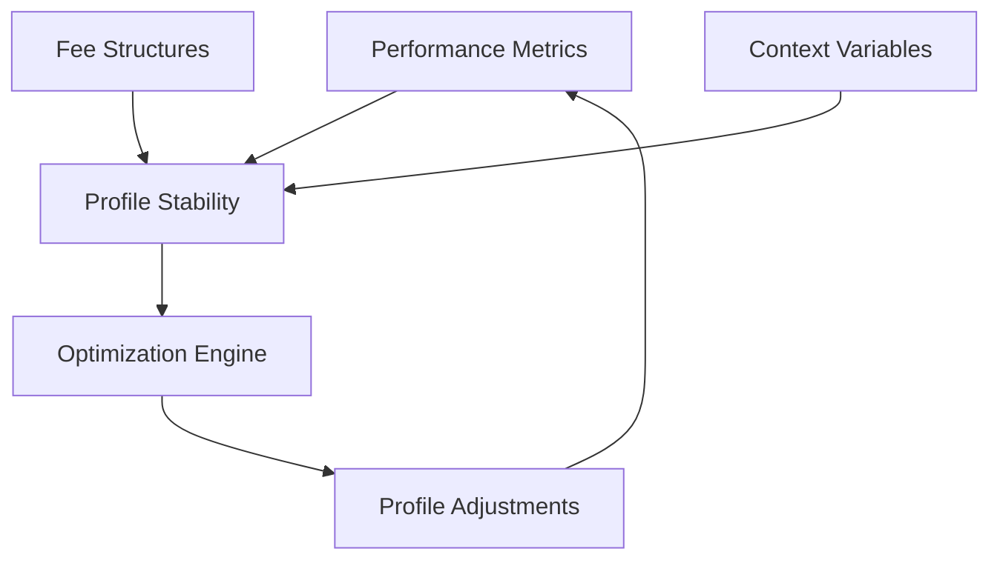
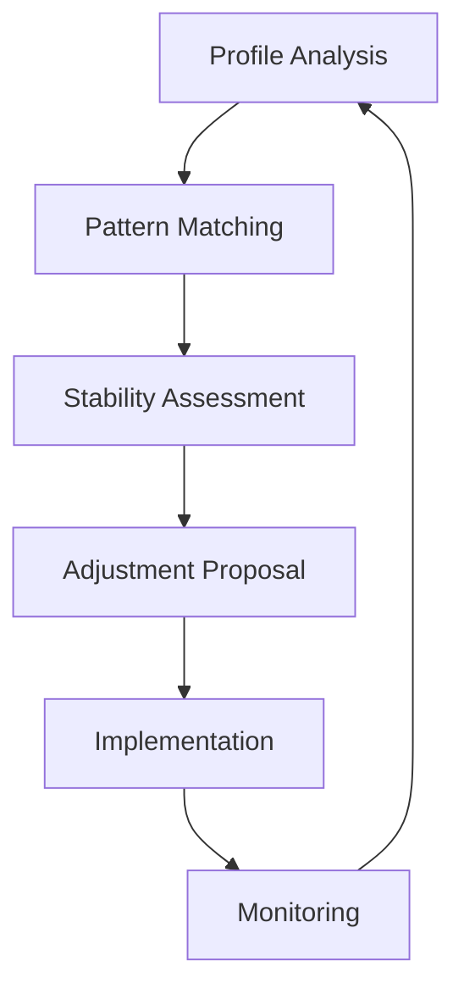

# Self-Optimizing Profiles: U(3) Symmetry in Performance Metrics and Fee Structures

## Abstract

This paper presents a customer-centric framework for self-optimizing profiles in DeFi optimization services, using U(3)
symmetry principles to minimize user fees while maintaining service stability. The primary goal is reducing customer
costs through efficient profile management, demonstrating how proper alignment of incentives creates sustainable value
for all participants. Our approach proves that optimizing for customer savings, rather than service provider profits,
leads to better long-term outcomes and network effects.

## 1. Introduction

Traditional fee structures and performance metrics in DeFi services are typically designed to maximize service provider
profits, often at the expense of customer value. We propose a fundamentally different approach: a dynamic system where
the primary optimization goal is minimizing customer fees while maintaining service stability. This customer-first
approach creates a virtuous cycle where reduced fees lead to increased adoption, generating sufficient revenue through
volume rather than high margins.

### 1.1 Core Principles

1. Customer Fee Minimization
    - Primary goal is reducing customer costs
    - Our fees are a consequence, not a target
    - Success measured by customer savings
    - Transparent optimization process

2. Alignment of Interests
    - We succeed when customers pay less
    - Volume-based sustainability
    - Long-term relationship focus
    - Network effect benefits

3. Ethical Operation
    - No hidden fees or complexity
    - Clear success metrics
    - Customer control over profiles
    - Transparent reporting

## 2. Profile Components

### 2.1 The Three Colors

1. Performance Metrics (P)
    - Return targets
    - Risk tolerance
    - Time horizons
    - Custom KPIs
    - Benchmark preferences

2. Fee Structures (F)
    - Base rates
    - Performance thresholds
    - Payment timing
    - Fee caps
    - Sharing ratios

3. Context Variables (C)
    - Market conditions
    - Business cycles
    - Liquidity needs
    - Regulatory requirements
    - External constraints

### 2.2 Component Interactions



## 3. Stable Profile Combinations

### 3.1 Conservative Profile Pattern

```
P: Risk-adjusted returns, Sharpe ratio focus
F: 0.1% base + 15% of risk-adjusted outperformance
C: Monthly rebalancing, high liquidity requirements

Stability Features:
- Low volatility
- Predictable fee structure
- Conservative optimization
```

### 3.2 Aggressive Profile Pattern

```
P: Absolute returns, maximum yield
F: 0.2% base + 25% of excess returns
C: Daily optimization, lower liquidity needs

Stability Features:
- High responsiveness
- Performance-driven fees
- Aggressive optimization
```

### 3.3 Hybrid Profile Pattern

```
P: Blended metrics, custom benchmarks
F: Dynamic base rate + tiered performance fees
C: Adaptive timing based on market conditions

Stability Features:
- Balanced approach
- Flexible fee structure
- Context-sensitive optimization
```

## 4. Context Drift Detection

### 4.1 Drift Monitoring

1. Market Variables
    - Volatility changes
    - Volume trends
    - Correlation shifts
    - Liquidity conditions

2. Profile Variables
    - Performance deviation
    - Fee accumulation rates
    - Optimization frequency
    - Risk metrics

### 4.2 Drift Response Patterns

```
Algorithm Flow:
1. Monitor stability metrics
2. Detect significant deviations
3. Classify drift type
4. Generate adjustment proposals
5. Implement approved changes
```

## 5. Profile Optimization

### 5.1 Optimization Objectives

1. Performance Alignment
    - Match stated goals
    - Maintain risk boundaries
    - Adapt to market changes

2. Fee Optimization
    - Minimize costs
    - Maximize value
    - Ensure fairness

3. Context Adaptation
    - Market responsiveness
    - Business cycle alignment
    - Regulatory compliance

### 5.2 Optimization Process



## 6. Implementation Architecture

### 6.1 Technical Components

1. Profile Management System
    - Profile creation interface
    - Component configuration
    - Interaction rules
    - Validation checks

2. Optimization Engine
    - Pattern recognition
    - Stability analysis
    - Adjustment calculation
    - Implementation logic

3. Monitoring System
    - Real-time tracking
    - Drift detection
    - Alert generation
    - Performance reporting

### 6.2 Integration Points

1. Data Sources
    - Market data feeds
    - Performance metrics
    - Context variables
    - User preferences

2. Execution Systems
    - Trading interfaces
    - Fee calculations
    - Payment processing
    - Reporting systems

## 7. Profile Examples

### 7.1 Institutional Profile

```
Performance Metrics:
- Risk-adjusted returns
- Benchmark outperformance
- Drawdown limits

Fee Structure:
- 0.15% base fee
- 20% of alpha
- Quarterly crystallization

Context Variables:
- Regulatory requirements
- Reporting needs
- Risk limits
```

### 7.2 Retail Profile

```
Performance Metrics:
- Absolute returns
- Daily liquidity
- Simplified reporting

Fee Structure:
- 0.1% base fee
- 25% of excess returns
- Monthly crystallization

Context Variables:
- Market volatility
- Personal goals
- Time horizon
```

## 8. Drift Management

### 8.1 Detection Mechanisms

1. Statistical Monitoring
    - Moving averages
    - Volatility measures
    - Correlation analysis
    - Trend detection

2. Pattern Recognition
    - Historical comparison
    - Peer analysis
    - Anomaly detection
    - Context classification

### 8.2 Response Framework

1. Immediate Responses
    - Fee adjustments
    - Risk controls
    - Trading limits
    - Alert generation

2. Strategic Adjustments
    - Profile rebalancing
    - Parameter updates
    - Strategy modification
    - Communication triggers

## 9. Fee Optimization Patterns

### 9.1 Dynamic Fee Structures

1. Market-Responsive Fees

```
Base Fee = f(market_volatility, volume)
Performance Fee = g(excess_return, risk_adjusted_performance)
```

2. Context-Aware Adjustments

```
Fee Multiplier = h(market_condition, profile_stability)
Final Fee = Base Fee × Fee Multiplier + Performance Component
```

### 9.2 Optimization Strategies

1. Cost Minimization
    - Batch processing
    - Efficient execution
    - Smart timing
    - Volume discounts

2. Value Maximization
    - Performance alignment
    - Risk management
    - Opportunity capture
    - Resource optimization

## 10. Future Developments

### 10.1 Technical Enhancements

1. Machine Learning Integration
    - Pattern discovery
    - Predictive analytics
    - Automated optimization
    - Risk forecasting

2. Advanced Monitoring
    - Real-time analytics
    - Behavioral analysis
    - Network effects
    - Cross-profile optimization

### 10.2 Business Evolution

1. Product Development
    - Custom profiles
    - Template library
    - Analytics tools
    - Integration APIs

2. Market Expansion
    - New asset classes
    - Geographic coverage
    - Customer segments
    - Service offerings

## 11. Risk Management

### 11.1 Profile Risks

1. Design Risks
    - Parameter instability
    - Conflicting objectives
    - Implementation challenges
    - System complexity

2. Operational Risks
    - Execution errors
    - System failures
    - Data quality
    - Integration issues

### 11.2 Mitigation Strategies

1. Technical Controls
    - Validation checks
    - Monitoring systems
    - Backup procedures
    - Testing protocols

2. Business Controls
    - Governance framework
    - Review processes
    - Documentation requirements
    - Audit trails

## 12. Conclusion

The self-optimizing profile system represents a significant advancement in DeFi service customization and fee
optimization. By applying U(3) symmetry principles to profile management, we create a framework that maintains stability
while adapting to changing conditions and customer needs.

## Appendix A: Mathematical Foundations

[To be added - detailed mathematical treatment of profile stability and optimization]

## Appendix B: Implementation Guide

[To be added - technical specifications and integration requirements]

## References

[To be added - relevant papers on profile optimization and fee structures]