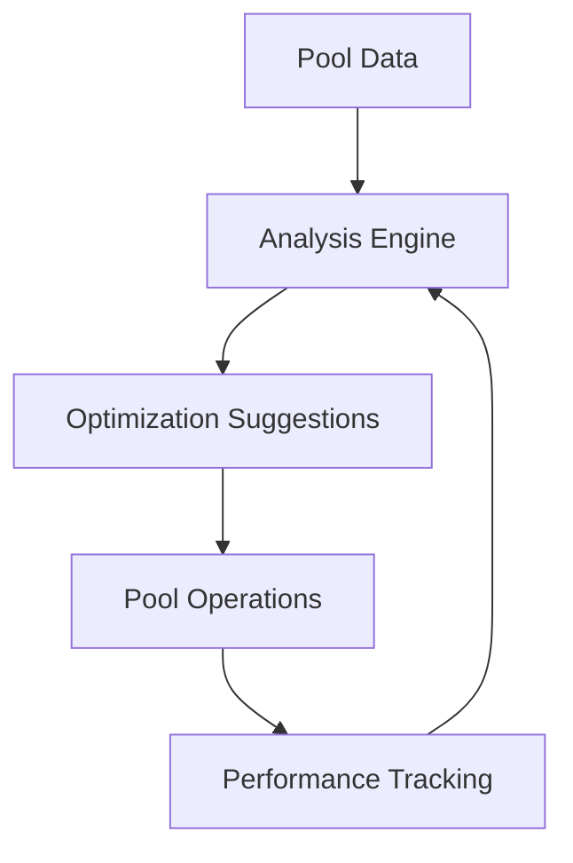

# U(3) Optimization as a Service: A Revenue-Sharing Model for DeFi Pool Operators

## Abstract

This paper presents a Software-as-a-Service (SaaS) model for providing U(3) symmetry-based optimization to existing
cryptocurrency pool operators. Rather than managing pools directly, this approach offers advanced optimization
algorithms as a service layer, generating revenue through performance-based sharing arrangements while minimizing
operational risk and regulatory exposure.

## 1. Introduction

Traditional DeFi pools face optimization challenges but have established operational infrastructure and user bases. We
propose providing U(3) symmetry-based optimization as a service layer, enhancing existing pool performance while sharing
in the incremental value created.

## 2. Service Model

### 2.1 Core Offering

1. Optimization Layer
    - Pattern recognition algorithms
    - Cross-chain opportunity detection
    - Risk assessment tools
    - Performance analytics

2. Integration Options
    - API access
    - Smart contract hooks
    - Data feeds
    - Strategy suggestions

### 2.2 Revenue Model

```
Performance-Based Sharing:
- Base Fee: None (reduces barrier to adoption)
- Success Fee: 20-30% of incremental gains
- Measured against baseline performance
```

## 3. Value Proposition

### 3.1 For Pool Operators

1. Risk-Free Implementation
    - No upfront costs
    - Pay only for results
    - Maintain full control

2. Enhanced Performance
    - Better yields
    - Reduced slippage
    - Optimized routing

### 3.2 For End Users

1. Better Returns
    - Higher yields
    - Lower fees
    - Improved efficiency

2. Unchanged Experience
    - Same interface
    - Same security model
    - Same pool relationships

## 4. Technical Integration

### 4.1 API Structure



### 4.2 Implementation Process

1. Initial Integration
    - Data access setup
    - Performance baseline
    - Strategy configuration

2. Ongoing Operations
    - Real-time monitoring
    - Strategy updates
    - Performance reporting

## 5. Business Model Advantages

### 5.1 Risk Mitigation

1. No Direct Asset Management
    - Reduced regulatory exposure
    - No custody risk
    - Limited liability

2. Scalable Operations
    - Low overhead
    - Automated systems
    - Multiple pool support

### 5.2 Growth Potential

1. Network Effects
    - Cross-pool optimization
    - Shared intelligence
    - Pattern amplification

2. Market Expansion
    - Chain-agnostic
    - Protocol-agnostic
    - Geography-agnostic

## 6. Revenue Projections

### 6.1 Per Pool Analysis

Assumptions:

- Average pool TVL: $100M
- Current yield: 10% APY
- Optimization improvement: 2-4%

```
Annual Revenue Calculation:
Base Pool Revenue: $10M
Optimization Added: $2-4M
Our Share (25%): $500K-1M per pool
```

### 6.2 Scaling Model

```
Year 1:
- 5-10 pools
- Revenue: $2.5-10M

Year 2:
- 20-30 pools
- Revenue: $10-30M

Year 3:
- 50-100 pools
- Revenue: $25-100M
```

## 7. Operational Requirements

### 7.1 Core Infrastructure

1. Computing Resources
    - Pattern recognition systems
    - Real-time analysis
    - Data storage

2. Human Capital
    - Algorithm developers
    - Integration specialists
    - Client support

### 7.2 Cost Structure

```
Fixed Costs:
- Core development team: $1-2M/year
- Infrastructure: $500K/year
- Operations: $500K/year

Variable Costs:
- Computing resources: ~1% of revenue
- Client support: ~2% of revenue
```

## 8. Go-to-Market Strategy

### 8.1 Target Segments

1. Priority Targets
    - Mid-sized pools ($50M-500M TVL)
    - Multi-chain operations
    - Innovative protocols

2. Secondary Markets
    - Smaller pools
    - Single-chain operations
    - Traditional DeFi

### 8.2 Partnership Approach

1. Pilot Programs
    - 3-month trials
    - Guaranteed minimums
    - Performance tracking

2. Full Integration
    - Revenue sharing
    - Long-term contracts
    - Deep integration

## 9. Competitive Advantages

### 9.1 Technology Moat

1. Pattern Recognition
    - Proprietary algorithms
    - Historical data
    - Cross-pool insights

2. Integration Expertise
    - Protocol knowledge
    - Security track record
    - Performance history

### 9.2 Business Model

1. Alignment of Interests
    - Success-based fees
    - Shared upside
    - No downside risk

2. Network Effects
    - Multi-pool optimization
    - Shared intelligence
    - Growing dataset

## 10. Future Development

### 10.1 Product Roadmap

1. Phase 1: Basic Optimization
    - Yield optimization
    - Route optimization
    - Risk management

2. Phase 2: Advanced Features
    - MEV protection
    - Cross-pool strategies
    - Custom algorithms

3. Phase 3: Ecosystem Tools
    - Developer APIs
    - Strategy marketplace
    - Analytics platform

### 10.2 Market Evolution

1. Geographic Expansion
2. New Chain Support
3. Protocol Adaptations
4. Regulatory Compliance

## 11. Risk Analysis

### 11.1 Business Risks

1. Technical Risk
    - Algorithm performance
    - Integration issues
    - System failures

2. Market Risk
    - Competition
    - Protocol changes
    - Market conditions

### 11.2 Mitigation Strategies

1. Technical
    - Gradual rollout
    - Extensive testing
    - Redundant systems

2. Business
    - Diversification
    - Contract protection
    - Insurance coverage

## 12. Conclusion

The U(3) optimization-as-a-service model offers a compelling opportunity to enhance DeFi pool performance while
maintaining a lean, scalable business operation. By focusing on the intelligence layer rather than direct asset
management, we can create significant value with minimal risk exposure.

## Appendix A: Integration Specifications

[To be added - technical details of API integration and data requirements]

## Appendix B: Performance Metrics

[To be added - detailed explanation of performance measurement and fee calculations]

## References

[To be added - relevant papers on SaaS models in DeFi and optimization algorithms]