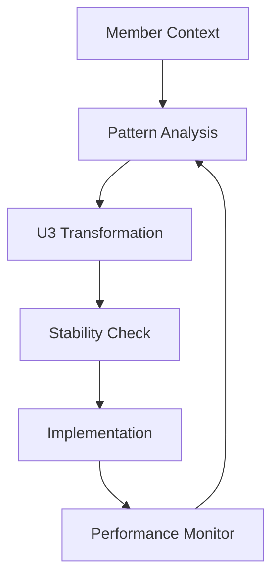

# Composable Business Workflows: A U(3) Symmetry Approach to Service Optimization

## Abstract

This paper presents a novel approach to business workflow optimization using principles inspired by quantum
chromodynamics (QCD) and U(3) symmetry groups. We demonstrate how treating fundamental business operations as
orthogonal "colors" leads to naturally stable service combinations, enabling AI-driven discovery of optimal business
patterns. The model is applied to a group purchasing and fulfillment platform, showing how mathematical symmetry
principles can guide practical business operations.

## 1. Introduction

Modern business services often combine multiple operational workflows in complex ways. This complexity can lead to
inefficient resource allocation and missed opportunities. We propose a framework that treats core business operations as
fundamental "colors" that combine according to U(3) symmetry rules, similar to quantum chromodynamics. This approach
provides a mathematical foundation for discovering and optimizing stable business patterns.

## 2. Fundamental Components

### 2.1 The Three Colors

Our model identifies three fundamental, orthogonal business operations:

1. Pool (P): Group purchasing power and demand aggregation
    - Member coordination
    - Volume discount optimization
    - Batch order formation

2. Buffer (B): Inventory and fulfillment management
    - Stock holding
    - Warehouse operations
    - Order fulfillment

3. Direct (D): Individual transaction handling
    - Single-member orders
    - Immediate fulfillment
    - Market price arbitrage

### 2.2 U(3) Symmetry Properties

The U(3) symmetry group describes how these components can combine:

- Conservation of each "color" in stable combinations
- Rotation generators producing new valid states
- Conjugate pairs forming temporary stable states

## 3. Stable Combinations

### 3.1 Three-Color States (Baryonic)

Example: Full-Service Material Supply

```
P + B + D = Stable Service Pattern
- Pool orders aggregate demand
- Buffer smooths delivery
- Direct sales handle urgency
```

Practical Implementation:

1. Members submit purchase intentions to pool
2. AI optimizes batch timing and volume
3. Buffer stock maintains availability
4. Direct sales handle immediate needs

### 3.2 Color-Anticolor Pairs (Mesonic)

Example: Pool-Buffer Service

```
P + B̄ Pattern:
- Pool ordering with temporary storage
- No direct sale capability
- Limited stability timeframe
```

## 4. AI Pattern Discovery

### 4.1 Context Mapping

The AI system maps member contexts to workflow combinations:

1. Input Variables:
    - Business type
    - Order patterns
    - Storage capacity
    - Cash flow timing
    - Delivery requirements

2. Pattern Matching:
    - Existing workflow compatibility
    - New combination discovery
    - Stability analysis

### 4.2 Optimization Process

```
Algorithm Flow:
1. Map member context to state space
2. Apply U(3) generators to find valid combinations
3. Test stability through simulation
4. Rank by profitability and resource requirements
```

## 5. Practical Examples

### 5.1 Small Manufacturer Case

Context:

- Limited storage
- Variable order volumes
- Seasonal demands
- High material costs

Stable Combination Found:

```
P(seasonal) + B(shared) + D(emergency)
- Seasonal pool orders for base materials
- Shared buffer storage with similar businesses
- Direct purchase access for urgent needs
```

### 5.2 Hobby Workshop Network

Context:

- Irregular demands
- Space constraints
- Price sensitivity
- Quality requirements

Optimized Pattern:

```
P(specialty) + B(community) + D(tools)
- Pool orders for specialty materials
- Community-shared storage
- Direct tool purchases
```

## 6. Implementation Architecture

### 6.1 Technical Stack

1. Core Services:
    - Pool Order Management
    - Inventory Control
    - Transaction Processing

2. AI Layer:
    - Pattern Recognition
    - Stability Analysis
    - Optimization Engine

3. Member Interface:
    - Context Input
    - Service Configuration
    - Performance Analytics

### 6.2 Workflow Discovery Process



## 7. Business Benefits

### 7.1 For Platform Operators

1. Efficient Resource Utilization
    - Optimized inventory levels
    - Reduced operational complexity
    - Natural scaling patterns

2. Continuous Innovation
    - AI-driven pattern discovery
    - Automatic optimization
    - Organic growth paths

### 7.2 For Members

1. Customized Solutions
    - Context-aware services
    - Flexible combinations
    - Optimal resource usage

2. Cost Benefits
    - Volume discounts
    - Shared resources
    - Efficient operations

## 8. Future Directions

### 8.1 Extended Symmetries

Potential extensions of the model include:

- Time-dependent symmetries
- Multi-level combinations
- Cross-platform integrations

### 8.2 AI Enhancement

Future AI capabilities:

- Predictive pattern discovery
- Real-time optimization
- Autonomous adaptation

## 9. Conclusion

The U(3) symmetry approach to business workflow composition provides a robust framework for discovering and implementing
stable service combinations. By treating core operations as fundamental "colors" subject to symmetry constraints, we
enable AI-driven optimization that naturally aligns with business realities. This framework offers a powerful tool for
service providers and a valuable resource for members seeking optimal operational patterns.

## References

[To be added - relevant papers on U(3) symmetry, business process optimization, and AI pattern recognition]

## Appendix: Mathematical Foundations

[To be added - detailed mathematical treatment of U(3) symmetry applications to workflow combinations]