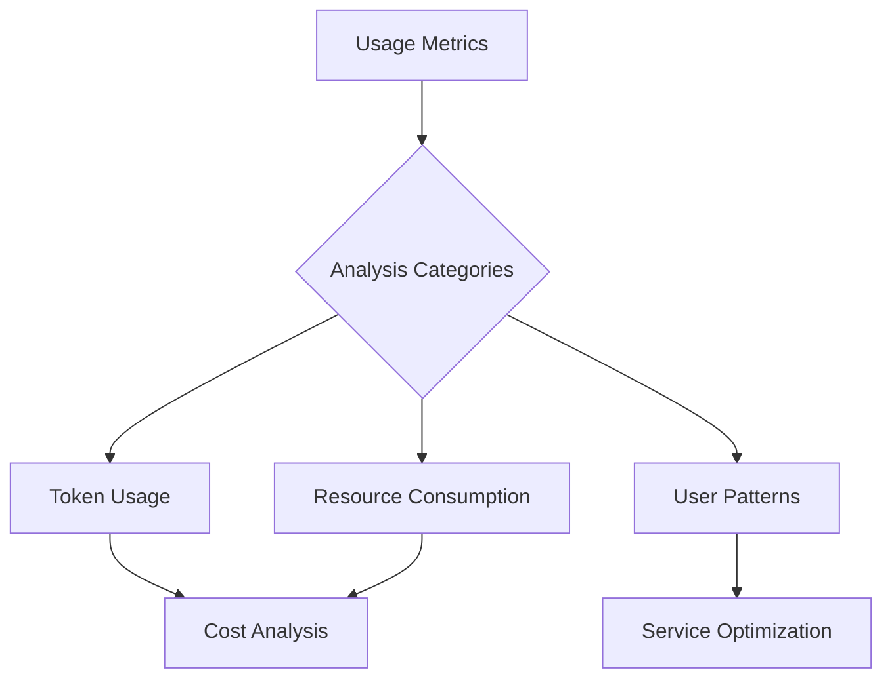
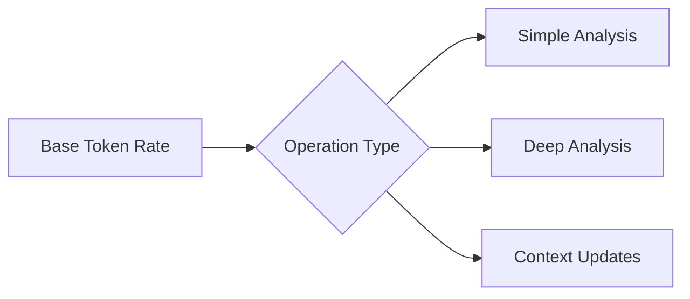
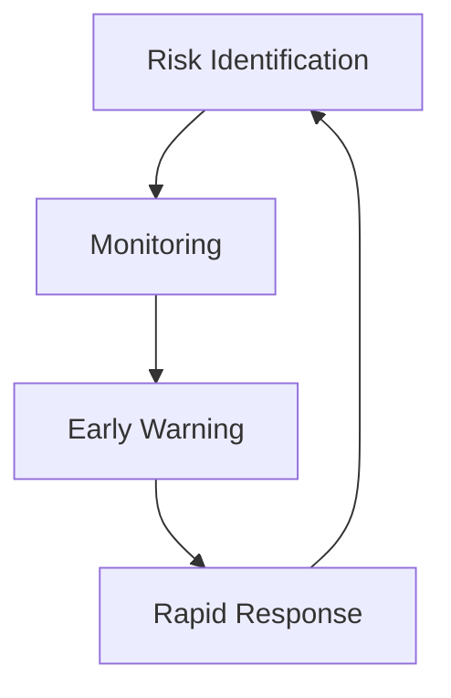

# AI Dependency Testing Service: Business Model

## 1. Service Structure

### Core Service

- AI-powered dependency testing
- Common model with client-specific contexts
- Token-based pricing
- Open source codebase with commercial license

### Infrastructure

- M1/M2 MacBook servers (32GB RAM)
- Central coordination server
- API gateway
- Client management system

## 2. Business Validation Phase

### Free Tier

- 1000 tokens/month
- Single repository
- Basic analysis features
- No time limit

### Data Collection



#### Key Metrics

1. Token Usage
    - Tokens per analysis
    - Operation types
    - Usage frequency
    - Peak periods

2. Resource Consumption
    - CPU time
    - Memory usage
    - Storage needs
    - Network bandwidth

3. User Behavior
    - Common workflows
    - Feature adoption
    - Integration methods
    - Support requests

## 3. Pricing Model

### Token System



### Initial Pricing Tiers

1. Free
    - 1000 tokens/month
    - Basic features
    - Community support

2. Developer
    - 10,000 tokens/month
    - All features
    - Email support
    - $X/month based on validation data

3. Team
    - 50,000 tokens/month
    - Priority processing
    - Dedicated support
    - $Y/month based on validation data

## 4. Cost Structure

### Fixed Costs

- Hardware (MacBooks)
- Server infrastructure
- Network services
- Development tools

### Variable Costs

- Processing time
- Storage
- Bandwidth
- Support time

### Cost Tracking

```javascript
class ServiceCosts {
    calculateOperationCost(operation) {
        return {
            processing: operation.cpuTime * CPU_COST_RATE,
            memory: operation.memoryUsage * MEMORY_COST_RATE,
            storage: operation.storageNeeds * STORAGE_COST_RATE,
            support: operation.supportTime * SUPPORT_COST_RATE
        };
    }
}
```

## 5. Revenue Streams

### Primary

- Token purchases
- Subscription tiers
- Commercial licenses

### Secondary

- Premium support
- Custom integrations
- Training/consulting

## 6. Growth Strategy

### Phase 1: Validation

- Duration: 3 months
- Goal: Gather usage data
- Focus: Free tier
- Metrics collection

### Phase 2: Market Entry

- Duration: 6 months
- Goal: Establish paid tiers
- Focus: Convert free users
- Refine pricing

### Phase 3: Scaling

- Duration: Ongoing
- Goal: Market expansion
- Focus: Infrastructure scaling
- Service optimization

## 7. Market Position

### Target Market

1. Primary
    - Small dev teams
    - Open source projects
    - Independent developers

2. Secondary
    - Medium businesses
    - Development agencies
    - Tech startups

### Competitive Advantages

- Simple pricing
- Open source core
- Specialized focus
- Community driven

## 8. Risk Management

### Technical Risks

- Service reliability
- Model accuracy
- Resource scaling
- Security concerns

### Business Risks

- Market adoption
- Pricing accuracy
- Competition
- Cost management

### Mitigation Strategies



## 9. Success Metrics

### Short Term (3-6 months)

- Free tier adoption
- Usage patterns
- Resource utilization
- User feedback

### Medium Term (6-12 months)

- Conversion rates
- Revenue growth
- Cost stability
- Market presence

### Long Term (12+ months)

- Market share
- Profitability
- Service expansion
- Community growth

## 10. Resource Requirements

### Initial Setup

- 1-2 MacBook servers
- Basic infrastructure
- Support system
- Development team

### Scaling Points

- User count thresholds
- Resource utilization
- Response times
- Support load

## 11. Financial Projections

### Cost Modeling

```javascript
class FinancialProjection {
    modelCosts(usage) {
        const fixed = this.calculateFixedCosts();
        const variable = this.calculateVariableCosts(usage);
        const overhead = this.calculateOverhead();
        
        return {
            monthly: fixed + variable + overhead,
            perUser: (fixed + overhead) / usage.userCount
                    + variable / usage.operationCount
        };
    }
}
```

### Revenue Modeling

- Based on validation phase data
- Usage patterns
- Conversion rates
- Market size

## 12. Evolution Path

### Service Expansion

- Additional features
- Integration options
- Market segments
- Geographic regions

### Technology Growth

- Model improvements
- Infrastructure scaling
- Automation increase
- Tool sophistication

### Business Development

- Partnership programs
- Channel development
- Market penetration
- Brand building