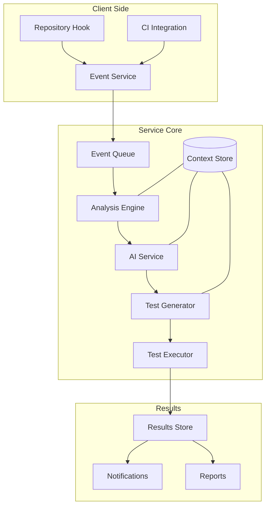
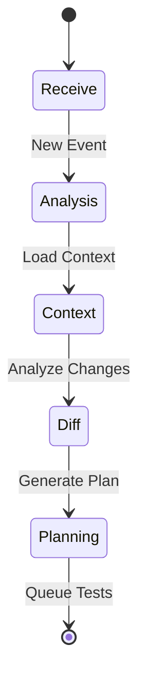
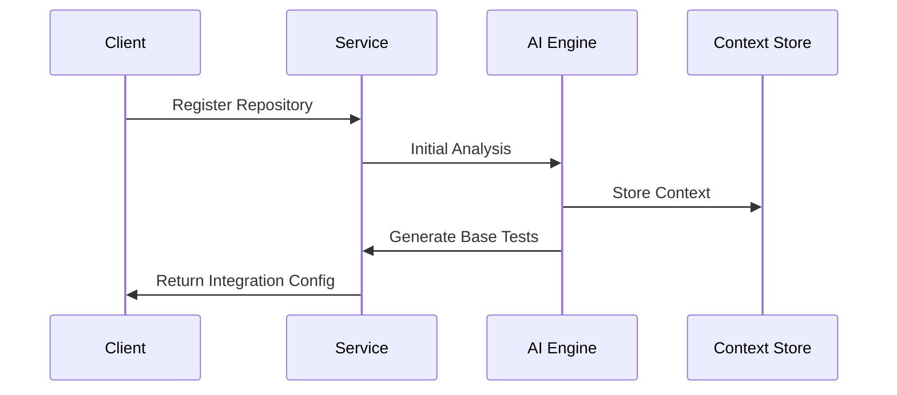
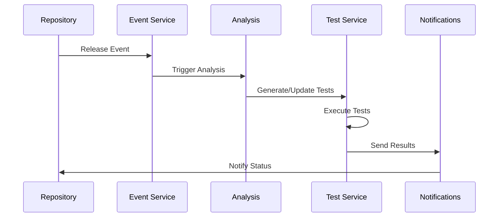
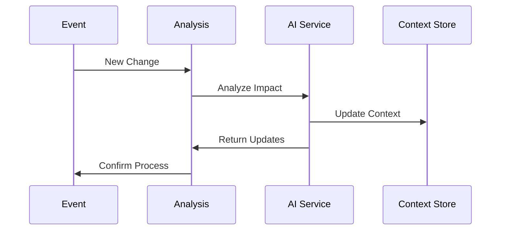

# Dependency Testing Service: System Design

## 1. System Overview

### Core Mission

Provide automated, AI-driven dependency testing that detects behavioral changes and potential issues before they impact
production systems.

### System Architecture



## 2. Core Components

### 2.1 Event Service

- Handles repository events
- Manages token validation
- Initial request processing
- Rate limiting and queuing
- Priority management

### 2.2 Analysis Engine



Key Functions:

- Change detection
- Dependency graph analysis
- Impact assessment
- Test coverage mapping

### 2.3 AI Service

Primary Responsibilities:

- Context maintenance
- Test pattern analysis
- Behavioral analysis
- Test generation guidance

Operations:

```javascript
class AIService {
  async analyzeChanges(diff, context) {
    // Analyze impact of changes
  }

  async generateTestPattern(analysis) {
    // Create new test patterns
  }

  async updateExistingTests(patterns) {
    // Modify existing tests
  }

  async validateTestCoverage(tests) {
    // Ensure adequate coverage
  }
}
```

### 2.4 Test Generator

Capabilities:

- Test case creation
- Fixture generation
- Environment setup
- Validation criteria

### 2.5 Test Executor

Features:

- Isolated environments
- Parallel execution
- Resource management
- Result collection

## 3. Workflows

### 3.1 New Repository Integration



### 3.2 Release Testing



### 3.3 Context Update



## 4. Token System

### 4.1 Cost Calculation

```javascript
function calculateTokenCost(operation) {
  const baseCost = getOperationBaseCost(operation);
  const contextSize = getContextSize();
  const complexity = analyzeComplexity(operation);
  
  return {
    analysis: baseCost.analysis * complexity,
    generation: baseCost.generation * contextSize,
    execution: baseCost.execution * getTestCount()
  };
}
```

### 4.2 Token Usage Optimization

- Context caching
- Incremental updates
- Shared knowledge base
- Pattern reuse

## 5. Storage Systems

### 5.1 Context Store

- Repository structure
- Dependency graphs
- Usage patterns
- Historical issues

Schema:

```javascript
{
  repository: {
    id: String,
    structure: Object,
    dependencies: [{
      name: String,
      version: String,
      usage: Object
    }],
    patterns: [{
      type: String,
      context: Object
    }]
  }
}
```

### 5.2 Test Store

- Test cases
- Execution results
- Coverage data
- Performance metrics

## 6. Integration Points

### 6.1 Repository Integration

```javascript
// Client-side hook
const hook = new DepTestHook({
  repository: 'owner/repo',
  token: 'access_token',
  events: ['release', 'dependency_update']
});

hook.on('test_complete', (results) => {
  // Handle test results
});
```

### 6.2 CI Integration

```yaml
# GitHub Actions example
steps:
  - uses: dep-test-action@v1
    with:
      token: ${{ secrets.DEP_TEST_TOKEN }}
      mode: pre_release
      notify: true
```

## 7. Monitoring and Alerts

### 7.1 System Monitoring

- Service health
- Queue status
- Token usage
- Error rates

### 7.2 Test Monitoring

- Execution time
- Resource usage
- Coverage metrics
- Failure patterns

## 8. Implementation Phases

### Phase 1: Core Infrastructure

- Event handling
- Basic analysis
- Token system
- Test execution

### Phase 2: AI Integration

- Context analysis
- Pattern learning
- Test generation
- Behavioral analysis

### Phase 3: Advanced Features

- Cross-repo analysis
- Pattern sharing
- Predictive testing
- Auto-remediation

## 9. Security Considerations

### 9.1 Data Security

- Code isolation
- Access control
- Token security
- Data encryption

### 9.2 Test Security

- Resource limits
- Code scanning
- Dependency validation
- Environment isolation

## 10. Scaling Strategy

### 10.1 Infrastructure

- Queue sharding
- Test parallelization
- Context distribution
- Load balancing

### 10.2 AI Processing

- Batch processing
- Priority queues
- Resource allocation
- Cache optimization

## 11. Success Metrics

### 11.1 Service Metrics

- Analysis accuracy
- Detection rate
- False positive rate
- Processing time

### 11.2 Business Metrics

- Customer retention
- Token usage
- Issue prevention
- Cost savings
