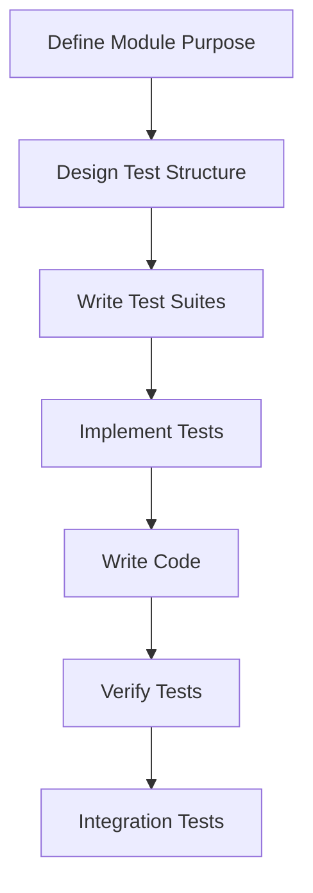
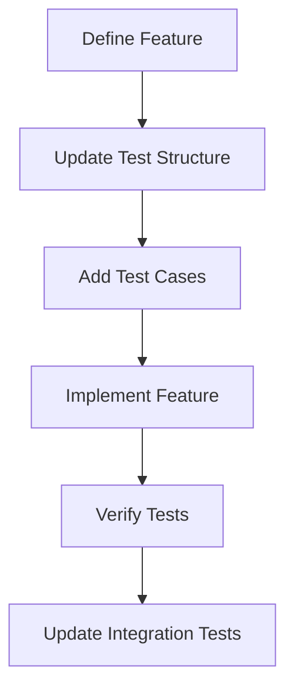

# Test-Driven AI-Assisted Development Workflow

## Core Philosophy

Our development workflow puts tests first - not as an afterthought or checkbox exercise, but as the primary driver of
design and implementation. This approach, combined with AI assistance, creates a powerful framework for building robust,
maintainable software.

### Key Principles

1. **Tests Drive Design**
    - Tests are written before implementation
    - Tests document behavior and intent
    - Tests guide architectural decisions
    - Tests prevent feature creep

2. **Structured Testing**
    - One test file per logical module
    - Tests organized by functionality in suites
    - Maximum two levels of nesting for clarity
    - Integration tests verify module interactions

3. **AI Assistance Integration**
    - AI helps design test structure
    - AI suggests test cases
    - AI assists with implementation
    - AI reviews test coverage

## Development Phases

### 1. Vision & Planning

- Brainstorm with AI to define scope
- Document intended functionality
- Create preliminary roadmap
- Establish success criteria

### 2. Documentation First

- Write high-level documentation
- Define module interfaces
- Document behavior specifications
- Create usage examples

### 3. Test Structure Design

- Define test file organization
- Create test suite hierarchy
- Document test categories
- Establish naming conventions

### 4. Test Implementation

- Write unit tests for each functionality
- Create integration tests
- Implement performance tests
- Add edge case coverage

### 5. Code Implementation

- Implement minimal code to pass tests
- Refactor for clarity and performance
- Document implementation details
- Review with AI assistance

### 6. Integration & Deployment

- Run integration test suite
- Verify performance metrics
- Check deployment configuration
- Validate documentation

## Test Organization

### Module Level

```
tests/
├── moduleA.test.ts           # One file per module
├── moduleB.test.ts
└── integration.test.ts       # Module integration tests
```

### Suite Structure

```typescript
describe('Module Functionality', () => {
  describe('Specific Feature', () => {
    test('should handle basic case', () => {
      // Test implementation
    });

    test('should handle edge case', () => {
      // Test implementation
    });
  });
});
```

## Best Practices

### Test Design

1. **Clarity First**
    - Tests should be self-documenting
    - Use descriptive suite and test names
    - Document complex test setups
    - Explain edge cases

2. **Independence**
    - Tests should not depend on each other
    - Each test should be self-contained
    - Avoid shared state between tests
    - Clean up after each test

3. **Coverage Goals**
    - Aim for full functionality coverage
    - Include edge cases
    - Test error conditions
    - Verify performance requirements

### AI Collaboration

1. **Design Phase**
    - Use AI to brainstorm test cases
    - Review test structure with AI
    - Discuss edge cases and scenarios
    - Validate test coverage

2. **Implementation Phase**
    - AI assists with test implementation
    - AI suggests optimizations
    - AI reviews test quality
    - AI helps with documentation

3. **Review Phase**
    - AI checks test coverage
    - AI suggests missing cases
    - AI reviews test structure
    - AI validates best practices

## Implementation Flow

### 1. New Module Development



### 2. Feature Addition



## Tools & Environment

### Required Setup

- Testing framework configuration
- Code coverage tools
- Performance testing tools
- CI/CD integration

### AI Integration

- AI assistant setup
- Context gathering tools
- Code analysis integration
- Documentation generation

## Quality Metrics

### Test Quality

- Test coverage percentage
- Test execution time
- Number of edge cases
- Integration coverage

### Code Quality

- Complexity metrics
- Performance benchmarks
- Documentation coverage
- Maintainability index

## Conclusion

This workflow ensures that tests drive development while leveraging AI assistance to improve quality and efficiency. By
following these guidelines, we create more robust, maintainable, and well-documented code.
